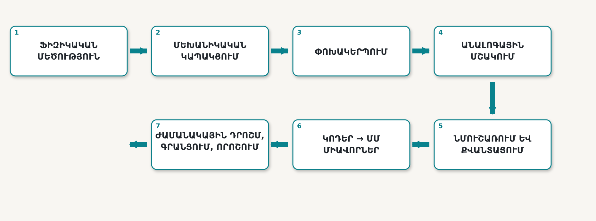
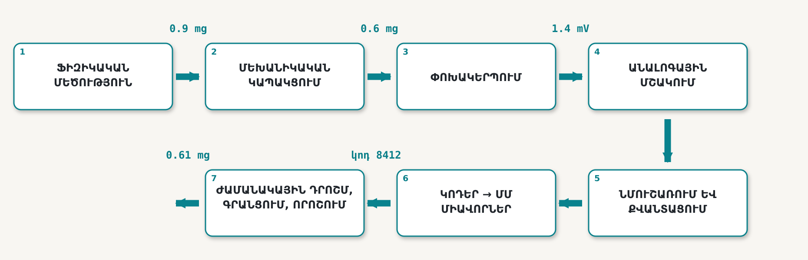
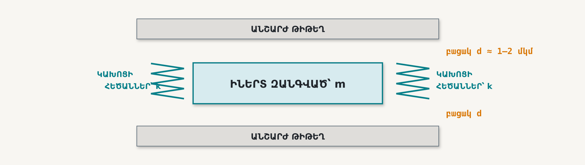
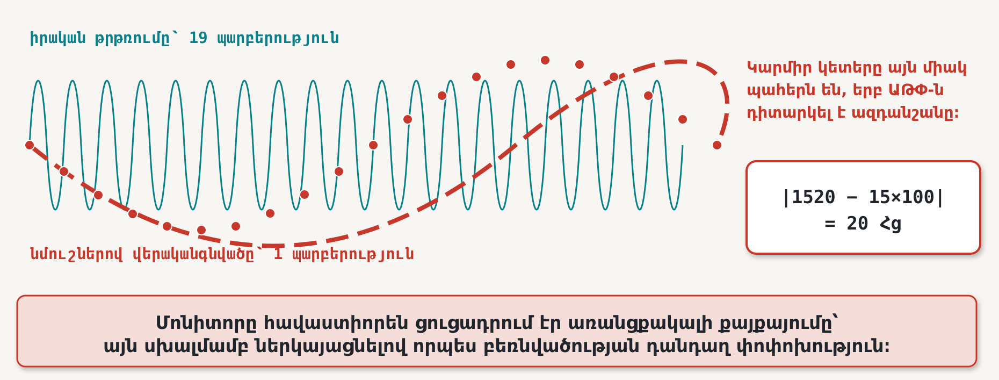

# 1 · Չափման շղթան

## Ի՞նչ պետք է կարողանաք կատարել այս գլուխն ուսումնասիրելուց հետո

1. **Պատկերել** ֆիզիկական մեծությունից մինչև պահպանված թվային արժեքը տանող ուղին, անվանել յուրաքանչյուր փուլը և նշել, թե դրանցից յուրաքանչյուրում ինչ տեղեկություն կարող է կորսվել։
2. **Դասակարգել** անծանոթ սարքը որպես տվիչ, փոխակերպիչ կամ ակտուատոր և նշել այն ֆիզիկական մեծությունը, որին այն արձագանքում է։
3. **Կանխատեսել**, մասշտաբային օրինաչափությունների հիման վրա, թե ինչու են միկրոսկոպական մեխանիկական սարքերն արագ և զգայուն, ինչպես նաև նշել առնվազն մեկ հատկություն, որը սարքի չափերի փոքրացման դեպքում *վատթարանում է*։
4. **Վերածել** անորոշ պահանջը չափման տեխնիկական բնութագրի՝ սահմանելով մեծությունը, չափման տիրույթը, լուծաչափը, ճշտությունը, հաճախականային թողունակությունը, շահագործման միջավայրը և ելքային տվյալները։

Ուշադրություն դարձրեք, որ բոլոր չորս կետերն էլ նկարագրում են գործողություններ, որոնք դուք պետք է *կարողանաք կատարել*։ Դրանցից ոչ մեկը պարզապես «իմանալ ինչ-որ բանի մասին» չէ։

---

## 1.1 Դիտարկման ընթացքում խափանված շարժիչը

Արտադրամասում շահագործվում էր պոմպը պտտող 1500 պտ/րոպ արագությամբ ասինխրոն շարժիչ։ Քանի որ այդ մեքենայի առանցքակալի խափանումը մեծ ծախսեր էր առաջացնում, տեխնիկական սպասարկման բաժինը սարքավորել էր այն չափման համակարգով՝ առանցքակալի իրանին հեղույսով ամրացված արագաչափ, միկրոկառավարիչ, ամենօրյա գրանցամատյան և էկրանին արտածվող միտման գիծ, որը ճարտարագետն իսկապես դիտում էր ամեն շաբաթ։

Վեց շաբաթ շարունակ էկրանին երևում էր մոտ 20 Հց հաճախությամբ թրթռման բաղադրիչ, որի լայնույթն աստիճանաբար մեծանում էր։ Այն տեսնող բոլոր մասնագետները պատկերը մեկնաբանում էին նույն կերպ՝ բեռնվածության դանդաղ աճ։ Ոչ մի արտասովոր բան։

Յոթերորդ շաբաթ առանցքակալը սեպվեց, և շարժիչը շարքից դուրս եկավ։

Խափանումից հետո կատարված քննությունը առանձին որևէ անսարքություն չհայտնաբերեց։ Արագաչափը համապատասխանում էր իր տվյալների թերթիկում նշված բոլոր պարամետրերին։ Էլեկտրոնային սալը սարքին էր։ Ծրագրաշարում սխալ չկար։ Տվյալների գրանցիչը գրանցել էր իրեն հանձնարարված յուրաքանչյուր նմուշ։ Ճարտարագետը դիտել էր էկրանը։

Յուրաքանչյուր բաղադրիչ համապատասխանում էր իր տեխնիկական բնութագրին, որևէ մեկը անփութություն չէր ցուցաբերել, սակայն շարժիչն այլևս պիտանի չէր։

Պահենք այս պատմությունը մտքում։ Գլխի վերջում, երբ արդեն կունենաք այն բացատրելու համար անհրաժեշտ գործիքակազմը, կվերադառնանք դրան։ Բացատրությունն արտասովոր չէ․ այն պարզ թվաբանություն է։ Հենց դրա համար էլ գոյություն ունի այս դասընթացը։

---

## 1.2 Երեք եզրույթ՝ հստակ նշանակությամբ

Այսուհետ հետևյալ երեք եզրույթները տարբեր նշանակություններ ունեն, իսկ տվյալների թերթիկներում այդ տարբերակումը միշտ չէ, որ պահպանվում է։

**Տվիչը** ֆիզիկական մեծությունը փոխակերպում է ընթերցելի ազդանշանի։ MEMS խոսափողը ձայնային ճնշումը փոխակերպում է լարման։

**Փոխակերպիչը** էներգիայի մի տեսակը փոխակերպում է մեկ այլ տեսակի։ Սա ընդհանուր եզրույթն է։ Տվիչը դրա մասնավոր դեպքն է, որի ուղղությունը դեպի ներս է՝ արտաքին աշխարհից դեպի էլեկտրոնային համակարգ։ Բարձրախոսը, պիեզոէլեկտրական սկավառակը և թենզոտվիչը փոխակերպիչներ են։

**Ակտուատորը (գործարկիչը)** ազդանշանը փոխակերպում է արտաքին աշխարհի վրա ֆիզիկական ներգործության։ MEMS հայելին լարումը փոխակերպում է անդրադարձնող մակերևույթի անկյունային շեղման։

Հետագայի համար կարևոր է հիշել երկու դիտարկում։

Առաջին՝ **յուրաքանչյուր ակտուատոր միաժամանակ նաև չափման խնդիր է**։ Ակտուատորի գործարկումը կարելի է հաստատել միայն դրա արդյունքը չափելով։ Շարժիչին պտտման հրահանգ տալը դեռևս չի նշանակում, որ շարժիչն իսկապես պտտվել է։

Երկրորդ՝ որոշ տվիչներ **պասիվ** են․ ինքնուրույն որևէ ազդանշան չեն առաջացնում։ Ձգման ժամանակ թենզոտվիչի էլեկտրական դիմադրությունը փոխվում է, սակայն դիմադրությունն ինքնին ազդանշան չէ։ Քանի դեռ դրա միջով հայտնի հոսանք չի անցկացվել կամ այն հայտնի գրգռման լարմամբ կամրջակային շղթայում չի ներառվել, այն որևէ տեղեկություն չի հաղորդում։ Գլուխ 12-ը հիմնականում նվիրված է այդպիսի գրգռման ճիշտ ապահովմանը։

> **Չափվող ֆիզիկական մեծությունն ունի հատուկ անվանում՝ *չափվող մեծություն* (measurand)**։ Սովորեք այն հստակ անվանել և արտահայտել ՄՄ (SI) միավորներով, քանի որ չափման բազմաթիվ խափանումներ սկսվում են այն բանից, որ թիմը չի համաձայնեցրել, թե իրականում ինչ է չափում։ «Թրթռումը» չափվող մեծության բավարար ձևակերպում չէ։ «Իրանի արագացման միջին քառակուսային արժեքը՝ մ/վ²-ով, 1–4 կՀց հաճախականային տիրույթում»՝ հստակ ձևակերպում է։

---

## 1.3 Չափումը շղթա է, ոչ թե առանձին բաղադրիչ

Դասընթացը սկսող ուսանողները սովորաբար չափումը պատկերացնում են որպես առանձին բաղադրիչ․ գնում ենք տվիչը և կարդում թիվը։ Այդ պատկերացումը ոլորտում ամենաթանկ արժեցող թյուրիմացություններից մեկն է, և այս գլխի նպատակը այն փոխարինելն է ամբողջական համակարգային ընկալմամբ։

Չափումը ֆիզիկական մեծությունից մինչև պահպանված և վստահելի թվային արժեքը տանող **ուղի** է։ Այդ ուղու յուրաքանչյուր փուլ փոխակերպում է տեղեկությունը, և յուրաքանչյուր փուլ կարող է աղավաղել այն։ Նկար 1.1-ում ներկայացված է այդ ուղին։ Այն նաև, ընդհանուր առմամբ, արտացոլում է դասընթացի կառուցվածքը․ տասնվեց դասախոսություններից յուրաքանչյուրը տեղավորվում է այս յոթ բլոկներից մեկում։

**Նկար 1.1** — Չափման շղթայի յոթ փուլերը։ Վերին շարքը կարդացեք ձախից աջ, ապա անցեք ստորին շարք և շարունակեք աջից ձախ։

Դիտարկենք փուլերն առանձին-առանձին։

**Փուլ 1 · Ֆիզիկական մեծություն։** Սա գծապատկերում միակ անվիճելի իրականությունն է։ Շարժիչն իսկապես թրթռում է։ Այս բլոկից աջ գտնվող ամեն ինչ սարքի հաղորդած նկարագրությունն է այդ թրթռման մասին, իսկ ձեր խնդիրն է ապահովել այդ նկարագրության հավաստիությունը։

**Փուլ 2 · Մեխանիկական կապակցում։** Նախքան էլեկտրոնային որևէ գործընթացի առաջացումը՝ չափվող մեծությունը պետք է հասնի զգայուն տարրին՝ հեղույսի, բարձակապի, իրանի, սոսնձային բարձիկի, խողովակի կամ ջերմային միջերեսի միջոցով։ Այդ ուղին ունի սեփական փոխանցման ֆունկցիան․ այն թուլացնում և ուշացնում է ազդանշանը, կարող է ռեզոնանսի մեջ մտնել, ընդ որում՝ տարբեր հաճախականությունների դեպքում տարբեր կերպ։ Այն ձեր չափիչ համակարգի մասն է, սակայն որևէ տվյալների թերթիկում ներկայացված չէ։ Ուսանողները հաճախ բաց են թողնում հենց այս փուլը, իսկ փորձառու ճարտարագետներն առաջին հերթին ստուգում են այն։

**Փուլ 3 · Փոխակերպում։** Այստեղ ֆիզիկական երևույթը վերածվում է էլեկտրական մեծության․ փոխվում է ունակությունը կամ դիմադրությունը, առաջանում է լիցք կամ լարում։ Գլուխ 4-ը ներկայացնում է փոխակերպման մեխանիզմները, իսկ 5–11-րդ գլուխները՝ թե որ մեխանիզմն է նպատակահարմար տարբեր չափվող մեծությունների համար։

**Փուլ 4 · Անալոգային ազդանշանի մշակում։** Ուժեղացում, զտում, մակարդակի շեղում և բուֆերացում։ Այս փուլում գտնվող զտիչներից մեկը՝ **հակաալիասինգային զտիչը**, գլխի ավարտին վճռորոշ նշանակություն կունենա։ Հիշեք՝ այն գտնվում է փոխակերպիչից առաջ։

**Փուլ 5 · Նմուշառում և քվանտացում։** Սրանք երկու տարբեր գործողություններ են, որոնք ուսանողները հաճախ նույնացնում են, թեև դրանց սխալները տարբեր կերպ են դրսևորվում։ **Նմուշառումը** դիսկրետացնում է *ժամանակը*․ փոխակերպիչը ազդանշանը դիտարկում է միայն որոշակի պահերի։ **Քվանտացումը** դիսկրետացնում է *լայնույթը*․ յուրաքանչյուր դիտարկված արժեք կլորացվում է վերջավոր բազմության մոտակա մակարդակին։ Չափազանց դանդաղ նմուշառումը և չափազանց կոպիտ քվանտացումը հանգեցնում են բոլորովին տարբեր հետևանքների։

**Փուլ 6 · Թվային կոդերից դեպի ՄՄ միավորներ։** Տվիչը երբեք «արագացում» չի արտածում․ այն արտածում է ամբողջ թիվ։ Որևէ մեկը այդ թիվը բազմապատկում է տվյալների թերթիկից վերցված գործակցով։ Եթե գործակիցը սխալ է, դրանից հետո ստացվող բոլոր տվյալները վստահորեն և մեծ թվային ճշտությամբ սխալ կլինեն։ Գլուխ 2-ը բացատրում է, թե որտեղից է ստացվում այդ գործակիցը և ինչ պայմաններից է այն կախված։

**Փուլ 7 · Ժամանակային դրոշմ, գրանցում և որոշում։** Առանց ժամանակային դրոշմի նմուշը գրեթե անարժեք է։ Եթե չեք կարող նշել, թե *երբ* է վերցվել նմուշը, չեք կարող հաշվարկել հաճախականությունը։ Իսկ գլուխը բացող պատմության մեջ հենց հաճախականությունն էր ամբողջ խնդրի բանալին։

Նկար 1.2-ում նույն շղթայով մեկ իրական թրթռման անցումն է՝ իրանից մինչև որոշում։

**Նկար 1.2** — 0.9 mg արագացմամբ թրթռման անցումը մինչև որոշման ընդունում։ Ուշադրություն դարձրեք 2-րդ փուլին․ մեխանիկական ուղին ազդանշանի մեկ երրորդն արդեն կորցրել է՝ նախքան առաջին իսկ էլեկտրոնի շարժվելը։ Գծապատկերի թվերից տվյալների որևէ թերթիկում կարող են ներկայացվել միայն 3–6-րդ փուլերին վերաբերողները։

---

## 1.4 Որտե՞ղ է կորչում իրականությունը, և հնարավո՞ր է այն վերականգնել

Տեղեկության բոլոր կորուստները համարժեք չեն։ Որոշ կորուստներ պարզապես անհարմարություն են և հետագայում կարող են շտկվել հաշվարկով կամ չափաբերմամբ, իսկ մյուսներն անդառնալի են և պետք է կանխվեն նախագծման փուլում։ Դրանց տարբերակումը ճարտարագիտական դատողության կարևոր մասն է։

| Փուլ | Ինչ է կորչում | Հնարավո՞ր է վերականգնել |
|---|---|---|
| 2․ Մեխանիկական կապակցում | լայնույթը և փուլը՝ յուրաքանչյուր հաճախականության համար տարբեր չափով | **Ոչ**․ այն պետք է ինքնուրույն բնութագրել |
| 3․ Փոխակերպում | միջառանցքային ներթափանցում, ոչ գծայնություն, ջերմաստիճանային դրեյֆ | Մասամբ՝ չափաբերմամբ |
| 4․ Ազդանշանի մշակում | հագեցումը սահմանափակում է գագաթները, սխալ զտիչը հեռացնում է օգտակար ազդանշանը | **Ոչ** |
| 5․ Նմուշառում | նմուշառման հաճախականության կեսից բարձր բաղադրիչները ծալվում են չափման տիրույթի մեջ | **Երբեք** |
| 5․ Քվանտացում | կրտսեր նշանակալի մեկ բիթից փոքր մանրամասները | Մասամբ՝ միջինացմամբ |
| 6․ Միավորների մասշտաբավորում | ճշտությունը՝ զգայունության սխալ գործակցի դեպքում | Այո՝ վերահաշվարկով |
| 7․ Ժամանակային դրոշմավորում | ժամանակային առանցքը և, հետևաբար, ամբողջ հաճախականային պարունակությունը | **Ոչ** |

**Աղյուսակ 1.1** — Չափման շղթայում առաջացող կորուստները։ Դրանցից երեքն անդառնալի են․ դրանք նախագծային որոշումների, ոչ թե չափաբերման խնդիրներ են։

Աղյուսակում «երբեք» բառը հանդիպում է միայն մեկ անգամ։ Հիշեք, թե որ տողում է այն։

---

## 1.5 Ինչու է միկրոսկոպական աշխարհն այլ կերպ գործում

Տարիներ շարունակ ձեր մեխանիկական պատկերացումները ձևավորվել են ձեռքով շոշափելի մեքենաների հիման վրա։ Միկրոմետրային մասշտաբում այդ պատկերացումների զգալի մասը շրջվում է, և կարևոր է հստակ հասկանալ, թե հատկապես ինչը։

### Իրականում ի՞նչ կա սարքի ներսում

Նկար 1.3-ում ներկայացված է ունակային MEMS արագաչափի լայնական հատույթը։ *m* զանգվածով **իներտ (սեյսմիկ) զանգվածը** կախված է *k* կոշտությամբ ճկուն կախոցի հեծաններից և տեղակայված է իրենից *d* բացակներով բաժանված երկու անշարժ թիթեղների միջև։ Սարքի արագացման ժամանակ զանգվածն իներցիայի պատճառով հետ է մնում շրջանակից․ մի բացակը մեծանում է, մյուսը՝ փոքրանում, իսկ երկու ունակությունների տարբերությունը ձևավորում է ելքային ազդանշանը։

**Նկար 1.3** — Ունակային MEMS արագաչափ։ Արագացումը տեղաշարժում է իներտ զանգվածը, բացակները փոխվում են, իսկ ելքային մեծությունը տարբերակային ունակությունն է՝ *C* = ε*A*/*d*։ Բնորոշ բացակները 1–2 մկմ են՝ էրիթրոցիտի չափից փոքր։ Հենց այդ պատճառով պատյանի ներսում փոշու նույնիսկ մեկ մասնիկը կարող է աղետալի լինել, իսկ Գլուխ 4-ում զգալի ուշադրություն է դարձվում պատյանավորմանը, ոչ թե վիմագրությանը։

Եթե մեխանիկայից հասկացել եք զսպանակ–զանգված համակարգը, ապա արդեն հասկանում եք նաև այս սարքի աշխատանքը։ MEMS արագաչափի տվյալների թերթիկում նշված բոլոր բնութագրերը *m*, *k* և *d* մեծությունների հետևանք են։

### Մասշտաբավորում․ երկու աստիճանային օրենք

Այժմ փոքրացնենք ամբողջ կառուցվածքը։ Յուրաքանչյուր չափ՝ երկարությունը, լայնությունը և հաստությունը, բազմապատկենք նույն *s* գործակցով։ Սա կոչվում է **իզոտրոպ մասշտաբավորում** և փոփոխությունները դիտարկելու ամենապարզ եղանակն է։

Զանգվածը համեմատական է ծավալին․

$$ m \propto L^3 $$

Կոշտությունն այլ կերպ է մասշտաբավորվում։ *w* լայնությամբ, *t* հաստությամբ և *L* երկարությամբ հեծանի ծռման կոշտությունը հավասար է՝

$$ k = \frac{Ewt^3}{4L^3} $$

Փոխարինելով *w*, *t* և *L* մեծությունները՝ յուրաքանչյուրն *s* անգամ մասշտաբավորված արժեքով, ստանում ենք՝

$$ k \propto \frac{s\cdot s^3}{s^3}=s, \qquad \text{այսինքն՝}\qquad k\propto L^1 $$

**Այս երկու մեծությունները միևնույն օրենքով չեն մասշտաբավորվում, և հենց այդ մեկ փաստի վրա է հիմնված MEMS ոլորտի էությունը։** Հաճախ ենթադրվում է, որ երկու ազդեցությունները փոխհատուցում են միմյանց։ Դա այդպես չէ, և աստիճանների տարբերությունն է ձևավորում ամբողջ ոլորտի առանձնահատկությունները։

Հետևանքը երևում է ռեզոնանսային հաճախականության արտահայտությունից․

$$ f_0=\frac{1}{2\pi}\sqrt{\frac{k}{m}}\propto \sqrt{\frac{L^1}{L^3}}=\sqrt{L^{-2}}=\frac{1}{L} $$

**Սարքի չափերը տասն անգամ փոքրացնելիս դրա ռեզոնանսային հաճախականությունը մեծանում է տասն անգամ։**

| Սարք | Չափ | Ռեզոնանսային հաճախականություն |
|---|---:|---:|
| Կամրջի թռիչք | 100 մ | ≈ 0.2 Հց |
| Կամերտոն | 10 սմ | ≈ 440 Հց |
| MEMS արագաչափ | 300 մկմ | ≈ 5 կՀց |
| MEMS գիրոսկոպի գրգռման համակարգ | 100 մկմ | ≈ 20 կՀց |
| MEMS ՌՀ ռեզոնատոր | 10 մկմ | ≈ 100 ՄՀց և ավելի |

**Աղյուսակ 1.2** — Չափերի հինգ և հաճախականության ութ կարգ ընդգրկող համեմատություն։

Սա կարևոր է, քանի որ տվիչը չի կարող հավաստիորեն փոխանցել իր սեփական ռեզոնանսային հաճախականությանը մոտ կամ դրանից բարձր հաճախականության ազդանշաններ։ Բարձր *f*₀-ն պարզապես հետաքրքիր առանձնահատկություն չէ․ այն ապահովում է **հաճախականային թողունակություն**, որի շնորհիվ էլ հնարավոր է արագաչափով վերահսկել առանցքակալի թրթռումը։

### Մյուս աստիճանային օրենքը և դրա գինը

Մակերեսը նույնպես ծավալից տարբեր օրենքով է մասշտաբավորվում․

$$ \frac{A}{V}\propto \frac{L^2}{L^3}=\frac{1}{L} $$

Չափերի փոքրացման հետ մարմինը հարաբերականորեն գրեթե ամբողջությամբ «մակերես» է դառնում։ Ձգողականությունը և իներցիան ծավալային ազդեցություններ են, իսկ շփումը, կպչունությունը և մակերևութային լարվածությունը՝ մակերեսային։ Բավականաչափ փոքր մասշտաբում մակերեսային ազդեցությունները գերակշռում են։ Այդ պատճառով միկրոսկոպական մեխանիկական կառուցվածքը կարող է հպվել ինքն իրեն և պարզապես մնալ կպած։ Այդ խափանումը կոչվում է **ստիկցիա (կպչում)** և արտադրության իրական խնդիր է։

Այսպիսով, սարքի փոքրացման առավելությունների և թերությունների անկողմնակալ հաշվեկշիռը հետևյալն է․

| Բարելավվում է | Վատթարանում է |
|---|---|
| Հաճախականային թողունակությունը, քանի որ *f*₀ ∝ 1/*L* | Ջերմամեխանիկական աղմուկի նվազագույն մակարդակը |
| Արձագանքման և ջերմային հաստատման ժամանակը | Ստիկցիան․ մակերեսային ուժերը գերակշռում են |
| Մեկ սարքին բաժին ընկնող հզորությունը | Պատյանավորման մեխանիկական լարումների նկատմամբ զգայունությունը |
| Մեծաքանակ արտադրության դեպքում մեկ սարքի արժեքը | Ջերմաստիճանային դրեյֆը և զրոյական շեղման կայունությունը |
| Մեկ ենթաշերտի վրա հազարավոր սարքերի խմբաքանակային արտադրությունը | Աղտոտումը․ փոշու հատիկը կարող է ճակատագրական լինել |

**Աղյուսակ 1.3** — Փոքրացումը փոխզիջում է, ոչ թե անվերապահ բարելավում։

Աղմուկին վերաբերող տողն առանձին մեկնաբանության է արժանի, քանի որ դա «ինչո՞ւ պարզապես չփոքրացնել սարքը» հարցի անկեղծ պատասխանն է։ Իներտ զանգվածը միջինացնում է շրջապատող գազի մոլեկուլների պատահական ջերմային հարվածները։ Դրանցով պայմանավորված աղմուկին համարժեք արագացումը մոտավորապես մասշտաբավորվում է հետևյալ կերպ․

$$ a_n\propto \sqrt{\frac{4k_BT\omega_0}{mQ}} $$

Ուստի այն **մեծանում է իներտ զանգվածի փոքրացման հետ**։ Մենք ստանում ենք ավելի մեծ թողունակություն՝ աղմուկի մակարդակի վատթարացման գնով։ Տվյալների թերթիկը ստիպելու է ընտրել այս երկուսի միջև, իսկ Գլուխ 2-ում կսովորեք ճիշտ գնահատել այդ գինը։

> **Մակրոսկոպական համակարգերի ճարտարագետին մտահոգում է զանգվածը, իսկ MEMS ճարտարագետին՝ մակերեսները։**

---

## 1.6 Հաշվարկային օրինակ․ ինչպես է արագ ազդանշանը վերածվում դանդաղի

Այժմ կարող ենք բացատրել շարժիչի հետ պատահածը։

**Նայքվիստ–Շենոնի նմուշառման թեորեմի** համաձայն՝ մինչև *f*max հաճախականություններ պարունակող ազդանշանը ճիշտ ներկայացնելու համար անհրաժեշտ է նմուշառել այն հետևյալ հաճախականությամբ․

$$ f_s>2f_{max} $$

Ավելի դանդաղ նմուշառման դեպքում տեղեկությունը ոչ միայն կորչում է, այլև հայտնվում է սխալ հաճախականության տակ։ *f*ₛ/2-ից բարձր *f* հաճախականությամբ բաղադրիչը չափման տիրույթում կրկին հայտնվում է **կեղծ (alias) հաճախականությամբ**․

$$ f_{alias}=|f-nf_s| \qquad (n\text{-ը մոտակա ամբողջ բազմապատիկն է}) $$

Այն այլևս հնարավոր չէ տարբերել այդ ցածր հաճախականությամբ իրական ազդանշանից։ Հետագա մշակման որևէ եղանակ չի կարող դրանք տարանջատել, քանի որ նմուշների ձևավորման պահին տարբերությունն արդեն վերացված է։

### Խափանումից հետո հաստատված թվերը

Շարժիչի խափանումից հետո հաստատվել էր երեք փաստ․

- առանցքակալի խափանման բնութագրական հաճախականությունը **1520 Հց** էր,
- համակարգի նմուշառման հաճախականությունը **100 Հց** էր,
- 4-րդ փուլում **հակաալիասինգային զտիչ չկար**։

1520 Հց-ը հավաստի դիտարկելու համար անհրաժեշտ էր 3040 Հց-ից բարձր նմուշառման հաճախականություն։ Համակարգը նմուշառում էր մոտ երեսուն անգամ ավելի դանդաղ։ Որտե՞ղ հայտնվեց այդ էներգիան։

$$ n=\operatorname{round}(1520/100)=15 $$

$$ f_{alias}=|1520-15\times100|=|1520-1500|=20\ \text{Հց} $$

**Ահա 20 Հց բաղադրիչի ծագումը։** Այն երբեք բեռնվածության փոփոխություն չի եղել։ Դա քայքայվող առանցքակալի ազդանշանն էր, որը ճշգրիտ գրանցվել, սակայն դասակարգվել էր սխալ հաճախականության տակ։

Նկար 1.4-ում ներկայացված է այդ մեխանիզմը։ Փիրուզագույն արագ ազդանշանը իրական թրթռումն է։ Կարմիր կետերը միակ պահերն են, երբ փոխակերպիչը դիտարկել է ազդանշանը։ Եթե միայն այդ կետերով անցկացնենք հնարավոր ամենասահուն կորագիծը, կստանանք կարմիր ընդհատ գիծ՝ դանդաղ տատանում, որն իրական ֆիզիկական աշխարհում առհասարակ գոյություն չունի։

**Նկար 1.4** — Ալիասինգի երևույթը։ Մեխանիզմը տեսանելի դարձնելու համար պատկերված է ազդանշանի 19 պարբերություն՝ 20 նմուշի հաշվով։ Շարժիչի իրական հարաբերակցությունը 1520։100 էր, սակայն թվաբանական օրինաչափությունը նույնն է։ Նմուշներն ամբողջովին ճշգրիտ են, իսկ դրանց *մեկնաբանությունը*՝ ոչ։

### Ինչո՞ւ որևէ մեկը չնկատեց խնդիրը

Հենց հետևյալ հանգամանքն է այս դեպքը պարզ հետաքրքրությունից վերածում կարևոր դասի։ Լիսեռը պտտվում էր 1500 պտ/րոպ, այսինքն՝ **25 Հց** հաճախականությամբ։ Ուստի էկրանին երևացող 20 Հց թրթռման բաղադրիչը լիովին իրատեսական էր թվում բոլոր ճարտարագետներին․ այն նույն կարգի էր, ինչ պտտման հաճախականությունը, և լայնույթն աստիճանաբար մեծանում էր՝ ճիշտ այնպես, ինչպես դանդաղ աճող բեռնվածության դեպքում։

**Սխալ պատասխանը համոզիչ էր։** Այդ պատճառով այն վեց շաբաթ շարունակ կասկած չառաջացրեց։

Երկու եզրակացություն, որոնք նաև բացատրում են այս գլխի անհրաժեշտությունը․

1. **Ալիասինգն անդառնալի է։** Հետագա որևէ զտիչ, խելացի ծրագրաշար կամ մեքենայական ուսուցման մեթոդ չի վերականգնի այն հաճախականությունը, որը պատշաճ կերպով չեք նմուշառել։ Միակ պաշտպանությունը 4-րդ փուլում հակաալիասինգային զտիչն է և 5-րդ փուլում բավարար նմուշառման հաճախականությունը․ երկուսն էլ պետք է ընտրվեն *մինչև* համակարգի կառուցումը։
2. **Ոչինչ անսարք չէր։ Յուրաքանչյուր բաղադրիչ համապատասխանում էր իր բնութագրին, սակայն համակարգն ամբողջությամբ երբեք չէր բնութագրվել։** Նմուշառման որոշումը որևէ առանձին բաղադրիչի պատասխանատվության տակ չէր, ուստի այն ոչ ոք չէր կայացրել։

---

## 1.7 Ցանկությունից դեպի տեխնիկական բնութագիր

Ոչ ոք պատրաստի տեխնիկական բնութագիր չի տրամադրելու։ Փոխարենը կլսեք նման նախադասություն․

> *«Պարզապես ասեք՝ շարժիչը չափազանց ուժե՞ղ է թրթռում, թե՞ ոչ»։*

Այստեղ որևէ թիվ չկա։ Քանի դեռ թվեր չկան, հնարավոր չէ սարք ընտրել, համակարգ նախագծել և, ինչը նույնպես կարևոր է, հստակ պատասխանատվություն սահմանել։ Այդ նախադասությունը ճարտարագիտական փաստաթղթի վերածելը յուրաքանչյուր չափման նախագծի առաջին խնդիրն է։ Դրա համար անհրաժեշտ է պատասխանել հետևյալ յոթ հարցերին։

|  | Հարց |
|---|---|
| **Մեծություն** | Ո՞ր ֆիզիկական փոփոխականն է չափվում և ի՞նչ միավորով։ |
| **Տիրույթ** | Ո՞րն է հաղորդվող նվազագույն և առավելագույն արժեքը։ |
| **Լուծաչափ** | Ո՞րն է տարբերակման ենթակա նվազագույն փոփոխությունը։ |
| **Ճշտություն** | Որքա՞ն սխալ կարող է լինել ցուցմունքը, և **ջերմաստիճանային ո՞ր տիրույթում**։ |
| **Թողունակություն** | Որքա՞ն արագ է փոխվում մեծությունը։ Ո՞րն է նշանակություն ունեցող առավելագույն հաճախականությունը։ |
| **Միջավայր** | Ջերմաստիճան, խոնավություն, թրթռում, էլեկտրամագնիսական խանգարումներ, սնուցում, հզորության սահմանափակումնե՞ր։ |
| **Ելք** | Ո՞վ է օգտագործում տվյալը, ի՞նչ ձևաչափով, ի՞նչ հաճախականությամբ և ինչպիսի՞ ժամանակային դրոշմով։ |

**Աղյուսակ 1.4** — Ցանկությունը տեխնիկական բնութագրի վերածող յոթ հարց։

Այս հարցերից երկուսն արժանի են հատուկ շեշտադրման։ Առանց ջերմաստիճանային տիրույթի նշված **ճշտությունը** մարքեթինգային, ոչ թե ճարտարագիտական պնդում է։ Գլուխ 2-ը ցույց է տալիս, թե որքան լուրջ հետևանքներ կարող է ունենալ այդ բացթողումը։ Իսկ **հաճախականային թողունակությունը** հենց այն հարցն է, որի անտեսումը հանգեցրեց շարժիչի խափանմանը։

Շարժիչի դեպքում անորոշ պահանջը վերածվում է հետևյալ տեխնիկական բնութագրի․

|  | Տեխնիկական պահանջ | Թվի հիմնավորումը |
|---|---|---|
| Մեծություն | իրանի արագացման ՄՔՄ արժեքը՝ մ/վ² | խափանվող առանցքակալը թրթռում է հաղորդում իրանին |
| Տիրույթ | ±16 g | հարվածային անցումային գործընթացներ, ոչ թե կայուն թրթռում |
| Լուծաչափ | ≤ 5 mg | ամենավաղ հայտնաբերվող խափանումը՝ ≈ 30 mg |
| Ճշտություն | ցուցմունքի ±5 %, 0–70 °C | միտման բացահայտում, ոչ թե բացարձակ չափագիտություն |
| Թողունակություն | **≥ 4 կՀց, հակաալիասինգային զտմամբ** | առանցքակալի բնութագրական ազդանշանը 1–4 կՀց տիրույթում է |
| Միջավայր | 0–70 °C, 24 Վ սնուցում, յուղային միջավայր, շարժաբերի ԷՄԽ | շարժիչի իրական էլեկտրական պահարանի պայմանները |
| Ելք | ՄՔՄ արժեք և սպեկտր՝ 1 Հց հաճախությամբ, ±1 մվ ժամանակային դրոշմամբ | հաճախականությունը հաշվարկելու համար |

**Աղյուսակ 1.5** — Նույն պահանջը՝ ձևակերպված որպես տեխնիկական բնութագիր։

Աղյուսակ 1.5-ում նկատեք երկու հանգամանք։ Յուրաքանչյուր տող ունի **հիմնավորում**․ առանց հիմնավորման բնութագրային արժեքը պարզապես ենթադրություն է՝ պաշտոնական տեսքով։ Բացի այդ, այստեղ չկան արտադրողի անվանում, բաղադրիչի կոդ կամ գին։ Դրանք ընտրվում են ավելի ուշ, և հենց դրան է նվիրված Գլուխ 2-ը։

Իրական համակարգում բացակայում էր թողունակության պահանջը։ Այն կարող էր ներկայացվել մեկ տողով՝

> `Թողունակություն՝ ≥ 4 կՀց, հակաալիասինգային զտմամբ։ Նմուշառման հաճախականություն՝ ≥ 8 կՀց։`

Մեկ տող։ Մեկ շարժիչ։

---

## 1.8 Ընթերցանության նյութեր

Այս գլխի նյութը համապատասխանում է **Morris & Langari, *Measurement and Instrumentation*, 3-րդ հրատարակություն (Elsevier, 2020), Գլուխ 1՝ «Fundamentals of Measurement Systems»** աշխատությանը։ Այն ուսումնասիրեք չափման համակարգի կառուցվածքային սխեմայի և չափման տերմինաբանության պաշտոնական շարադրանքի համար։

Նմուշառման թեորեմն ու քվանտացումը մանրամասն ներկայացված են նույն գրքի **Գլուխ 6-ում՝ «Data Acquisition and Signal Processing»**։ Այս նյութին կրկին կանդրադառնանք ձեռնարկի Գլուխ 3-ում, ուստի այժմ բավարար է նախնական ընթերցումը։

MEMS կառուցվածքների և արտադրական տեխնոլոգիաների վերաբերյալ ԻՏՄՕ համալսարանի անվճար *«Микроэлектромеханические системы и датчики»* (2020) ուսումնական ձեռնարկի 1-ին և 2-րդ գլուխներում ներկայացված են սարքերի կառուցվածքները և աշխատանքի սկզբունքները՝ ինքնաստուգման հարցերով։ Այդ աղբյուրը մանրամասն կօգտագործվի Գլուխ 4-ում։

*Գլուխների և բաժինների համարակալումը պետք է ստուգել ձեզ հասանելի հրատարակության համաձայն։*

---

## 1.9 Վարժություններ

**1.1** Թվարկեք չափման շղթայի փուլերը՝ ֆիզիկական մեծությունից մինչև պահպանված արժեքը։

**1.2** Բերեք անալոգաթվային փոխակերպման փուլում տեղեկության այնպիսի կորստի մեկ օրինակ, որը հնարավոր չէ վերականգնել հետագա որևէ մշակմամբ։ Բացատրեք, թե ինչու է «հնարավոր չէ» ձևակերպումն այստեղ ճիշտ։

**1.3** MEMS ռեզոնատորի բոլոր չափերը իզոտրոպ կերպով փոքրացվել են 5 անգամ։ Ինչպե՞ս է փոխվում դրա ռեզոնանսային հաճախականությունը և ինչո՞ւ։

**1.4** Նշեք տվիչի մեկ հատկություն, որը վատթարանում է սարքի փոքրացման դեպքում, և բացատրեք պատճառը։

**1.5** Դասակարգեք հետևյալ սարքերը և նշեք դրանց չափվող մեծությունը կամ ելքային գործողությունը․ ա) MEMS խոսափող, բ) պիեզոէլեկտրական ազդանշանիչ, գ) թենզոտվիչ, դ) MEMS հայելի։ Դրանցից ո՞րն առանց արտաքին գրգռման ընդհանրապես ազդանշան չի ձևավորում։

**1.6** Համակարգը նմուշառում է 500 Հց հաճախականությամբ և չունի հակաալիասինգային զտիչ։ Իրական ազդանշանում առկա է 1800 Հց բաղադրիչ։ Ի՞նչ հաճախականությամբ այն կհայտնվի գրանցված տվյալներում։

**1.7** Անօդաչու թռչող սարքը պետք է բարոմետրական ճնշման տվիչով պահպանի իր բարձրությունը ±0.5 մ ճշտությամբ։ ա) Ո՞րն է չափվող մեծությունը, և արդյո՞ք դա բարձրությունն է։ բ) Ծովի մակարդակին մոտ բարձրության 0.5 մ փոփոխությանը մոտավորապես ճնշման ի՞նչ փոփոխություն է համապատասխանում։ գ) Բացատրեք, թե ինչու են տվիչի պահանջվող տիրույթը և լուծաչափը միմյանցից տարբերվում մի քանի կարգով։

**1.8** Մեկ նախադասությամբ բացատրեք, թե ինչու էր շարժիչի մոնիտորը ցուցադրում հանգիստ 20 Հց բաղադրիչ։

**1.9** Հետևյալ պահանջի համար գրեք տեխնիկական բնութագրի յոթ տողերը․ *«Կեսօրից հետո ջերմոցում չափազանց շոգ է լինում․ որևէ լուծում տվեք»*։ Այն դեպքերում, երբ պահանջը բավարար տեղեկություն չի տալիս, հստակ նշեք ձեր ենթադրությունը։

---

## Պատասխաններ

**1.1** Չափվող մեծություն → մեխանիկական կապակցում և ամրացում → փոխակերպում → անալոգային մշակում՝ ներառյալ հակաալիասինգային զտումը → նմուշառում և քվանտացում → հում կոդերի մասշտաբավորում ՄՄ միավորների → ժամանակային դրոշմավորում, գրանցում և որոշման ընդունում։

**1.2** Նմուշառման հաճախականության կեսից բարձր ցանկացած հաճախականային բաղադրիչ։ Նմուշառման հետևանքով այն ալիասինգով հայտնվում է չափման տիրույթում և այլևս չի տարբերվում իրական ցածր հաճախականությամբ բաղադրիչից։ Քանի որ նմուշներում սկզբնական հաճախականության մասին որևէ տեղեկություն չի պահպանվում, հետագա մշակմամբ դրանք տարանջատել հնարավոր չէ։ Մեկ ԿՆԲ-ից փոքր մանրամասները նույնպես կորչում են, թեև միջինացումը կարող է դրանք մասամբ վերականգնել։

**1.3** Ռեզոնանսային հաճախականությունը մեծանում է 5 անգամ։ Իզոտրոպ մասշտաբավորման դեպքում *k* ∝ *L*, իսկ *m* ∝ *L*³, հետևաբար՝ *f*₀ ∝ √(*k*/*m*) ∝ 1/*L*։

**1.4** Ջերմամեխանիկական աղմուկի նվազագույն մակարդակը․ իներտ զանգվածի փոքրացման դեպքում աղմուկին համարժեք արագացումը մեծանում է, հետևաբար փոքր սարքն ունի ավելի բարձր աղմուկի մակարդակ։ Մեկ այլ ճիշտ օրինակ է ստիկցիան, քանի որ *A*/*V* ∝ 1/*L*, և մակերեսային ուժերը սկսում են գերակշռել ծավալային ուժերին։ Կարելի է նշել նաև պատյանավորման լարումների և ջերմաստիճանային դրեյֆի նկատմամբ զգայունության աճը։

**1.5** ա) Տվիչ․ չափվող մեծությունը ձայնային ճնշումն է։ բ) Ակտուատոր և փոխակերպիչ․ էլեկտրական ազդանշանը փոխակերպում է ձայնային ելքի։ գ) Տվիչ․ չափվող մեծությունը մեխանիկական դեֆորմացիան է։ **Սա պասիվ սարքն է**, քանի որ միայն փոխում է իր դիմադրությունը և ազդանշան ձևավորելու համար պահանջում է գրգռման հոսանք կամ կամրջակի սնուցման լարում։ դ) Ակտուատոր․ լարումը փոխակերպում է հայելու անկյունային շեղման։

**1.6** *n* = round(1800/500) = 4, հետևաբար՝ *f*alias = |1800 − 2000| = **200 Հց**։

**1.7** ա) Չափվող մեծությունը **բացարձակ մթնոլորտային ճնշումն** է՝ պասկալով կամ հեկտոպասկալով։ Բարձրությունն *ածանցյալ* մեծություն է, որը հաշվարկվում է ճնշումից՝ մթնոլորտի մոդելի միջոցով։ բ) Ծովի մակարդակին մոտ ճնշումը յուրաքանչյուր մետրի համար նվազում է մոտ 12 Պա-ով, ուստի 0.5 մ-ը համապատասխանում է մոտ **6 Պա**, այսինքն՝ 0.06 հՊա փոփոխության։ գ) Տվիչը պետք է գործի եղանակային և տեղանքի ճնշման ամբողջ տիրույթում՝ օրինակ 950–1050 հՊա, որը կազմում է 10 000 Պա, միաժամանակ տարբերակելով մոտ 6 Պա փոփոխությունները։ Ուստի տիրույթն ու լուծաչափը տարբերվում են ավելի քան երեք կարգով, և դրանց շփոթումը տեխնիկական պահանջների կազմման ամենատարածված սխալներից է։

**1.8** Առանցքակալի ≈1520 Հց խափանման ազդանշանը 100 Հց նմուշառման և հակաալիասինգային զտիչի բացակայության պատճառով ալիասինգով վերածվել էր |1520 − 15×100| = 20 Հց բաղադրիչի, որը սխալմամբ ընկալվել էր որպես բնական բեռնվածության փոփոխություն, քանի որ լիսեռն ինքնին պտտվում էր 25 Հց հաճախականությամբ։

**1.9** Պատասխանները կարող են տարբեր լինել։ Հիմնավորված տարբերակ է՝ **մեծություն**՝ օդի ջերմաստիճանը °C-ով, բույսերի սաղարթի բարձրության վրա (ենթադրություն՝ չափվում է օդի, ոչ թե հողի կամ տերևների ջերմաստիճանը), **տիրույթ**՝ −10-ից +60 °C, **լուծաչափ**՝ 0.5 °C, **ճշտություն**՝ ±1 °C՝ 0–50 °C տիրույթում, **թողունակություն**՝ շատ փոքր․ ջերմոցի ջերմային ժամանակային հաստատունը րոպեների կարգի է, հետևաբար 0.01 Հց-ը բավարար է, իսկ րոպեում մեկ նմուշը՝ նույնիսկ առատ, **միջավայր**՝ բարձր խոնավություն, խտացում և ուղիղ արևային ճառագայթում, որը պահանջում է ճառագայթային վահան, իսկ ցանցային սնուցումը հասանելի է, **ելք**՝ րոպեում մեկ ժամանակային դրոշմով ցուցմունք՝ օդանցքը բացող շեմային կառավարման համակարգին։ Լիարժեք են այն պատասխանները, որոնցում նշված են ենթադրությունները և հիմնավորված են թվերը, հատկապես՝ նկատված է փոքր թողունակության պահանջը և այն, որ հիմնական սխալի աղբյուրը կարող է լինել տվիչի ուղիղ արևային տաքացումը, ոչ թե հենց տվիչը։
