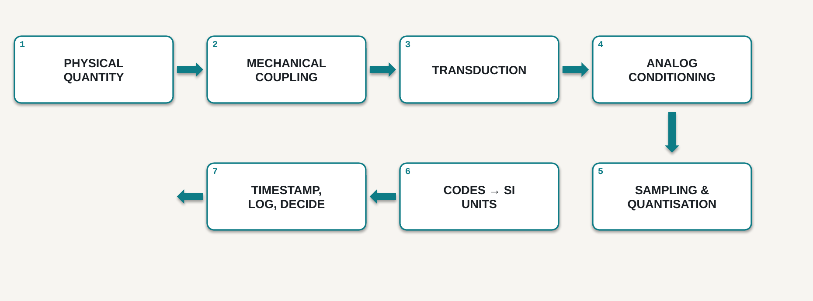
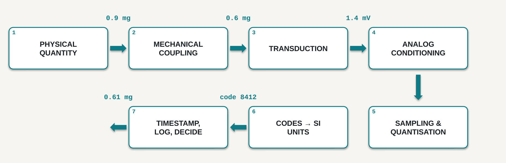
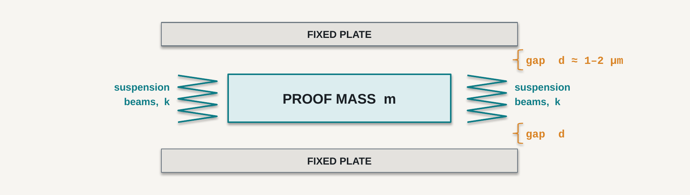
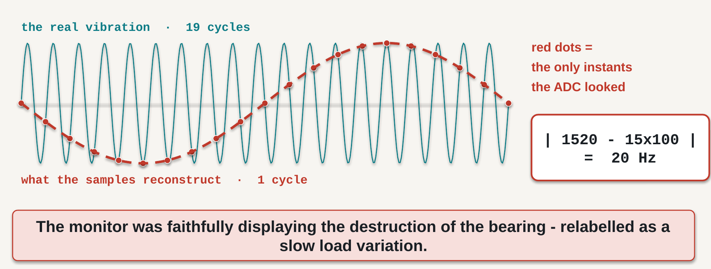

# 1 · The measurement chain

## What you should be able to do after this chapter

1. **Draw** the path from a physical quantity to a stored number, name each stage, and say what information can be lost at each one.
2. **Classify** an unfamiliar device as a sensor, a transducer or an actuator, and name the physical quantity it responds to.
3. **Predict**, from scaling arguments, why microscopic mechanical devices are fast and sensitive — and name at least one property that becomes *worse* as a device shrinks.
4. **Convert** a vague request into a measurement specification: quantity, range, resolution, accuracy, bandwidth, environment and output.

Notice that all four are things you *do*. None of them is "know about".

---

## 1.1 A motor that died under observation

A plant operated a 1500 rpm induction motor driving a pump. Bearing failure on that machine was expensive, so the maintenance department instrumented it: an accelerometer bolted to the bearing housing, a microcontroller, a daily log, and a trend line on a screen that an engineer actually looked at every week.

For six weeks the screen showed a vibration component near 20 Hz, slowly rising in amplitude. Everybody who saw it read it the same way: a gradual increase in load. Unremarkable.

In the seventh week the bearing seized and the motor was destroyed.

The post-mortem found no fault. The accelerometer met every number in its datasheet. The circuit board was sound. The firmware contained no bug. The logger had recorded every sample it was asked to record. The engineer had looked at the screen.

Every component met its specification, nobody was negligent, and the motor was scrap.

Hold that. We will return to it at the end of the chapter, once you have the equipment to explain it. The explanation is not exotic — it is arithmetic — and it is the reason this course exists.

---

## 1.2 Three words, used precisely

From here on these three words mean different things, and datasheets will not respect the distinction for you.

A **sensor** converts a physical quantity into a signal you can read. A MEMS microphone converts sound pressure into a voltage.

A **transducer** converts energy from one form into another. This is the general term; a sensor is the special case that points *inward*, from the world into your electronics. A loudspeaker, a piezoelectric disc and a strain gauge are all transducers.

An **actuator** converts a signal into a physical action on the world. A MEMS mirror converts a voltage into an angular deflection of a reflective surface.

Two remarks worth carrying forward.

First, **every actuator is also a measurement problem.** You only know that an actuator acted if you sense the result. A motor commanded to turn is not a motor that turned.

Second, some sensors are **passive**: they produce nothing at all on their own. A strain gauge changes its electrical resistance when it is stretched, but a resistance is not a signal. Until you pass a known current through it, or place it in a bridge with a known excitation voltage, it says nothing. Chapter 12 is largely about supplying that excitation correctly.

> **The quantity you are measuring has a name: the *measurand*.** Get into the habit of naming it explicitly and in SI units, because a surprising number of measurement failures begin with a team that never agreed on what it was measuring. "Vibration" is not a measurand. "Housing acceleration in m/s², RMS, in the band 1–4 kHz" is.

---

## 1.3 A measurement is a chain, not a component

Students arriving at this course usually picture a measurement as a component: you buy the sensor, you read the number. That picture is the single most expensive misconception in the field, and replacing it is the work of this chapter.

A measurement is a **path** from a physical quantity to a stored, trustworthy number. Every stage on that path transforms the information, and every stage can damage it. Figure 1.1 is the path. It is also, more or less, the syllabus of this course: every one of the sixteen lectures lives inside one of these seven boxes.

**Figure 1.1** — The seven stages of a measurement chain. Read the top row left to right, then drop to the second row and read right to left.

Take the stages one at a time.

**Stage 1 · The physical quantity.** The only thing in the diagram that is unambiguously true. The motor really is vibrating. Everything to the right of this box is a story your instrument tells about it, and your job is to make the story faithful.

**Stage 2 · Mechanical coupling.** Before any electronics exist, the quantity has to reach the sensing element — through a bolt, a bracket, a housing, an adhesive pad, a length of tubing, a thermal interface. That path has its own transfer function: it attenuates, it delays, it resonates, and it does all three differently at different frequencies. It is part of your instrument, and it appears in no datasheet ever written. This is the stage that students omit and that experienced engineers check first.

**Stage 3 · Transduction.** Here physics becomes electricity: a capacitance changes, a resistance changes, a charge appears, a voltage develops. Chapter 4 covers the mechanisms; Chapters 5 to 11 cover which mechanism suits which measurand.

**Stage 4 · Analog conditioning.** Amplify, filter, level-shift, buffer. One filter in this stage — the **anti-alias filter** — is going to matter enormously by the end of this chapter. Remember that it lives here, in front of the converter.

**Stage 5 · Sampling and quantisation.** Two distinct operations that students merge for years, and they fail in different ways. **Sampling** chops *time*: the converter looks at the signal only at particular instants. **Quantisation** chops *amplitude*: each look is rounded to the nearest of a finite set of levels. Sampling too slowly and quantising too coarsely produce entirely different symptoms.

**Stage 6 · Codes to SI units.** A sensor never outputs an acceleration. It outputs an integer. Somebody multiplies that integer by a constant taken from a datasheet — and if the constant is wrong, everything downstream is confidently, precisely wrong. Chapter 2 is about where that constant comes from and what it depends on.

**Stage 7 · Timestamp, log, decide.** A sample without a time is nearly worthless. If you cannot say *when* a sample was taken, you cannot compute a frequency — and in the story that opened this chapter, frequency was the whole answer.

Figure 1.2 shows the same chain carrying one real vibration from housing to decision.

**Figure 1.2** — One 0.9 mg vibration, all the way to a decision. Note stage 2: the mechanical path has already lost a third of the signal before a single electron has moved. Of all the numbers on this diagram, only those inside stages 3 to 6 would appear in any datasheet.

---

## 1.4 Where the truth dies, and whether you can recover it

Not all damage is equal. Some losses are annoying and can be repaired later by calculation or calibration; others are permanent and must be prevented by design. Knowing which is which is a large part of engineering judgement.

| Stage | What is lost | Can you recover it? |
|---|---|---|
| 2 Mechanical coupling | amplitude and phase, differently at each frequency | **No** — you must characterise it yourself |
| 3 Transduction | cross-axis leakage, nonlinearity, temperature drift | Partly, by calibration |
| 4 Conditioning | saturation clips peaks; a wrong filter removes the signal | **No** |
| 5 Sampling | everything above half the sample rate, folded into your band | **Never** |
| 5 Quantisation | detail below one least-significant bit | Partly, by averaging |
| 6 Scaling to units | accuracy, if the sensitivity constant is wrong | Yes — recompute |
| 7 Timestamping | the time axis, and therefore all frequency content | **No** |

**Table 1.1** — Losses along the chain. Three of these are permanent: they are design decisions, not calibration problems.

There is exactly one *never* in that table. Note which row it is on.

---

## 1.5 Why the microscopic world behaves differently

You have spent several years building mechanical intuition on machines you can hold. At the micrometre scale a good part of that intuition inverts, and it is worth knowing precisely which part.

### What is actually inside

Figure 1.3 is a capacitive MEMS accelerometer in cross-section. A **proof mass** of mass *m* hangs on flexible suspension beams of stiffness *k*, between two fixed plates separated from it by gaps *d*. When the device accelerates, the mass lags behind its frame; one gap grows and the other shrinks; the difference in the two capacitances is the signal.

**Figure 1.3** — A capacitive MEMS accelerometer. Acceleration displaces the proof mass; each gap changes; the differential capacitance *C* = ε*A*/*d* is the output. Typical gaps are 1–2 µm — smaller than a red blood cell, which is why a single dust particle inside the package is a catastrophe and why Chapter 4 spends its time on packaging rather than on lithography.

If you understood the spring–mass system in mechanics, you already understand this device. Everything in a MEMS accelerometer datasheet is a consequence of *m*, *k* and *d*.

### Scaling: the two exponents

Now shrink the whole structure. Scale every dimension — length, width, thickness — by the same factor *s*. This is called **isotropic scaling**, and it is the cleanest way to see what changes.

Mass follows volume:

$$ m  ∝  L³ $$

Stiffness does not. For a beam of width *w*, thickness *t* and length *L*, the bending stiffness is

$$ k  =  E · w · t³ / 4L³ $$

Substitute *w*, *t* and *L* all scaled by *s*:

$$ k  ∝  (s · s³) / s³  =  s
so
k  ∝  L¹ $$

**These two do not scale together, and that single fact is the whole of MEMS.** Students assume the two effects cancel. They do not, and the gap between the exponents is where the entire field lives.

The consequence appears in the resonant frequency:

$$ f₀  =  (1 / 2π) · √(k / m)   ∝   √(L¹ / L³)  =  √(L⁻²)  =  1 / L $$

**Shrink a device by ten and its resonant frequency rises by ten.**

| Device | Size | Resonance |
|---|---|---|
| Bridge span | 100 m | ≈ 0.2 Hz |
| Tuning fork | 10 cm | ≈ 440 Hz |
| MEMS accelerometer | 300 µm | ≈ 5 kHz |
| MEMS gyroscope drive | 100 µm | ≈ 20 kHz |
| MEMS RF resonator | 10 µm | ≈ 100 MHz and above |

**Table 1.2** — Five orders of magnitude in size, eight in frequency.

This matters because a sensor cannot faithfully report signals near or above its own resonance. A high *f*₀ is not a curiosity; it is what buys you **bandwidth**, and bandwidth is what let anybody put an accelerometer on a bearing in the first place.

### The other exponent, and the price you pay

Surface area also scales differently from volume:

$$ A / V   ∝   L² / L³  =  1 / L $$

As things get smaller, they become almost entirely surface. Gravity and inertia are volume effects; friction, adhesion and surface tension are area effects. Shrink far enough and the area effects win — which is why a microscopic mechanical structure can touch itself and simply stay stuck. That failure is called **stiction**, and it is a real production concern.

So the honest ledger of shrinking a device looks like this:

| Gets better | Gets worse |
|---|---|
| Bandwidth, since *f*₀ ∝ 1/*L* | Thermomechanical noise floor |
| Response time, thermal settling | Stiction; surface forces dominate |
| Power per device | Sensitivity to packaging stress |
| Cost per device at volume | Temperature drift and offset stability |
| Thousands per wafer, batch fabricated | Contamination: a dust speck is fatal |

**Table 1.3** — Shrinking is a trade, not an improvement.

The noise entry deserves a sentence, because it is the honest answer to *"why not just make them smaller?"*. The proof mass is what averages out the random thermal buffeting of the gas molecules around it. The noise-equivalent acceleration produced by that buffeting scales roughly as

$$ aₙ   ∝   √( 4 k_B T ω₀ / m Q ) $$

so it **rises as the proof mass falls**. You buy bandwidth and you pay in noise floor. The datasheet will make you choose, and Chapter 2 is where you learn to read the price.

> **A macroscopic engineer worries about mass. A MEMS engineer worries about surfaces.**

---

## 1.6 Worked calculation: how a fast signal becomes a slow one

We can now explain the motor.

The **Nyquist–Shannon sampling theorem** states that to represent a signal containing frequencies up to *f*max, you must sample at a rate

$$ f_s  >  2 f_max $$

Sample more slowly and the information is not merely missing — it is *misfiled*. A component at frequency *f* higher than *f*s/2 reappears inside your measurement band at the **alias frequency**

$$ f_alias  =  | f − n · f_s |          (n = the nearest integer multiple) $$

It arrives indistinguishable from a real signal at that lower frequency. Nothing downstream can separate them, because by the time the samples exist the distinction has already been destroyed.

### The numbers from the post-mortem

Three facts were established after the motor failed:

- the bearing-fault signature sat at **1520 Hz**
- the system sampled at **100 Hz**
- there was **no anti-alias filter** in stage 4

To observe 1520 Hz honestly you would need to sample above 3040 Hz. The system sampled thirty times too slowly. So where did that energy go?

$$ n  =  round( 1520 / 100 )  =  15
f_alias  =  | 1520 − 15 × 100 |  =  | 1520 − 1500 |  =  20 Hz $$

**There is the 20 Hz line.** It was never load variation. It was the bearing destroying itself, faithfully recorded and filed under the wrong frequency.

Figure 1.4 shows the mechanism. The fast teal signal is the real vibration. The red dots are the only instants at which the converter looked. Draw the smoothest curve you can through just those dots and you get the dashed red line — a slow oscillation that is not present in the physical world at all.

**Figure 1.4** — Aliasing. Drawn at 19 signal cycles per 20 samples so the mechanism is visible; the motor's real ratio was 1520:100, which is identical arithmetic. The samples are perfectly accurate. Their *interpretation* is not.

### Why nobody caught it

Here is the detail that turns this from a curiosity into a lesson. The shaft turned at 1500 rpm, which is **25 Hz**. A vibration component at 20 Hz was therefore entirely plausible to every engineer who looked at that screen — the same order as the running speed, drifting slowly upward, exactly what a gradually loading machine does.

**The wrong answer was believable.** That is why it survived six weeks of weekly review.

Two conclusions, and they are the reason this chapter exists:

1. **Aliasing is permanent.** No filter applied afterwards, no clever software, no amount of machine learning recovers a frequency you failed to sample. The only defence is an anti-alias filter in stage 4 and an adequate rate in stage 5 — both chosen *before* the system is built.
2. **Nothing was broken. Every part met its specification. The system was never specified.** No individual component owned the sampling decision, so nobody made it.

---

## 1.7 From a wish to a specification

Nobody will hand you a specification. They will hand you a sentence like:

> *"Just tell me if the motor is vibrating too much."*

There is not one number in it. Until there is, you cannot buy anything, you cannot design anything, and — importantly — you cannot be held to anything. Converting that sentence into an engineering document is the first task of every measurement project, and these seven questions do it.

| | Question |
|---|---|
| **Quantity** | What physical variable, in what units? |
| **Range** | The smallest and largest value that must be reported? |
| **Resolution** | The smallest change that must be distinguishable? |
| **Accuracy** | How wrong may a reading be — **and over what temperature range**? |
| **Bandwidth** | How fast does it change? What is the highest frequency that matters? |
| **Environment** | Temperature, humidity, vibration, EMI, supply, power budget? |
| **Output** | Who consumes the number, in what form, how often, timestamped how? |

**Table 1.4** — Seven questions that turn a wish into a specification.

Two of these deserve emphasis. **Accuracy** without a temperature range is marketing, not engineering; Chapter 2 shows exactly how much damage that omission does. And **bandwidth** is the question that killed the motor.

Applied to the motor, the wish becomes this:

| | Specification | Where the number came from |
|---|---|---|
| Quantity | housing acceleration, m/s² RMS | vibration is what a failing bearing radiates |
| Range | ±16 g | impact transients, not steady vibration |
| Resolution | ≤ 5 mg | earliest detectable fault ≈ 30 mg |
| Accuracy | ±5 % of reading, 0–70 °C | trend detection, not absolute metrology |
| Bandwidth | **≥ 4 kHz, anti-aliased** | bearing signature spans 1–4 kHz |
| Environment | 0–70 °C, 24 V rail, oily, EMI from a drive | the motor's actual cabinet |
| Output | RMS + spectrum, 1 Hz, timestamped ±1 ms | so that a frequency can be computed |

**Table 1.5** — The same request, specified.

Notice two things about Table 1.5. Every line has a **reason** — a specification value without a justification is a guess wearing a suit. And notice what is absent: no manufacturer, no part number, no price. Those come afterwards, and choosing them is the subject of Chapter 2.

The bandwidth line is the one that was missing from the real system. One line, in one document:

> `Bandwidth: ≥ 4 kHz, anti-aliased.  Sample rate: ≥ 8 kHz.`

One line. One motor.

---

## 1.8 Reading

This chapter's material corresponds to **Morris & Langari, *Measurement and Instrumentation*, 3rd edition (Elsevier, 2020), Chapter 1**, "Fundamentals of Measurement Systems". Read it for the formal treatment of the measurement-system block diagram and the vocabulary of measurement.

The sampling theorem and quantisation are developed properly in **Chapter 6**, "Data Acquisition and Signal Processing" — we return to that material in Chapter 3 of this reader, so a first pass now is enough.

For MEMS structures and fabrication, the free ITMO text *Микроэлектромеханические системы и датчики* (Университет ИТМО, 2020) covers device constructions and operating principles in its Chapters 1 and 2, with self-check questions. We use it properly in Chapter 4.

*Chapter and section numbering should be checked against the edition available to you.*

---

## 1.9 Exercises

**1.1** List the stages of a measurement chain in order, from physical quantity to stored value.

**1.2** Give one example of information lost at the analog-to-digital converter that cannot be recovered by any later processing. Explain why "cannot" is the right word.

**1.3** A MEMS resonator is scaled down isotropically by a factor of 5. What happens to its resonant frequency, and why?

**1.4** Name one sensor property that gets *worse* as a device shrinks, and explain the mechanism.

**1.5** Classify each of the following, and name its measurand or its output action: (a) a MEMS microphone, (b) a piezoelectric buzzer, (c) a strain gauge, (d) a MEMS mirror. Which one produces no signal at all without external excitation?

**1.6** A system samples at 500 Hz with no anti-alias filter. A real 1800 Hz component is present. At what frequency does it appear in the recorded data?

**1.7** A drone must hold its altitude to ±0.5 m using a barometric pressure sensor. (a) What is the measurand — and is it altitude? (b) Roughly what pressure change corresponds to 0.5 m of altitude near sea level? (c) Explain why the *range* and the *resolution* required of this sensor differ by several orders of magnitude.

**1.8** In one sentence: why did the motor's monitor display a calm 20 Hz line?

**1.9** Write the seven specification lines for the following request: *"The greenhouse gets too hot in the afternoon — do something about it."* State an assumption wherever the request does not give you enough information.

---

## Answers

**1.1** Measurand → mechanical coupling and mounting → transduction → analog conditioning, including anti-alias filtering → sampling and quantisation → raw codes scaled to SI units → timestamp, log, decide.

**1.2** Any frequency content above half the sample rate. Sampling folds it into the measurement band as an alias, arriving indistinguishable from a genuine low-frequency component; since no record of the original frequency survives in the samples, no later processing can separate them. Detail below one LSB is also lost, though averaging can partially recover it.

**1.3** It rises by a factor of 5. Under isotropic scaling *k* ∝ *L* while *m* ∝ *L*³, so *f*₀ ∝ √(*k*/*m*) ∝ 1/*L*.

**1.4** The thermomechanical noise floor: noise-equivalent acceleration rises as the proof mass falls, so a smaller device has a worse noise floor. Alternatively stiction, because *A*/*V* ∝ 1/*L* means surface forces come to dominate body forces; or increased sensitivity to package stress and thermal drift.

**1.5** (a) Sensor; measurand sound pressure. (b) Actuator (and a transducer); converts an electrical signal into acoustic output. (c) Sensor; measurand strain — **this is the passive one**, since it only changes resistance and needs an excitation current or bridge voltage to produce a signal. (d) Actuator; converts a voltage into angular deflection of a mirror.

**1.6** *n* = round(1800/500) = 4, so *f*alias = |1800 − 2000| = **200 Hz**.

**1.7** (a) The measurand is **absolute air pressure**, in pascals or hectopascals; altitude is a *derived* quantity, computed from pressure using a model of the atmosphere. (b) Near sea level pressure falls by roughly 12 Pa per metre, so 0.5 m ≈ **6 Pa**, about 0.06 hPa. (c) The sensor must *operate over* the full range of weather and site pressure — perhaps 950 to 1050 hPa, a span of 10 000 Pa — while *resolving* changes of about 6 Pa. Range and resolution therefore differ by more than three orders of magnitude, and confusing the two is one of the most common specification errors.

**1.8** The ≈1520 Hz bearing-fault energy was aliased by a 100 Hz sample rate with no anti-alias filter, appearing at |1520 − 15×100| = 20 Hz, which was misread as normal load variation because the shaft itself turned at 25 Hz.

**1.9** Answers will vary; a defensible version is: **Quantity** air temperature in °C at canopy height (assumption: air, not soil or leaf temperature). **Range** −10 to +60 °C. **Resolution** 0.5 °C. **Accuracy** ±1 °C over 0–50 °C. **Bandwidth** very low — a greenhouse has a thermal time constant of minutes, so 0.01 Hz is ample, and one sample per minute is generous. **Environment** high humidity, condensation, direct sunlight requiring a radiation shield, mains supply available. **Output** one timestamped reading per minute to a controller, with a threshold that opens a vent. Credit belongs to any answer that states its assumptions and justifies its numbers — particularly one that notices the bandwidth is *low*, and that direct sunlight on the sensor is the dominant error source rather than the sensor itself.
