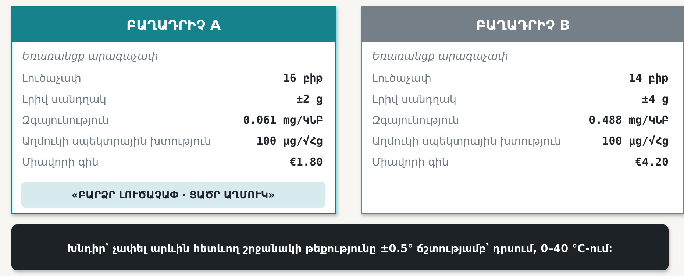
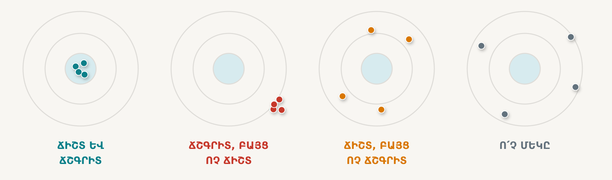
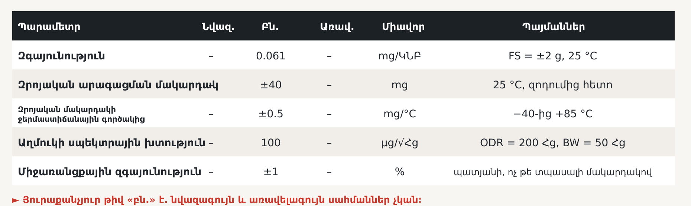

# 2 · Տեխնիկական բնութագրեր և բաղադրիչի ընտրություն

## Ի՞նչ պետք է կարողանաք կատարել այս գլուխն ուսումնասիրելուց հետո

1. **Տարբերակել** ճշտությունը, ճշգրտությունը, լուծաչափը և զգայունությունը, ինչպես նաև պարամետրերը դասակարգել որպես ստատիկ կամ դինամիկ բնութագրեր։
2. **Գտնել** իրական տվյալների թերթիկում պահանջվող արժեքը՝ այն պայմանների հետ միասին, որոնցում այն չափվել է, և նշել աշխատանքի առնվազն մեկ սահմանափակում, որը տվյալների թերթիկը չի կարող բնութագրել։
3. **Հաշվարկել** աղմուկով սահմանափակված լուծաչափը՝ աղմուկի սպեկտրային խտությունից և հաճախականային թողունակությունից, ապա որոշել՝ գերակշռում է աղմո՞ւկը, թե՞ քվանտացումը։
4. **Ընտրել** թեկնածու սարքերից մեկը՝ կազմելով սխալների հաշվեկշիռ, և հիմնավորել ընտրությունը՝ նշելով գերակշռող սխալի բաղադրիչը։

---

## 2.1 Երկու առաջին էջ

Տեխնիկական բնութագիրն արդեն կազմված է։ Այժմ պետք է ընտրել և գնել համապատասխան բաղադրիչը։ Գոյություն ունեն հազարավոր տարբերակներ, բոլոր թվերը հրապարակված են, տվյալների թերթիկներն էլ անվճար հասանելի են։ Հետևաբար թվում է, թե ընտրությունը պարզապես աղյուսակում արժեք գտնելու խնդիր է։

Դիտարկենք հետևյալ խնդիրը․

> Արևին հետևող համակարգի շրջանակի թեքության անկյունը պետք է չափվի **±0.5°** ճշտությամբ՝ բացօթյա պայմաններում և շրջակա միջավայրի **0-ից 40 °C** ջերմաստիճանային տիրույթում։ Համակարգը մեկ անգամ չափաբերվելու է լաբորատոր պայմաններում՝ 20 °C ջերմաստիճանում։

Ստորև ներկայացված են երկու թեկնածու արագաչափերը՝ ինչպես դրանք գովազդվում են տվյալների թերթիկների առաջին էջերում։

**Նկար 2.1** — Երկու թեկնածու արագաչափերի գովազդային տվյալները։ A բաղադրիչն առաջարկում է ութ անգամ ավելի մանր լուծաչափ՝ կրկնակիից ավելի ցածր գնով, և դա ընդգծված է։ B բաղադրիչը որևէ գովազդային պնդում չունի։ *(Ներկայացված թվերը բնորոշ առևտրային արժեքներ են, ոչ թե կոնկրետ արտադրանքի տվյալներ․ դրանք ընտրվել են, որպեսզի այս գլխի հաշվարկները ճշգրիտ լինեն։)*

Ո՞ր բաղադրիչը կընտրեիք։ Նախքան շարունակելը՝ որոշում կայացրեք։

Ճարտարագետների մեծ մասն ընտրում է A բաղադրիչը, և այդ ընտրությունը սովորաբար անհիմն չէ․ 16 բիթն իսկապես ավելի լավ է, քան 14-ը, իսկ €1.80-ն իսկապես ավելի քիչ է, քան €4.20-ը։ Սակայն այս գլխի ավարտին կկարողանաք ցույց տալ, որ **A բաղադրիչը չի բավարարում պահանջին**, մինչդեռ **B բաղադրիչն այն բավարարում է քառակի պաշարով**, և վճռորոշ պարամետրը նշված չէ դրանցից ոչ մեկի առաջին էջում։

---

## 2.2 Նախ պահանջը վերածենք թվային արժեքի

Անկյան համար ուղղակի սխալների հաշվեկշիռ կազմել հնարավոր չէ։ Ուստի նախքան տվյալների որևէ թերթիկ ուսումնասիրելը պահանջը պետք է վերածել այն ֆիզիկական մեծության, որն իրականում չափում է տվիչը։

Հանգիստ վիճակում թեքված արագաչափը չափում է ծանրության արագացման համապատասխան բաղադրիչը։ Հորիզոնականից θ անկյան դեպքում զգայուն առանցքի երկայնքով բաղադրիչը հավասար է *g* sin θ-ի։ Հետևաբար կես աստիճան թեքությանը համապատասխանում է՝

$$ \sin(0.5^\circ)\times1g=0.008727g=8.73\ \text{mg} $$

Գրեք այս թիվը և պահեք տեսանելի տեղում ամբողջ գլխի ընթացքում։

> **8.73 mg-ը մեր չափման ամբողջ օգտակար ազդանշանն է։**

Այսուհետ յուրաքանչյուր սխալի բաղադրիչ համեմատվում է 8.73 mg-ի հետ։ Դրանից մեծ ցանկացած սխալ անընդունելի է։ Դրանից շատ փոքր ցանկացած սխալ գործնականում աննշան է՝ անկախ նրանից, թե որքան տպավորիչ է այն ներկայացվում առաջին էջում։ Այս մեկ փոխակերպումը «ո՞րն է ավելի լավ» կարծիքային հարցը վերածում է թվաբանական խնդրի։

---

## 2.3 Չորս հաճախ շփոթվող հասկացություն

Տվիչների վերաբերյալ ճարտարագիտական վեճերի մեծ մասը իրականում վերաբերում է այս չորս հասկացություններին։

**Նկար 2.2** — Նույն թիրախը և չորս տարբեր չափիչ սարքեր։ Կենտրոնը *իրական* արժեքն է։

**Ճշգրտությունը (precision)** ցույց է տալիս, թե որքան սերտ են խմբավորված արդյունքները։ **Ճշտությունը (accuracy)** ցույց է տալիս, թե արդյունքների խումբը որքան մոտ է իրական արժեքին։ Սրանք միմյանցից անկախ հատկություններ են։ Երկրորդ թիրախը՝ սերտ խմբավորված, սակայն ամբողջովին սխալ արդյունքներով, վտանգավոր չափիչ սարքի օրինակ է, քանի որ բոլոր ցուցմունքները համընկնում են միմյանց հետ, բայց նույն չափով շեղված են իրական արժեքից։

**Լուծաչափը** նկարում ընդհանրապես ներկայացված չէ։ Այն ցույց է տալիս, թե որքան մանր քայլով կարելի է *ներկայացնել* արդյունքը։ Սխալ դիրքը նույնպես կարելի է հաղորդել ստորակետից հետո վեց թվանշանով․ հենց այս թակարդն է ստեղծում A բաղադրիչը։

**Զգայունությունը** մեկ այլ բնութագիր է․ այն ելքային մեծության փոփոխությունն է մուտքային մեծության միավոր փոփոխության դեպքում։ Մեր արագաչափի համար այն արտահայտվում է mg/ԿՆԲ-ով։ Զգայունությունը սահմանում է սանդղակի բաժանումը, ոչ թե ցուցմունքի հավաստիությունը։

Դիտարկենք կոնկրետ օրինակ։ Ճնշման տվիչը գտնվում է խցում, որտեղ իրական ճնշումը հաստատուն է և հավասար է 1000.0 հՊա-ի։ Այն ընթերցվում է հարյուր անգամ, և բոլոր ցուցմունքները գտնվում են 1012.3–1012.5 հՊա միջակայքում։

Սարքը **ճշգրիտ է, բայց ոչ ճշտորեն չափող**․ այն գերազանց կրկնելիություն ունի, սակայն սխալվում է 12.4 հՊա-ով։ Սա առաջացնում է գլխի հետագա նյութի համար առանցքային հարցը․

> **Այս երկու խնդիրներից ո՞րը կարելի է վերացնել չափաբերմամբ։**

12.4 հՊա հաստատուն շեղումը՝ **այո**։ Այն մեկ անգամ չափեք հենակային սարքի նկատմամբ և հանեք արդյունքից։

0.2 հՊա պատահական ցրումը՝ **ոչ**։ Պատահական ցրումը չափաբերմամբ չի վերացվում։ Այն կարելի է միայն նվազեցնել միջինացմամբ, իսկ միջինացումը նվազեցնում է հաճախականային թողունակությունը։ Եթե աղմուկը չորս անգամ նվազեցնելու համար միջինացնեք տասնվեց նմուշ, ապա չափիչ սարքը կդառնա նաև տասնվեց անգամ ավելի դանդաղ։

Այսպիսով ստանում ենք մի կանոն, որն արժե հիշել․ այն Գլուխ 14-ի և մի շարք լաբորատոր աշխատանքների հիմքն է։

> **Համակարգային սխալը չափաբերման խնդիր է։**  
> **Պատահական սխալը հաճախականային թողունակության խնդիր է։**  
> **Դրեյֆը բաղադրիչի ընտրության խնդիր է։**

Երրորդ տողն ամենահաճախն է խափանում նախագծերը։ Դրեյֆի դեպքում սարքը կարող է անցնել բոլոր փորձարկումները 22 °C լաբորատոր ջերմաստիճանում, բայց ձմռանը խափանվել շահագործման վայրում, քանի որ չափաբերումից հետո պարամետրը *փոփոխվում է*։ Այն մեծությունը, որը փոխվում է ձեր դիտարկումներից անկախ, մեկանգամյա չափաբերմամբ վերացնել հնարավոր չէ։

---

## 2.4 Տերմինաբանության դասակարգում

Տվյալների թերթիկները կառուցվում են այս տերմինաբանության հիման վրա, ուստի այն անհրաժեշտ է հստակ դասակարգել։ **Ստատիկ** բնութագրերը նկարագրում են սարքի վարքը անփոփոխ պայմաններում, իսկ **դինամիկ** բնութագրերը՝ փոփոխվող գործընթացների դեպքում։

| Ստատիկ բնութագիր | Նշանակություն |
|---|---|
| Տիրույթ | չափելի նվազագույնից մինչև առավելագույն արժեքների միջակայքը |
| Զգայունություն | մուտքի միավոր փոփոխությանը համապատասխանող ելքի փոփոխությունը |
| Լուծաչափ | տարբերակելի նվազագույն փոփոխությունը |
| Շեմ | որևէ ելքային փոփոխություն առաջացնող նվազագույն մուտքային ազդեցությունը |
| Զրոյական շեղում | ելքային արժեքը զրոյական մուտքի դեպքում |
| Գծայնություն | իրական բնութագրի շեղումը ուղիղ գծից |
| Հիստերեզիս | ցուցմունքի կախվածությունը այն բանից, թե տվյալ արժեքին ո՞ր ուղղությունից ենք մոտեցել |
| Կրկնելիություն | նույն մուտքին համապատասխանող նույն ելքը՝ ավելի ուշ կատարված կրկնակի չափման դեպքում |

| Դինամիկ բնութագիր | Նշանակություն |
|---|---|
| Հաճախականային թողունակություն | առավելագույն հաճախականությունը, որը վերարտադրվում է հավաստիորեն |
| Արձագանքման ժամանակ | ցատկաձև մուտքից հետո հաստատման համար անհրաժեշտ ժամանակը |
| Ելքային տվյալների հաճախություն (ODR) | մեկ վայրկյանում հաղորդվող նմուշների քանակը․ **նույնը չէ, ինչ թողունակությունը** |
| Աղմուկի սպեկտրային խտություն | աղմուկը մեկ √Հց-ի հաշվով, որը թողունակության ընտրությունից հետո վերածվում է ՄՔՄ արժեքի |
| Խմբային ուշացում | զտված արդյունքի ժամանակային ուշացումը |
| Խաչաձև զգայունություն | արձագանքը այն առանցքի կամ մեծության նկատմամբ, որը չէիք ցանկանում չափել |
| Դրեյֆ | ժամանակի և ջերմաստիճանի հետ դանդաղ փոփոխությունը |

**Աղյուսակ 2.1** — Ստատիկ և դինամիկ բնութագրեր։ Երկու կետ պետք է հատուկ ընդգծել։

**ODR-ը հաճախականային թողունակություն չէ։** Տվիչը կարող է վայրկյանում երկու հարյուր թիվ հաղորդել, բայց 50 Հց-ից բարձր ազդանշանային բաղադրիչների մասին որևէ հավաստի տեղեկություն չտրամադրել։ Այս երկուսի շփոթումը գլխի հաշվարկներում ամենատարածված սխալն է, իսկ §2.6-ը ցույց է տալիս դրա հետևանքը։

**Խաչաձև զգայունությունն** առկա է յուրաքանչյուր իրական սարքում․ *x* առանցքով թրթռեցվող արագաչափը փոքր ազդանշան է հաղորդում նաև *z* առանցքով։ Կարևոր պատճառով դրան կրկին կանդրադառնանք §2.8-ում։

---

## 2.5 Նախ կարդացեք պայմանները, ապա՝ թիվը

Տվյալների թերթիկը իրավական փաստաթուղթ է, ոչ թե անվերապահ խոստում։ Վերնագիրը գտնվում է առաջին էջում, իսկ իրականությունը՝ չափման պայմանների սյունակում։

**Նկար 2.3** — Արագաչափի տվյալների թերթիկից բնորոշ հատված։ Առաջինը կարդացեք ամենաաջ սյունակը։

Նկար 2.3-ի երկու առանձնահատկություն տարածվում է գրեթե բոլոր տվիչների տվյալների թերթիկների վրա։

**Յուրաքանչյուր արժեք «typ» է՝ բնորոշ արժեք։** Նվազագույն և առավելագույն արժեքներ նշված չեն։ Ձեզ հաղորդվում է արտադրական խմբաքանակի *միջին արժեքը*, ոչ թե երաշխավորված սահմանը։ Եթե նախագիծն աշխատում է միայն բնորոշ պարամետրերով նմուշի դեպքում, ապա արտադրանքի մոտ կեսը կարող է չաշխատել։ Դա կբացահայտվի մեծաքանակ արտադրության փուլում՝ հնարավոր ամենաանբարենպաստ պահին։

**Պայմանները տարբեր են յուրաքանչյուր տողի համար։** Զգայունությունը նշված է 25 °C-ում։ Ջերմաստիճանային գործակիցը տրված է 125 °C տիրույթի համար։ Աղմուկի սպեկտրային խտությունը նշված է որոշակի թողունակության դեպքում։ **Տպված ձևով այս տողերը միմյանց հետ ուղղակիորեն համադրելի չեն** և, առավել ևս, չեն կարող համեմատվել մրցակից արտադրողի համապատասխան տողերի հետ, քանի դեռ չեք ստուգել պայմանների նույնականությունը։

Ուստի տվյալների թերթիկը կարդացեք աջից ձախ՝ **նախ պայմանները, ապա պարամետրի անվանումը և վերջում միայն թվային արժեքը**։ Մարդկանց մեծ մասը կարդում է ճիշտ հակառակ հերթականությամբ և շահագործման ժամանակ բախվում անակնկալների։

---

## 2.6 Հաշվարկային օրինակ․ սխալների հաշվեկշիռը

Այժմ ունենք A և B բաղադրիչների միջև ընտրություն կատարելու համար անհրաժեշտ ամեն ինչ։ Պետք է հաշվի առնել չորս բաղադրիչ։

### Բաղադրիչ 1 · Աղմուկ

Աղմուկի սպեկտրային խտությունը դեռևս ամբողջական աղմուկային արժեք չէ։ Այն այդպիսին է դառնում միայն հաճախականային թողունակությունն ընտրելուց հետո․

$$ noise_{RMS}=noise\ density\times\sqrt{bandwidth} $$

Մենք չափում ենք ստատիկ կողմնորոշում, ուստի կարող ենք ընտրել համեմատաբար փոքր թողունակություն՝ 50 Հց։ Երկու սարքերի համար էլ նշված է 100 µg/√Հց․

$$ 100\ \mu g/\sqrt{Hz}\times\sqrt{50\ Hz}=100\times7.07=707\ \mu g=0.707\ mg $$

Ստուգեք միավորները, քանի որ սովորաբար սխալվում են ոչ թե ֆիզիկայում, այլ միավորների կրճատման ժամանակ․ µg/√Հց × √Հց = µg։ Եթե միավորները չեն կրճատվում, կիրառվել է սխալ մեծություն։

**Ուշադրություն դարձրեք, թե ինչ *չօգտագործեցինք*։** Տվյալների թերթիկում այս արժեքը նշված էր 200 Հց ODR-ի և 50 Հց թողունակության դեպքում։ √200-ի կիրառումը կտար 1.41 mg՝ սխալ, բայց միանգամայն իրատեսական թվացող պատասխան։ Պետք է կիրառել **թողունակությունը, ոչ թե ODR-ը**։

Այստեղից հետևում է կարևոր եզրակացություն։ Աղմուկը միայն տվիչի հատկություն չէ․ այն տվիչի *և ընտրված թողունակության* համատեղ արդյունքն է։ Եթե օգտակար ազդանշանը թույլ է տալիս, թողունակությունը երկու անգամ նվազեցնելով՝ աղմուկը առանց այլ ծախսի բարելավում ենք √2 անգամ։ Արագ գործընթացներ որսալու համար թողունակությունը մեծացնելիս աղմուկով ենք վճարում։ Սա նույն փոխզիջումն է, որը Գլուխ 1-ի շարժիչի մոնիտորում սխալ էր ընտրվել՝ այժմ դիտված հակառակ կողմից։

### Բաղադրիչ 2 · Քվանտացում

Մոտակա կոդին կլորացնելը ստեղծում է մեկ կրտսեր նշանակալի բիթը √12-ի բաժանածին հավասար ՄՔՄ սխալ․

$$ A:\quad 0.061/3.464=0.018\ mg \qquad B:\quad 0.488/3.464=0.141\ mg $$

Երկու արժեքներն էլ աննշան են 8.73 mg-ի համեմատ։ Սա նշանակում է, որ A բաղադրիչի գովազդվող ութ անգամ ավելի մանր լուծաչափն ապահովում է մոտ 0.12 mg առավելություն մի սխալի բաղադրիչում, որն առանց այդ էլ անտեսանելի էր։

### Բաղադրիչ 3 · Զրոյական շեղում

A բաղադրիչի զրոյական արագացման շեղումը ±40 mg է, իսկ B-ինը՝ ±10 mg։ Երկուսն էլ շատ ավելի մեծ են, քան 8.73 mg չափվող ազդանշանը, սակայն երկուսն էլ հաշվեկշռում **դառնում են զրո**, քանի որ սարքը մեկ անգամ չափաբերում ենք 20 °C լաբորատոր ջերմաստիճանում և արդյունքից հանում չափված շեղումը։ Սա չափաբերմամբ վերացվող բաղադրիչ է, և հենց այդ պատճառով մեծ սկզբնական շեղումը պարտադիր չէ, որ սարքը դարձնի անընդունելի։

### Բաղադրիչ 4 · Զրոյական շեղման դրեյֆ

Ահա այն բաղադրիչը, որը սկզբում ոչ ոք չէր հաշվարկել։

Զրոյական շեղումը չի մնում չափաբերման պահին ունեցած արժեքում։ Այն ջերմաստիճանի հետ փոխվում է տվյալների թերթիկում նշված ջերմաստիճանային գործակցով։ Չափաբերումն իրականացվում է 20 °C-ում, իսկ շահագործման տիրույթը 0–40 °C է։ Հետևաբար ջերմաստիճանի վատագույն փոփոխությունը ΔT = ±20 °C է․

$$ A:\quad 0.5\ mg/^\circ C\times20\ ^\circ C=10.0\ mg \qquad B:\quad 0.1\times20=2.0\ mg $$

**A բաղադրիչի դրեյֆը 10 mg է, մինչդեռ մեր ամբողջ օգտակար ազդանշանը 8.73 mg է։** Սխալը մեծ է ազդանշանից և առաջանում է *չափաբերումից հետո*, ուստի լաբորատոր մեկանգամյա ստուգմամբ այն հնարավոր չէ հայտնաբերել կամ վերացնել։

### Բաղադրիչների համակցում

Այս սխալի աղբյուրներն անկախ են, ուստի համակցվում են քառակուսիների գումարի քառակուսի արմատով (RSS)․

$$ \varepsilon_{total}=\sqrt{\varepsilon_{noise}^2+\varepsilon_{quant}^2+\varepsilon_{drift}^2} $$

| Սխալի բաղադրիչ | A բաղադրիչ | B բաղադրիչ |
|---|---:|---:|
| Աղմուկ՝ 100 µg/√Հց × √50 Հց | 0.707 mg | 0.707 mg |
| Քվանտացում՝ ԿՆԲ/√12 | 0.018 mg | 0.141 mg |
| Զրոյական շեղման դրեյֆ՝ ՋԳ × ΔT | **10.000 mg** | **2.000 mg** |
| **Ընդհանուր (RSS)** | **10.02 mg** | **2.13 mg** |
| Համարժեք թեքության անկյուն՝ arcsin(mg/1000) | **0.574°** | **0.122°** |
| Համեմատություն ±0.5° պահանջի հետ | **չի բավարարում** | **բավարարում է՝ 4× պաշարով** |

**Աղյուսակ 2.2** — Սխալների հաշվեկշիռը։ Թողունակությունը՝ 50 Հց, չափաբերումը՝ 20 °C, շահագործումը՝ 0–40 °C։

Ուշադրություն դարձրեք RSS հաշվարկի ազդեցությանը։ 10 mg-ը 0.707 mg-ի հետ համակցելիս ստացվում է 10.02 mg․ աղմուկի բաղադրիչը, որի հաշվարկին կես էջ հատկացվեց, արդյունքը փոխեց ընդամենը mg-ի մի քանի հարյուրերորդականով։

> **Սխալների ցանկացած հաշվեկշռում նախ գտեք ամենամեծ բաղադրիչը։ Մնացածը երկրորդական է։**

### Եզրակացություն

**A բաղադրիչը B-ից ութ անգամ ավելի մանր լուծաչափ ունի, բայց չի կատարում խնդիրը։** B բաղադրիչի 0.488 mg/ԿՆԲ զգայունությունն արդեն համապատասխանում է թեքության 0.028° լուծաչափի, որը պահանջվող կես աստիճանից տասնութ անգամ մանր է։ Հետևաբար լուծաչափը երբեք որոշիչ պարամետր չէր։ Այն պարզապես այդպիսին էր թվում, քանի որ առաջին էջում ընդգծված թիվն էր։

Հաշվի առեք նաև ընտրության վրա ազդող գործոնները։ A բաղադրիչն ավելի էժան էր, ավելի բարձր լուծաչափ ուներ և կրում էր գրավիչ մարքեթինգային պնդում։ Բոլոր տեսանելի ազդակները մատնանշում էին հենց այն բաղադրիչը, որը չի բավարարում պահանջին։

Եթե գլխի սկզբում ընտրել էիք «միայն առաջին էջերի հիման վրա հնարավոր չէ որոշել» պատասխանը, ապա ճիշտ էիք՝ ամենակարևոր պատճառով։ Եթե ընտրել էիք A-ն, վարվել էիք այնպես, ինչպես ճարտարագետների մեծ մասը։ Եթե այժմ ընտրում եք B-ն, կարող եք այն հիմնավորել թվով, իսկ նախագծային քննարկմանը դիմանում է միայն այդպիսի հիմնավորումը։

---

## 2.7 Ձեր լաբորատոր սեղանի բաղադրիչը

A և B բաղադրիչները ստեղծված էին հաշվարկները պարզ ներկայացնելու նպատակով։ Այժմ կատարենք նույնը իրական սարքի՝ լաբորատոր աշխատանքում կիրառվող **ST ISM330DHCXTR** արդյունաբերական դասի վեցառանցք իներցիալ մոդուլի համար։ Տվյալների թերթիկում արագաչափի վերաբերյալ նշված է հետևյալը։

| Պարամետր | Նվազ. | **Բն.** | Առավ. | Միավոր |
|---|---:|---:|---:|---|
| Զգայունություն, ±2 g լրիվ սանդղակ |  | 0.061 |  | mg/ԿՆԲ |
| Զգայունության թույլատրելի շեղում | −2 |  | +2 | % |
| Արագացման աղմուկի սպեկտրային խտություն, բարձր արտադրողականության ռեժիմ |  | **60** | **100** | µg/√Հց |
| Զրոյական արագացման շեղման ճշտություն | −65 | **±10** | +65 | mg |
| Զրոյական արագացման շեղման ջերմաստիճանային փոփոխություն | −0.5 | **±0.1** | +0.5 | mg/°C |
| Զգայունության փոփոխությունը ջերմաստիճանից, −40-ից +105 °C | −0.01 | ±0.005 | +0.01 | %/°C |
| Միջառանցքային զգայունություն, **T = 25 °C-ում** |  | ±0.5 |  | % |
| Աշխատանքային ջերմաստիճանային տիրույթ | −40 |  | +105 | °C |

**Աղյուսակ 2.3** — ISM330DHCX արագաչափի բնութագրերը՝ DS13012 Rev 6 տվյալների թերթիկից։ Դիզայնը որոշող երկու սյունակներում՝ աղմուկի սպեկտրային խտության և զրոյական շեղման ջերմաստիճանային դրեյֆի համար, տրված են և՛ բնորոշ, և՛ առավելագույն արժեքները։

Այժմ նույն սխալների հաշվեկշիռը կատարենք երկու անգամ՝ նախ բնորոշ, ապա առավելագույն արժեքներով։ Թողունակությունը 50 Հց է, սարքը չափաբերվում է 20 °C-ում և շահագործվում 0–40 °C տիրույթում, ուստի ΔT = ±20 °C է։

| Սխալի բաղադրիչ | **Բնորոշ** արժեքներով | **Առավելագույն** արժեքներով |
|---|---:|---:|
| Աղմուկ՝ սպեկտրային խտություն × √50 Հց | 0.424 mg | 0.707 mg |
| Քվանտացում՝ 0.061/√12 | 0.018 mg | 0.018 mg |
| Զրոյական շեղման դրեյֆ՝ ՋԳ × 20 °C | **2.000 mg** | **10.000 mg** |
| **Ընդհանուր (RSS)** | **2.05 mg** | **10.02 mg** |
| Համարժեք թեքության անկյուն | **0.117°** | **0.574°** |
| Համեմատություն ±0.5° պահանջի հետ | **բավարարում է՝ 4× պաշարով** | **չի բավարարում** |

**Աղյուսակ 2.4** — Նույն բաղադրիչը, նույն պահանջը և նույն հաշվարկը, սակայն տվյալների թերթիկի տարբեր սյունակներով։

Կրկին դիտարկեք այս աղյուսակը, քանի որ այն գլխի ամենակարևոր աղյուսակն է։

**Սա նույն սարքն է։** Մենք չենք համեմատում լավ և վատ բաղադրիչներ։ ISM330DHCX-ի բնորոշ նմուշը հեշտությամբ բավարարում է թեքության պահանջը, իսկ հրապարակված բնութագրի սահմանային արժեք ունեցող նմուշը **չի բավարարում** այն։ Երկու նմուշներն էլ լիովին համապատասխանում են արտադրողի բնութագրին, երկուսն էլ կանցնեն մուտքային հսկողությունը և կարող են մատակարարվել նույն ժապավենի մեջ։

Այդ դեպքում ինչպե՞ս վարվել։

- Եթե տեխնիկական բնութագրի կատարումը պետք է **երաշխավորվի**, սխալների հաշվեկշիռը կազմեք **առավելագույն** արժեքներով։ Այս մոտեցմամբ նախագիծը չի բավարարում պահանջին և անհրաժեշտ է փոխել լուծումը՝ նեղացնել ջերմաստիճանային տիրույթը, չափել ջերմաստիճանն ու փոխհատուցել զրոյական շեղումը (Գլուխ 14), կամ թուլացնել ±0.5° պահանջը։
- Եթե պատրաստում եք տասը սարք և կարող եք յուրաքանչյուրն առանձին չափել, բնորոշ արժեքների ու յուրաքանչյուր սարքի անհատական չափաբերման կիրառումը պաշտպանելի ճարտարագիտական որոշում է՝ պայմանով, որ այն հստակ փաստաթղթավորվի։
- **Չի կարելի** հաշվարկը կատարել `typ` արժեքներով և ստացված արդյունքը ներկայացնել որպես երաշխիք։ Սա է ճարտարագիտական փաստաթղթի և հույսի տարբերությունը։

Նկատեք նաև, թե իրականում ինչ էին ներկայացնում մեր պայմանական բաղադրիչները։ A-ի թվերը՝ ±40 mg շեղում, ±0.5 mg/°C և 100 µg/√Հց, գրեթե համապատասխանում էին այս իրական սարքի **վատագույն դեպքին**, իսկ B-ի թվերը՝ ±10 mg և ±0.1 mg/°C, դրա **բնորոշ դեպքին**։ Դասը նույնն է, սակայն այն այլևս հնարավոր չէ անտեսել որպես երկու տարբեր բաղադրիչների միջև պայմանական ընտրություն, քանի որ այժմ խոսքը նույն բաղադրիչի մասին է։

> **Տվյալների թերթիկը չի նկարագրում ձեր կոնկրետ սարքը։ Այն նկարագրում է այն համախումբը, որից ընտրվել է ձեր սարքը։**

---

## 2.8 Ինչ չի կարող հայտնել տվյալների թերթիկը

Կրկին դիտարկեք Աղյուսակ 2.3-ի միջառանցքային զգայունության տողը։ ISM330DHCX-ի համար նշված է ±0.5 %՝ իրական, հրապարակված արժեք։ Այժմ ձևակերպենք փոքր-ինչ այլ հարց․

> **Որքա՞ն է այս սարքի միջառանցքային զգայունությունը՝ իմ տպասալի վրա զոդելուց հետո։**

Այդ արժեքը չկա և չի էլ կարող լինել տվյալների թերթիկում։ Դիտարկեք հրապարակված արժեքին կցված պայմանը՝ **T = 25 °C**, արտադրողի կողմից չափված պատյանավորված բյուրեղի համար։ Սակայն տպասալի վրա տեղակայման մեխանիկական լարումները, զոդման միացումների անհամաչափությունը, տպասալի ջերմաստիճանային գրադիենտներն ու ծռումը փոխում են այդ պարամետրը։ Արտադրողը չի կարող իմանալ, թե ձեր տպասալն ինչպես է ազդում իր բաղադրիչի վրա։

Հետևաբար ազնիվ ճարտարագիտական պատասխանը պետք է լինի առաջին դեմքով․ *տվյալների թերթիկը չի կարող ինձ հայտնել այս արժեքը, և ես պետք է այն չափեմ իմ հավաքված տպասալի վրա*։ Այս սովորույթի ձևավորումը գլխի ամենակարևոր նպատակներից է։ Այդ պատճառով լաբորատոր աշխատանքների ծրագրում ներառված են ոչ միայն սարքի գործարկման, այլև դրա բնութագրման աշխատանքներ։

Նույնը վերաբերում է Գլուխ 1-ի մեխանիկական կապակցմանը, պատյանի ներսում իրական ջերմային պայմաններին և այն աղմուկին, որը կարող է առաջանալ զգայուն անալոգային ուղին իմպուլսային կայունարարի կողքով անցկացնելու հետևանքով։ **Տվյալների թերթիկը նկարագրում է բաղադրիչը, իսկ դուք կառուցում եք համակարգ։**

---

## 2.9 Ընտրություն և չափազանցված ընտրություն

Ընտրությունը տեխնիկական պահանջի նկատմամբ կատարվող հաշվարկ է, որը պետք է փաստաթղթավորվի այնպես, որ մեկ այլ մասնագետ կարողանա ստուգել այն։ Բավարար է չափանիշների պարզ աղյուսակը, եթե կշիռները ազնվորեն են սահմանված։

Դիտարկենք երրորդ թեկնածուն՝ **C բաղադրիչը**․ 16 բիթ, ±2 g, 60 µg/√Հց, զրոյական շեղում՝ ±5 mg, ջերմաստիճանային գործակից՝ ±0.05 mg/°C, հոսանք՝ 0.9 մԱ, գին՝ €11.50։

| Չափանիշ | Կշիռ | A | B | C |
|---|---|---:|---:|---:|
| Բավարարում է ±0.5° պահանջին 0–40 °C-ում | անցնում/չի անցնում | ոչ | այո | այո |
| Ընդհանուր սխալը՝ արտահայտված անկյունով | բարձր | 0.574° | 0.122° | 0.06° |
| Միավորի գինը՝ 500 հատի դեպքում | միջին | €1.80 | €4.20 | €11.50 |
| Սպառվող հոսանք | միջին | 0.15 մԱ | 0.18 մԱ | 0.90 մԱ |
| Արդեն առկա է ծրագրային գրադարան | **ցածր** | այո | ոչ | ոչ |

**Աղյուսակ 2.5** — Ընտրության չափանիշների աղյուսակ։ Ուշադրություն դարձրեք վերջին տողի կշռին։

C-ն աղյուսակի տեխնիկապես լավագույն բաղադրիչն է։ Միևնույն ժամանակ այն **սխալ ընտրություն է**՝ ուսանելի պատճառով։ 500 սարքի դեպքում այն B-ից €3650-ով թանկ է, սպառում է հինգ անգամ ավելի շատ հոսանք և չի ապահովում պահանջով սահմանված որևէ լրացուցիչ օգտակար հնարավորություն։ Չափազանց բարձր բնութագրերով բաղադրիչի ընտրությունը նույնպես ճարտարագիտական սխալ է՝ թերագնահատումից ավելի աննկատ, բայց այն նույնպես պետք է հիմնավորել։

Վերջին տողից հետևում է դասընթացում մշտապես կիրառվող ևս մեկ կանոն․

> **Երբեք մի ընտրեք բաղադրիչը միայն այն պատճառով, որ դրա համար ծրագրային գրադարան գոյություն ունի։**

Գրադարանը իրական առավելություն է և կարող է մեկ շաբաթ աշխատանք խնայել, սակայն այն տեխնիկական բնութագիր չէ։ Այն դասեք վերջին տեղում, բայց մի անտեսեք ամբողջությամբ։ A բաղադրիչն ուներ գրադարան, սակայն չէր կատարում խնդիրը։

Փոխարենը ընտրեք այն հատկանիշներով, որոնք հնարավորություն են տալիս իրականացնել անհրաժեշտ ճարտարագիտական աշխատանքը՝ ընտրելի չափման տիրույթ և ելքային տվյալների հաճախություն, փաստաթղթավորված թողունակություն և աղմուկ, ինքնաստուգման գործառույթ, տվյալների պատրաստ լինելու ընդհատում, անհրաժեշտության դեպքում FIFO հիշողություն, հասանելի ռեգիստրային քարտեզ և ամբողջական տվյալների թերթիկ։

---

## 2.10 Ընթերցանության նյութեր

Այս գլխի հիմնական նյութը համապատասխանում է **Morris & Langari, *Measurement and Instrumentation*, 3-րդ հրատարակություն (Elsevier, 2020), Գլուխ 2՝ «Instrument Types and Performance Characteristics»** աշխատությանը։ Այն կարդացեք Աղյուսակ 2.1-ի ստատիկ և դինամիկ բնութագրերի պաշտոնական սահմանումների և հաշվարկային օրինակների համար։

Նույն գրքի **Գլուխ 3-ը՝ «Measurement Uncertainty»**, և **Գլուխ 4-ը՝ «Statistical Analysis of Measurements Subject to Random Errors»**, շատ ավելի մանրամասն են ներկայացնում սխալների համակցումը, ներառյալ Աղյուսակ 2.2-ում կիրառված քառակուսիների գումարի քառակուսի արմատի կանոնը։ Այս նյութին կրկին կանդրադառնանք Գլուխ 14-ում, իսկ նախնական ընթերցումը կօգնի սխալների վերոնշյալ հաշվեկշիռն ընկալել ոչ թե որպես մեխանիկական բաղադրատոմս, այլ որպես հիմնավորված մեթոդ։

Այնուհետև ուսումնասիրեք ձեր լաբորատոր սեղանին գտնվող **ISM330DHCX-ի տվյալների թերթիկի (DS13012)** էլեկտրական բնութագրերի բաժինը։ Սա լրացուցիչ, կամընտրական նյութ չէ։ Այս գլխից սկսած յուրաքանչյուր լաբորատոր աշխատանք ենթադրում է, որ կարող եք իրական փաստաթղթում գտնել անհրաժեշտ թիվը և դրա չափման պայմանները։ Արդյունքում պետք է ինքնուրույն ստանաք Աղյուսակ 2.3-ը․ անհրաժեշտ հմտությունը հենց այդ արդյունքին ինքնուրույն հասնելն է։

*Գլուխների և բաժինների համարակալումը պետք է ստուգել ձեզ հասանելի հրատարակության համաձայն։*

---

## 2.11 Վարժություններ

**2.1** Սահմանեք ճշտությունը, ճշգրտությունը և լուծաչափն այնպես, որ երեք հասկացությունները հնարավոր չլինի շփոթել։ Բերեք ճշգրիտ, բայց ոչ ճշտորեն չափող սարքի օրինակ։

**2.2** Հետևյալներից որո՞նք կարող է վերացնել մեկ կետում կատարված լաբորատոր չափաբերումը՝ զրոյական շեղումը, պատահական աղմուկը, ջերմաստիճանային դրեյֆը, քվանտացումը։ Հիմնավորեք յուրաքանչյուր պատասխանը։

**2.3** Տվիչի աղմուկի սպեկտրային խտությունը 150 µg/√Հց է։ Անհրաժեշտ է 20 Հց թողունակություն։ ա) Հաշվեք աղմուկի ՄՔՄ արժեքը։ բ) Նշեք, թե ինչ տեղի կունենա թողունակությունը մինչև 80 Հց մեծացնելու դեպքում և քանի անգամ։

**2.4** Տվյալների թերթիկում նշված զրոյական շեղման ջերմաստիճանային գործակիցը ±0.3 mg/°C է։ Սարքը չափաբերվում է 25 °C-ում և շահագործվում −10-ից +60 °C տիրույթում։ Հաշվեք միայն դրեյֆով պայմանավորված զրոյական շեղման վատագույն սխալը և արտահայտեք այն թեքության անկյունով։

**2.5** Պահանջվում է չափել 8.73 mg ազդանշան։ Թեկնածու բաղադրիչն ունի 0.061 mg լուծաչափ և 10 mg զրոյական շեղման դրեյֆ աշխատանքային ջերմաստիճանային տիրույթում։ Մեկ նախադասությամբ բացատրեք, թե ինչու է սխալ այն անվանել «բարձր լուծաչափով լուծում»։

**2.6** Տվիչի տվյալների թերթիկում նշված է «լրիվ սանդղակի ±0.05 %» ճշտություն 25 °C-ում, սակայն ջերմաստիճանային գործակից որևէ տեղ տրված չէ։ Լրիվ սանդղակը 20 կՊա է։ ա) Որքա՞ն է ճշտությունը պասկալներով՝ 25 °C-ում։ բ) Ինչո՞ւ այս բաղադրիչը չի կարելի կիրառել բացօթյա շահագործման սխալների հաշվեկշռում՝ չնայած հայտարարված գերազանց ճշտությանը։

**2.7** Նշեք ձեր պատրաստի արտադրանքի աշխատանքը սահմանափակող մեկ հատկություն, որը տվյալների թերթիկը չի կարող բնութագրել, և նշեք, թե ով պետք է այն որոշի։

**2.8** Անհրաժեշտ է չափել բացօթյա բաքի ջրի մակարդակը 2 մ խորության տիրույթում՝ ±20 մմ ճշտությամբ, երբ ջրի ջերմաստիճանը 5–35 °C է։ P տվիչի ընդհանուր սխալի գոտին լրիվ սանդղակի ±0.25 %-ն է 0–50 °C-ում։ Q տվիչի համար նշված է լրիվ սանդղակի ±0.05 % ճշտություն 25 °C-ում, բայց ջերմաստիճանային գործակից չկա։ Երկուսի լրիվ սանդղակն էլ 20 կՊա է։ Ո՞րը կընտրեք և ինչո՞ւ։ Ջրի սյան 1 մմ-ը համապատասխանում է մոտ 9.81 Պա-ի։

**2.9** Աղյուսակ 2.3-ի տվյալներով հաշվեք ISM330DHCX-ի աղմուկի ՄՔՄ արժեքը 200 Հց թողունակության դեպքում՝ աղմուկի սպեկտրային խտության և՛ բնորոշ, և՛ առավելագույն արժեքներով։ Յուրաքանչյուր արդյունք արտահայտեք թեքության անկյունով։

**2.10** ISM330DHCX-ի զգայունության թույլատրելի շեղումը ±2 % է։ Չափում եք 1 g ծանրության արագացումը, իսկ սարքը հաղորդում է 1015 mg։ ա) Արդյո՞ք սարքի զգայունությունը համապատասխանում է բնութագրին։ բ) Լաբորատոր ո՞ր մեկ չափումը թույլ կտա ուղղել այդ սխալը, և դրանից հետո ի՞նչ սխալներ կմնան չուղղված։

**2.11** Արագաչափն ունի ընտրելի ±2 g, ±4 g, ±8 g և ±16 g տիրույթներ՝ հաստատուն 14-բիթ ելքով։ ա) Հաշվեք յուրաքանչյուր տիրույթի լուծաչափը՝ mg/ԿՆԲ։ բ) Պետք է տարբերակել 5 mg և առանց հագեցման դիմանալ 12 g հարվածների։ Ո՞ր տիրույթը պետք է ընտրել, և դա ինչպե՞ս կազդի լուծաչափի վրա։

---

## Պատասխաններ

**2.1** **Ճշտությունը** ցուցմունքի մոտիկությունն է իրական արժեքին և համակարգային հատկություն է։ **Ճշգրտությունը** ցուցմունքների կրկնելիությունն է սեփական միջին արժեքի շուրջ․ այն պատահական ցրման հատկություն է և ոչինչ չի ասում իրական արժեքի մասին։ **Լուծաչափը** ելքի միջոցով ներկայացվող նվազագույն փոփոխությունն է, այսինքն՝ ներկայացման սանդղակի, ոչ թե արդյունքի հավաստիության հատկություն։ Օրինակ՝ մեծ չուղղված զրոյական շեղմամբ, բայց շատ փոքր աղմուկով տվիչը, ինչպիսին §2.3-ի 1012.4 հՊա ցուցմունքով սարքն է։

**2.2** **Զրոյական շեղումը՝ այո**, այն ջերմաստիճանում, որում իրականացվել է չափաբերումը։ **Պատահական աղմուկը՝ ոչ**․ այն նվազեցնում է միայն միջինացումը, իսկ դա նվազեցնում է թողունակությունը։ **Ջերմաստիճանային դրեյֆը՝ ոչ**․ մեկ կետը համապատասխանում է միայն մեկ ջերմաստիճանի, ուստի դրեյֆը վերացնելու համար անհրաժեշտ է չափել ջերմաստիճանը և կիրառել փոխհատուցման մոդել։ **Քվանտացումը՝ ոչ**․ այն սահմանվում է ԿՆԲ-ով, թեև դիզերինգն ու միջինացումը կարող են մասամբ վերականգնել մեկ ԿՆԲ-ից փոքր մանրամասները։

**2.3** ա) 150 × √20 = 150 × 4.472 = 671 µg ≈ **0.67 mg**։ բ) 150 × √80 = 1342 µg ≈ **1.34 mg**՝ ճիշտ երկու անգամ ավելի մեծ, քանի որ թողունակությունն աճել է չորս անգամ, իսկ աղմուկը համեմատական է դրա քառակուսի արմատին։

**2.4** 25 °C չափաբերման կետից առավելագույն շեղումը մինչև 60 °C է, հետևաբար ΔT = 35 °C։ Վատագույն դրեյֆը 0.3 × 35 = **10.5 mg** է, որը համապատասխանում է arcsin(10.5/1000) ≈ **0.602°** թեքության։

**2.5** 0.061 mg լուծաչափը չափվող ազդանշանից մոտ 143 անգամ փոքր է, սակայն ջերմաստիճանային դրեյֆը գերազանցում է ամբողջ ազդանշանը․ այսինքն՝ լուծումը շատ մանր քայլով հաղորդում է սխալ արժեք, քանի որ բարձր լուծաչափը դեռևս բարձր ճշտություն չէ։

**2.6** ա) 20 կՊա-ի 0.05 %-ը **10 Պա** է։ բ) Քանի որ այդ ճշտությունը նշված է միայն 25 °C-ում, իսկ ջերմաստիճանային գործակիցը բացակայում է, բացօթյա ջերմաստիճաններում սխալը ոչ թե պարզապես անհայտ է, այլև սահմանափակված չէ հրապարակված բնութագրով։ Չի կարելի չսահմանված մեծությունը ներառել երաշխավորված սխալների հաշվեկշռում։

**2.7** Օրինակ՝ հավաքված տպասալի միջառանցքային զգայունությունը, տեղակայման մեխանիկական լարումները, զոդման միացումների անհամաչափությունը, տպասալի ջերմաստիճանային գրադիենտներն ու ծռումը կամ իմպուլսային կայունարարից զգայուն անալոգային ուղի ներթափանցող աղմուկը։ Այդ պարամետրը պետք է որոշի **համակարգը նախագծող և ինտեգրող կազմակերպությունը**՝ պատրաստի հավաքված հանգույցի վրա չափումներ կատարելով։

**2.8** Պետք է ընտրել **P տվիչը**։ Դրա ընդհանուր սխալի գոտին 20 կՊա-ի ±0.25 %-ն է, այսինքն՝ ±50 Պա կամ մոտ ±5.1 մմ ջրային սյուն՝ 0–50 °C ամբողջ տիրույթում։ Այն բավարարում է ±20 մմ պահանջին։ Q տվիչի սխալը 25 °C-ում ընդամենը ±10 Պա կամ ±1.0 մմ է, սակայն այլ ջերմաստիճաններում դրա սխալը հայտնի չէ։ Ուստի Q-ի համար բացօթյա շահագործման հիմնավորված սխալների հաշվեկշիռ կազմել հնարավոր չէ։ Ամբողջ ջերմաստիճանային տիրույթի համար երաշխավորված ընդհանուր սխալն ավելի արժեքավոր է, քան մեկ ջերմաստիճանում հայտարարված գերազանց ճշտությունը։

**2.9** 200 Հց թողունակության դեպքում բնորոշ աղմուկը 60 × √200 = 60 × 14.142 = 848.5 µg ≈ **0.849 mg**, որը համապատասխանում է մոտ **0.049°** թեքության։ Առավելագույնը 100 × √200 = 1414 µg ≈ **1.414 mg**, այսինքն՝ մոտ **0.081°**։ Թողունակությունը չորս անգամ մեծացնելով՝ աղմուկը կրկնապատկվել է։

**2.10** ա) 1 g-ի ±2 %-ը ±20 mg է, ուստի 1015 mg ցուցմունքը **գտնվում է թույլատրելի սահմաններում**․ զգայունության սխալը 1.5 % է։ բ) Անհրաժեշտ է մեկ չափում հայտնի հենակային մեծությամբ․ զգայուն առանցքը ծանրության ուղղությամբ տեղադրելիս մուտքը ճշգրիտ 1 g է։ Ցուցմունքները 1.015-ի բաժանելով՝ կարելի է ուղղել այդ մասշտաբային սխալը։ Չուղղված կմնան զգայունության ջերմաստիճանային փոփոխությունը, զրոյական շեղման դրեյֆը և աղմուկը։ Մեկ կետով չափաբերումը ուղղում է միայն տվյալ ջերմաստիճանի զգայունությունը։

**2.11** ա) 14-բիթ ելքն ունի 16 384 կոդ։ Հետևաբար լուծաչափը հավասար է ամբողջ երկկողմ տիրույթը 16 384-ի բաժանելուն՝ ±2 g-ի դեպքում **0.244 mg/ԿՆԲ**, ±4 g-ի դեպքում՝ **0.488 mg/ԿՆԲ**, ±8 g-ի դեպքում՝ **0.977 mg/ԿՆԲ**, ±16 g-ի դեպքում՝ **1.953 mg/ԿՆԲ**։ բ) 12 g հարվածին առանց հագեցման դիմանալու համար պետք է ընտրել **±16 g** տիրույթը։ Քվանտացման ՄՔՄ սխալը կլինի 1.953/√12 = 0.564 mg, որը դեռևս թույլ է տալիս տարբերակել 5 mg փոփոխությունը։ Այս դեպքում տիրույթի և լուծաչափի փոխզիջումը չի խանգարում պահանջի կատարմանը․ դրա պարզման ճիշտ եղանակը հաշվարկն է։
