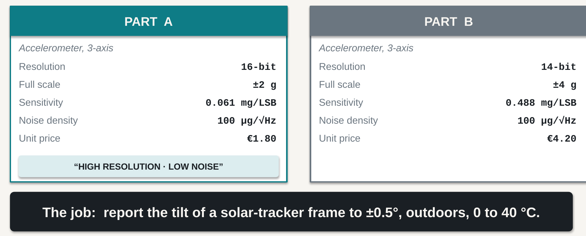
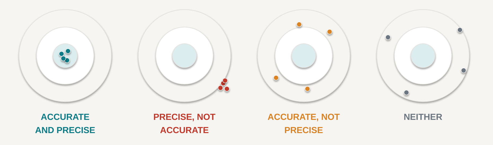
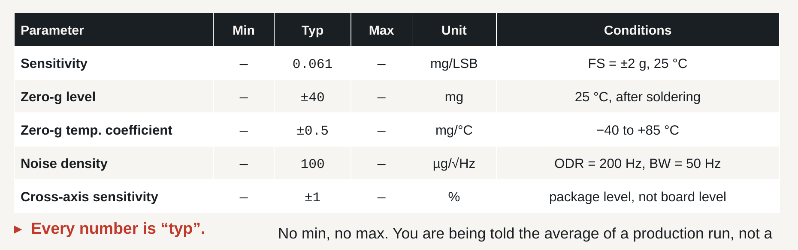

# 2 · Specifications, and choosing a part

## What you should be able to do after this chapter

1. **Distinguish** accuracy, precision, resolution and sensitivity, and sort a list of parameters into static and dynamic characteristics.
2. **Locate** a number in a real datasheet together with the conditions under which it was measured, and state at least one performance limit the datasheet cannot specify.
3. **Compute** noise-limited resolution from a noise-density figure and a bandwidth, and decide whether noise or quantisation dominates.
4. **Select** between candidate devices by building an error budget, and defend the choice by naming the dominant error term.

---

## 2.1 Two front pages

You have written a specification. Now you must buy something. Thousands of parts exist, every number is published, and the datasheets are free — so selection looks like a table lookup.

Here is the job:

> A solar-tracker frame must report its tilt angle to **±0.5°**, outdoors, over an ambient range of **0 to 40 °C**. It will be calibrated once on the bench, at 20 °C.

And here are two candidates, as their front pages present them.

**Figure 2.1** — Two candidate accelerometers as advertised. Part A offers eight times finer resolution at less than half the price, and says so. Part B says nothing for itself. *(These are representative commercial figures rather than a named product, chosen so that the arithmetic in this chapter is exact.)*

Which do you specify? Commit to an answer now, before reading on.

Most engineers choose Part A, and most of the time the reasoning is not lazy — sixteen bits genuinely is better than fourteen, and €1.80 genuinely is better than €4.20. By the end of this chapter you will be able to show that **Part A cannot meet the requirement**, that **Part B meets it with a fourfold margin**, and that the number which decides it appears on neither front page.

---

## 2.2 First, turn the requirement into a number

You cannot budget an error against an angle. So before reading any datasheet, convert the requirement into the physical quantity the sensor actually measures.

A tilted accelerometer at rest senses a component of gravity. For a tilt of angle θ from horizontal, the component along the sensitive axis is *g* sin θ. So a tilt of half a degree corresponds to

$$ sin(0.5°) × 1 g  =  0.008727 g  =  8.73 mg $$

Write that number down and keep it in front of you for the rest of the chapter.

> **8.73 mg is the entire signal we are trying to measure.**

Every error term from here on gets compared against those 8.73 mg. Any term larger than that is fatal. Any term far below it is irrelevant — no matter how impressive it looks on a front page. This single conversion turns *"which is better?"*, which is an opinion, into arithmetic.

---

## 2.3 Four words that get confused

Most engineering arguments about sensors are really arguments about these four words.

**Figure 2.2** — The same target, four different instruments. The centre is the *true* value.

**Precision** is how tightly the shots group. **Accuracy** is where the group sits relative to the truth. They are independent properties: the second target — tightly grouped and completely wrong — is the dangerous instrument, because every reading agrees with every other reading and they are all wrong by the same amount.

**Resolution** does not appear on that picture at all. Resolution is how finely you can *report* where the shot landed. You can report a wrong position to six decimal places, and this is precisely the trap Part A is setting.

**Sensitivity** is different again: it is the change in output per unit change in input — for our accelerometer, mg per least-significant bit. Sensitivity tells you how the scale is drawn, not how truthful it is.

Consider a concrete case. A pressure sensor sits in a chamber held at a true, constant 1000.0 hPa. It is read one hundred times. Every reading falls between 1012.3 and 1012.5 hPa.

That device is **precise but not accurate**: superbly repeatable, and 12.4 hPa wrong. And it raises the question that carries the rest of this chapter:

> **Which of these two problems can a calibration fix?**

The 12.4 hPa offset — **yes**. Measure it once against a reference and subtract it.

The 0.2 hPa scatter — **no**. Random scatter cannot be removed by calibration, only reduced by averaging, and averaging costs you bandwidth. If you average sixteen samples to cut the noise by a factor of four, you have also made your instrument sixteen times slower.

That gives us a rule worth memorising, because it is the spine of Chapter 14 and of several laboratories:

> **Systematic error is a calibration problem.**
> **Random error is a bandwidth problem.**
> **Drift is a component-selection problem.**

The third line is the one that ruins projects. Drift passes every test you run on the bench at 22 °C and fails in the field in February, because it *moves after you calibrated it*. You cannot calibrate away a quantity that changes when you are not looking.

---

## 2.4 The vocabulary, sorted

Datasheets are organised around this vocabulary, so it is worth having sorted once. **Static** characteristics describe behaviour when nothing is changing; **dynamic** characteristics describe behaviour when things change.

| Static | Meaning |
|---|---|
| Range | smallest to largest measurable value |
| Sensitivity | output change per unit of input |
| Resolution | smallest distinguishable change |
| Threshold | smallest input that produces any output at all |
| Offset | output when the input is zero |
| Linearity | deviation from a straight-line response |
| Hysteresis | does the reading depend on which direction you approached from? |
| Repeatability | same input, same output, measured again later |

| Dynamic | Meaning |
|---|---|
| Bandwidth | highest frequency reported faithfully |
| Response time | time to settle after a step input |
| Output data rate (ODR) | samples delivered per second — **not** the same as bandwidth |
| Noise density | noise per √Hz; becomes an RMS figure once you choose a bandwidth |
| Group delay | how late the filtered answer arrives |
| Cross-sensitivity | response to the axis or quantity you did *not* want |
| Drift | slow change with time and temperature |

**Table 2.1** — Static and dynamic characteristics. Two entries are worth flagging now.

**ODR is not bandwidth.** A sensor will happily hand you two hundred numbers per second while telling you nothing about signal content above 50 Hz. Confusing the two is the most common arithmetic error in this chapter, and §2.6 shows exactly what it costs.

**Cross-sensitivity** is real in every device: an accelerometer shaken along *x* reports a little *z*. We return to it in §2.8 for an important reason.

---

## 2.5 Read the conditions first, then the number

A datasheet is a legal document, not a promise. The headline is on page one; the truth is in the conditions.

**Figure 2.3** — A representative extract from an accelerometer datasheet. The rightmost column is the one to read first.

Two observations about Figure 2.3 that generalise to almost every sensor datasheet you will meet.

**Every number is "typ".** There is no minimum and no maximum. You are being told the *average of a production run*, not a guarantee. If your design works only with a typical part, then roughly half of your production does not work — and you will discover this at volume, which is the worst possible time.

**The conditions differ from row to row.** Sensitivity is quoted at 25 °C. The temperature coefficient is quoted over a 125 °C span. Noise density is quoted at one specific bandwidth. **As printed, these rows are not comparable with one another**, and they are certainly not comparable with the corresponding rows of a competitor's datasheet until you have checked that the conditions match.

So read a datasheet right to left: **conditions first, parameter name second, and the number last.** Most people read it in exactly the opposite order, and that is how they get surprised in February.

---

## 2.6 Worked calculation: the error budget

We now have everything needed to decide between Part A and Part B. There are four terms.

### Term 1 · Noise

A noise-density figure is not yet a noise figure. It becomes one only when you choose a bandwidth:

$$ noise_RMS  =  noise density  ×  √bandwidth $$

We are measuring a static orientation, so we can afford a modest bandwidth. Take 50 Hz. Both parts specify 100 µg/√Hz:

$$ 100 µg/√Hz  ×  √(50 Hz)  =  100 × 7.07  =  707 µg  =  0.707 mg $$

Check the units, because unit cancellation — not the physics — is what usually goes wrong here: µg/√Hz × √Hz = µg. If your units do not cancel, you have used the wrong number.

**Note carefully what we did *not* use.** The datasheet quoted this figure at an ODR of 200 Hz with a bandwidth of 50 Hz. Using √200 would give 1.41 mg — a wrong answer that looks entirely reasonable. **Bandwidth, not ODR.**

There is a useful corollary. Noise is not a property of the sensor alone; it is a property of the sensor *and the bandwidth you chose*. Halve your bandwidth and you improve noise by √2, for free, if the signal allows it. Widen it to chase fast events and you pay in noise. This is the same trade the motor's monitor got wrong in Chapter 1, seen from the other side.

### Term 2 · Quantisation

Rounding to the nearest code contributes an RMS error of one least-significant bit divided by √12:

$$ Part A:  0.061 / 3.464  =  0.018 mg          Part B:  0.488 / 3.464  =  0.141 mg $$

Both are negligible against 8.73 mg. Note what this means: Part A's celebrated eight-times-finer resolution buys it an advantage of about 0.12 mg on a term that was already invisible.

### Term 3 · Offset

Part A's zero-*g* offset is ±40 mg; Part B's is ±10 mg. Both are far larger than our 8.73 mg measurand — and both **go to zero**, because we calibrate the instrument once on the bench at 20 °C and subtract what we find. This is the calibration column, and it is why a large raw offset need not disqualify a part.

### Term 4 · Offset drift

Here is the term nobody computed.

The offset does not stay where you calibrated it. It moves with temperature, at a rate given by the temperature coefficient. We calibrate at 20 °C and operate from 0 to 40 °C, so the worst-case excursion is ΔT = ±20 °C:

$$ Part A:  0.5 mg/°C × 20 °C  =  10.0 mg          Part B:  0.1 × 20  =  2.0 mg $$

**Part A drifts by 10 mg. The entire quantity we are trying to measure is 8.73 mg.** The error is larger than the signal, and it appears *after* the calibration, so no bench procedure catches it.

### Combining the terms

These four error sources are independent, so they add in quadrature — root-sum-square:

$$ ε_total  =  √( ε_noise²  +  ε_quant²  +  ε_drift² ) $$

| Term | Part A | Part B |
|---|---|---|
| Noise, 100 µg/√Hz × √50 Hz | 0.707 mg | 0.707 mg |
| Quantisation, LSB/√12 | 0.018 mg | 0.141 mg |
| Offset drift, TC × ΔT | **10.000 mg** | **2.000 mg** |
| **Total (RSS)** | **10.02 mg** | **2.13 mg** |
| As a tilt angle, arcsin(mg/1000) | **0.574°** | **0.122°** |
| Against the ±0.5° requirement | **FAILS** | **passes, 4× margin** |

**Table 2.2** — The error budget. Bandwidth 50 Hz, calibrated at 20 °C, operated over 0–40 °C.

Look at what root-sum-square does. Combining 10 mg with 0.707 mg gives 10.02 mg: the noise term we spent half a page computing changed the answer by three hundredths of a milli-*g*.

> **In any error budget, find the largest term first. Everything else is decoration.**

### The verdict

**Part A resolves eight times finer than Part B and cannot do the job.** Part B's 0.488 mg/LSB already resolves 0.028° of tilt — eighteen times finer than the half-degree we need — so resolution was never the deciding variable. It only looked like it was, because it was the number printed on the front page.

And note the incentives. Part A was cheaper, had finer resolution, and carried a marketing line. Every visible signal pointed at the part that fails.

If you chose "I cannot decide from the front pages alone" at the start of this chapter, you were right, and right for the best possible reason. If you chose Part A, you did what most engineers do. If you now choose Part B, you can defend it with a number — which is the only defence that survives a design review.

---

## 2.7 The part on your bench

Parts A and B were built to make the arithmetic clean. Now do it for real, on the device
you will wire up in the laboratory: the **ST ISM330DHCXTR**, an industrial-grade 6-axis
inertial module. Here is what its datasheet actually says about the accelerometer.

| Parameter | Min | **Typ** | Max | Unit |
|---|---|---|---|---|
| Sensitivity, ±2 g full scale | | 0.061 | | mg/LSB |
| Sensitivity tolerance | −2 | | +2 | % |
| Acceleration noise density, high-performance mode | | **60** | **100** | µg/√Hz |
| Zero-g level offset accuracy | −65 | **±10** | +65 | mg |
| Zero-g level change vs. temperature | −0.5 | **±0.1** | +0.5 | mg/°C |
| Sensitivity change vs. temperature, −40 to +105 °C | −0.01 | ±0.005 | +0.01 | %/°C |
| Cross-axis sensitivity, **at T = 25 °C** | | ±0.5 | | % |
| Operating temperature range | −40 | | +105 | °C |

**Table 2.3** — ISM330DHCX accelerometer characteristics, from datasheet DS13012 Rev 6.
Note that the two columns that decided our design — noise density and zero-g temperature
drift — each carry both a typical *and* a maximum value.

Now run the same error budget twice: once with the typical column, once with the maximum.
Bandwidth 50 Hz, calibrated at 20 °C, operated 0–40 °C, so ΔT = ±20 °C, exactly as before.

| Term | Using **typ** | Using **max** |
|---|---|---|
| Noise, density × √50 Hz | 0.424 mg | 0.707 mg |
| Quantisation, 0.061/√12 | 0.018 mg | 0.018 mg |
| Offset drift, TC × 20 °C | **2.000 mg** | **10.000 mg** |
| **Total (RSS)** | **2.05 mg** | **10.02 mg** |
| As a tilt angle | **0.117°** | **0.574°** |
| Against the ±0.5° requirement | **passes, 4× margin** | **FAILS** |

**Table 2.4** — The same part, the same requirement, the same arithmetic. One datasheet
column apart.

Read that again, because it is the most important table in this chapter.

**This is one device.** It is not a comparison between a good part and a bad one. A
typical ISM330DHCX meets our tilt requirement comfortably; a part at the limit of its own
published specification **misses it** — and both parts are entirely within specification,
both would pass incoming inspection, and both would be shipped to you in the same reel.

So what do you actually do?

- **If you must guarantee the specification**, you budget with the **max** column. On that
  basis this design does not close, and you need a different approach: tighten the
  temperature range, measure temperature and compensate the offset (Chapter 14), or
  relax the ±0.5° requirement.
- **If you are building ten units** and can measure each one, the typical column plus a
  per-unit calibration is a defensible engineering decision — provided you write down
  that you made it.
- **What you must not do** is budget with `typ` and describe the result as a guarantee.
  That is the difference between an engineering document and a hope.

Notice also what our fictional parts were really doing. Part A's figures (±40 mg offset,
±0.5 mg/°C, 100 µg/√Hz) were essentially this real part's **worst case**, and Part B's
(±10 mg, ±0.1 mg/°C) were its **typical case**. The lesson has not changed; it has just
become harder to dismiss, because it is now a single part number rather than a choice
between two.

> **A datasheet does not describe your device. It describes the population your device
> was drawn from.**

---

## 2.8 What the datasheet cannot tell you

Look again at the cross-axis row of Table 2.3. The ISM330DHCX quotes ±0.5 % — a real,
published number. Now ask a slightly different question:

> **What is this device's cross-axis sensitivity after it has been soldered onto my board?**

That is not there, and it cannot be. Look at the condition attached to the published
figure: **T = 25 °C**, for the packaged die, as measured by the manufacturer. But board-level mounting stress, solder-joint asymmetry, thermal gradients across the PCB and flexing of the board all change it — and the manufacturer cannot know what your board does to their part.

The honest engineering answer is therefore in the first person: *the datasheet cannot tell me this; I must measure it on my own assembled board.* Installing that habit is the most important thing this chapter does, and it is why the laboratory programme includes characterisation work rather than only bring-up work.

The same applies to the mechanical coupling of Chapter 1, to the thermal environment inside your enclosure, and to the actual noise you achieve after routing a sensitive analog trace next to a switching regulator. **The datasheet describes a component. You are building a system.**

---

## 2.9 Selecting, and over-selecting

Selection is a calculation against a specification, documented so that somebody else can check it. A simple criteria table is enough, provided the weights are honest.

Consider a third candidate. **Part C**: 16-bit, ±2 g, 60 µg/√Hz, offset ±5 mg, temperature coefficient ±0.05 mg/°C, 0.9 mA, €11.50.

| Criterion | Weight | A | B | C |
|---|---|---|---|---|
| Meets ±0.5° over 0–40 °C | pass/fail | fail | pass | pass |
| Total error as an angle | high | 0.574° | 0.122° | 0.06° |
| Unit price at 500 off | medium | €1.80 | €4.20 | €11.50 |
| Current draw | medium | 0.15 mA | 0.18 mA | 0.90 mA |
| A library already exists | **low** | yes | no | no |

**Table 2.5** — A criteria table. Note the weight on the last row.

Part C is technically the best part in the table. It is also **the wrong answer**, and for an instructive reason: at 500 units it costs €3 650 more than Part B, draws five times the current, and buys no capability that the requirement asks for. Over-specification is an engineering failure too — a quieter one than under-specification, but you still have to explain it.

Which brings us to the last row, and to a rule this course applies throughout:

> **Never choose a component only because a software library exists for it.**

A library is a genuine asset and it may save you a week. It is not a specification. Rank it last, not zero. Part A had a library; Part A cannot do the job.

Choose instead on the features that expose the engineering you need to do: selectable range and output data rate, documented bandwidth and noise, a self-test function, a data-ready interrupt, a FIFO where relevant, an accessible register map, and a complete datasheet.

---

## 2.10 Reading

The core of this chapter corresponds to **Morris & Langari, *Measurement and Instrumentation*, 3rd edition (Elsevier, 2020), Chapter 2**, "Instrument Types and Performance Characteristics". Read it for the formal definitions of the static and dynamic characteristics in Table 2.1, and for its worked examples.

**Chapter 3** ("Measurement Uncertainty") and **Chapter 4** ("Statistical Analysis of Measurements Subject to Random Errors") develop error combination — including the root-sum-square rule used in Table 2.2 — much more fully than we have here. We return to that material in Chapter 14; a first reading now will make the error budget above feel less like a recipe.

Then read the electrical-characteristics section of the **ISM330DHCX datasheet
(DS13012)** — the part on your own bench. That is not an optional extra: from this chapter
onward every laboratory assumes you can find a number, and its conditions, in a real
document. Table 2.3 above is where you should end up; arriving there yourself is the
skill.

*Chapter and section numbering should be checked against the edition available to you.*

---

## 2.11 Exercises

**2.1** Define accuracy, precision and resolution so that the three definitions cannot be confused with one another. Give an example of a device that is precise but inaccurate.

**2.2** Which of the following can a single-point bench calibration remove: offset, random noise, temperature drift, quantisation? Explain each answer.

**2.3** A sensor specifies 150 µg/√Hz. You need 20 Hz of bandwidth. (a) Compute the RMS noise. (b) State what happens if you widen the bandwidth to 80 Hz, and by what factor.

**2.4** A datasheet gives an offset temperature coefficient of ±0.3 mg/°C. The device is calibrated at 25 °C and used from −10 to +60 °C. Compute the worst-case offset error from drift alone, and express it as a tilt angle.

**2.5** Your requirement is a signal of 8.73 mg. A candidate part offers 0.061 mg resolution and 10 mg of offset drift over your temperature range. In one sentence, explain what is wrong with calling this a "high-resolution solution".

**2.6** A sensor is quoted as "±0.05 % of full scale" accuracy at 25 °C, with no temperature coefficient given anywhere in the datasheet. Full scale is 20 kPa. (a) What is the accuracy in pascals at 25 °C? (b) Why can you *not* use this part in an error budget for outdoor operation, even though its quoted accuracy is excellent?

**2.7** Give one performance-limiting property that a datasheet cannot specify for your finished product, and say who must determine it.

**2.8** You must measure water level in an outdoor tank 2 m deep, to ±20 mm, with water between 5 and 35 °C. Sensor P has a total error band of ±0.25 % of full scale over 0–50 °C. Sensor Q is specified as ±0.05 % of full scale at 25 °C, with no temperature coefficient stated. Full scale for both is 20 kPa. Which do you specify, and why? (1 mm of water ≈ 9.81 Pa.)

**2.9** Using Table 2.3, compute the ISM330DHCX's RMS noise at a bandwidth of 200 Hz, for both the typical and the maximum noise density. Express each as a tilt angle.

**2.10** The ISM330DHCX's sensitivity tolerance is ±2 %. You measure 1 g of gravity and the device reports 1015 mg. (a) Is this part within specification on sensitivity? (b) Which single bench measurement would let you correct this error, and what would remain uncorrected afterwards?

**2.11** An accelerometer offers selectable ranges of ±2 g, ±4 g, ±8 g and ±16 g at a fixed 14-bit output. (a) Compute the resolution in mg/LSB at each range. (b) You need to resolve 5 mg and survive 12 g shocks without clipping. Which range do you configure, and what is the consequence for resolution?

---

## Answers

**2.1** **Accuracy** is closeness of a reading to the true value — a systematic property. **Precision** is the repeatability of readings about their own mean — a random-scatter property, which says nothing about truth. **Resolution** is the smallest change the output is able to represent, which is a property of the reporting scale and not of correctness at all. Example: a sensor with a large uncorrected offset but very low noise, such as the 1012.4 hPa device in §2.3.

**2.2** **Offset — yes**, at the temperature at which you calibrated. **Random noise — no**; only averaging reduces it, and averaging costs bandwidth. **Temperature drift — no**; a single point captures a single temperature, so removing drift requires measuring temperature and applying a compensation model. **Quantisation — no**; it is fixed by the LSB, although dithering and averaging can recover some detail below one LSB.

**2.3** (a) 150 × √20 = 150 × 4.472 = 671 µg ≈ **0.67 mg**. (b) 150 × √80 = 1342 µg ≈ **1.34 mg** — exactly double, because the bandwidth quadrupled and noise follows its square root.

**2.4** The worst-case excursion from the 25 °C calibration point is to 60 °C, so ΔT = 35 °C. Drift = 0.3 × 35 = **10.5 mg**, which as a tilt is arcsin(0.0105) ≈ **0.60°**.

**2.5** The resolution is roughly 140 times finer than the measurand while the drift alone exceeds the entire measurand, so the part resolves — very precisely — a number that is wrong; resolution is not accuracy.

**2.6** (a) 0.05 % of 20 kPa = **10 Pa**. (b) Because the figure is guaranteed only at 25 °C, and no temperature coefficient is published, the error at any other temperature is not merely large — it is **unknown**. An unspecified coefficient is not a small error, it is an unbounded one, and you cannot put an unbounded term into a budget you have to sign.

**2.7** Any board-level effect: cross-axis sensitivity after reflow soldering, package stress from PCB flex, thermal gradients across the assembly, mounting compliance, or noise picked up from your own power supply. The **integrator** must determine it, by measurement on the assembled unit.

**2.8** **Sensor P.** Its ±0.25 % of 20 kPa = 50 Pa ≈ **5.1 mm**, comfortably inside the ±20 mm requirement and, critically, *guaranteed across the whole operating temperature range*. Sensor Q's ±0.05 % = 10 Pa ≈ 1.0 mm at 25 °C, but its behaviour at 5 °C is unknown because no temperature coefficient is specified. You cannot write a defensible error budget for Q at all. A total error band over the operating range beats a headline accuracy at a single temperature.

**2.9** At 200 Hz: typ = 60 × √200 = 60 × 14.14 = **849 µg ≈ 0.85 mg**, which as a tilt is arcsin(0.00085) ≈ **0.049°**. Max = 100 × √200 = **1414 µg ≈ 1.41 mg**, or ≈ **0.081°**. Quadrupling the bandwidth from 50 Hz doubled the noise, as expected.

**2.10** (a) ±2 % of 1000 mg is ±20 mg, so a reading of 1015 mg is **within specification** — it is a 1.5 % scale-factor error. (b) A **known-reference measurement**: with the axis aligned to gravity you know the true value is 1 g, so dividing by 1.015 removes the scale-factor error. What remains uncorrected is the *change* of sensitivity with temperature (±0.005 %/°C typ), the zero-g offset drift, and the noise — a single-point scale calibration fixes the gain at one temperature and nothing else.

**2.11** (a) 14 bits gives 16 384 codes across the full span, so resolution = 2 × range / 16 384: **±2 g → 0.244 mg/LSB**; ±4 g → 0.488; ±8 g → 0.977; **±16 g → 1.953 mg/LSB**. (b) Surviving 12 g without clipping forces **±16 g**, giving 1.953 mg/LSB. Since quantisation contributes 1.953/√12 = 0.56 mg RMS, resolving 5 mg is still comfortable — so in this case the range requirement costs you nothing that matters. That is the point of doing the arithmetic rather than assuming the trade-off hurts.
