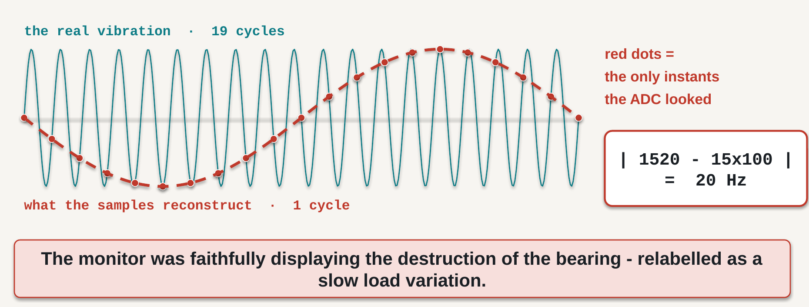

# 3 · Ֆիզիկական մեծությունից մինչև հավաստի նմուշներ

## Ի՞նչ պետք է կարողանաք անել այս գլուխն ուսումնասիրելուց հետո

1. **Փոխակերպել** ռեգիստրներից ընթերցված բայթերի զույգը, որը ներկայացված է երկուսի լրացման կոդով, SI միավորներով արտահայտված արժեքի՝ հստակ նշելով զգայունությունը, նշանի ներկայացման եղանակը և բայթերի կարգը։
2. **Տարբերել** ելքային տվյալների հաճախությունը (ODR), չափման հաճախականային թողունակությունը և հակաալիասավորման զտիչի կտրման հաճախականությունը, ինչպես նաև հասկանալ, թե դրանց սխալ ընտրությունը երբ է հանգեցնում անդառնալի սխալի։
3. **Հաշվարկել** տվյալների ձեռքբերման ուղու՝ աղմուկով սահմանափակված արդյունավետ լուծաչափը և որոշել, թե հայտարարված բիթերից քանիսն են իրականում օգտակար տեղեկություն պարունակում։
4. **Ընտրություն կատարել** պարբերական հարցման և տվյալների պատրաստ լինելու ընդհատման միջև՝ հաշվի առնելով ժամանակային դրոշմների սխալը, այլ ոչ միայն ծրագրավորման պարզությունը։
5. **Դասակարգել** չափման ուղում առաջացող սխալները՝ առանձնացնելով հետագա չափաբերմամբ ուղղելի և անդառնալի սխալները։

---

## 3.1 Մեկ գրանցման ֆայլ և երեք թիվ

Գլուխ 2-ում ընտրեցինք համապատասխան տվիչը և հիմնավորեցինք այդ ընտրությունը։ Այժմ դիտարկենք հաջորդ փուլը՝ ինչ է տեղի ունենում, երբ ընտրված սարքն արդեն միացված է և սկսում ենք տվյալներ գրանցել։

Սարքը կարգավորված է, ռեգիստրների քարտեզը բաց է, զգայունության արժեքը հայտնի է, իսկ `while()` ցիկլը տվյալները հաջորդաբար գրանցում է CSV ֆայլում։ Առաջին հայացքից կարող է թվալ, որ հիմնական աշխատանքն արդեն ավարտված է, քանի որ տվիչի ընտրությունն ու միացումը կատարված են։ Իրականում չափման հավաստիությունը դեռ պետք է հիմնավորել։

Դիտարկենք այն կարգավորումը, որը կիրառվելու է նաև 2-րդ լաբորատոր աշխատանքում․

> **ISM330DHCX** արագաչափը կարգավորված է **±2 g չափման լրիվ տիրույթով, 16-բիթանոց ելքով և ODR = 104 Հց**։ Տվյալների թերթիկում նշված զգայունությունը **0.061 mg/LSB** է։ Տվյալները գրանցվում են տասը րոպե շարունակ․ յուրաքանչյուր ցիկլում կանչվում է `HAL_Delay(10)`, ապա I²C կապուղով ընթերցվում է վեց բայթ։

Այս օրինակը մեզ բերում է գլխի հիմնական հարցին․

> **Գրանցված տվյալներից որքա՞նը կարելի է հավաստի համարել։**

Այստեղ հարցը տվիչի որակը չէ․ Գլուխ 2-ում արդեն պարզել ենք, որ այն համապատասխանում է առաջադրված պահանջներին։ Այժմ պետք է հասկանալ, թե ֆիզիկական ազդանշանից մինչև գրանցման ֆայլ անցնելու ընթացքում ինչ տեղեկություն է պահպանվել, իսկ ինչը՝ աղավաղվել կամ կորել։ Պատասխանը կարելի է ամփոփել երեք թվով․

| | |
|---|---|
| **12.4** | 16 բիթից իրականում օգտակար տեղեկություն պարունակող բիթերի թիվը |
| **12 Հց** | ալիասավորման հետևանքով տվյալներում առաջացած կեղծ հաճախականությունը |
| **12.1 վ** | տասը րոպեանոց գրանցման վերջում կուտակված ժամանակային սխալը |

Այս երեք արժեքներն էլ կարելի էր հաշվարկել դեռևս ծրագրավորումը սկսելուց առաջ՝ օգտվելով տվիչի տվյալների թերթիկից և ընտրված ձեռքբերման սխեմայից։ Սակայն դրանցից ոչ մեկը գրանցված տվյալներում ակնհայտորեն չի երևում, իսկ վերջին երկու սխալները գրանցումից հետո այլևս հնարավոր չէ վերացնել։

Այս գլխի հիմնական գաղափարը հետևյալն է․ **տվյալների ձեռքբերման համակարգի սխալ աշխատանքը միշտ չէ, որ ակնհայտ է։ Համակարգը կարող է ստեղծել թվերով լի, արտաքուստ ճիշտ և համոզիչ ֆայլ, որը, սակայն, չի ներկայացնում իրական չափումը։**

---

## 3.2 Ի՞նչ է ստացվում տվիչի ելքում

Տվիչների ելքերը կարելի է բաժանել երկու հիմնական խմբի՝ անալոգային և թվային։ Այս բաժանումը կարևոր է, քանի որ յուրաքանչյուր դեպքում չափման սխալների աղբյուրներն ու դրանց վերահսկման եղանակները տարբեր են։

**Անալոգային ելքը** չափվող մեծությանը համեմատական անընդհատ էլեկտրական մեծություն է։ Հանդիպում է երեք տարածված ձևով․

- **Լարման ելք։** Սա ամենապարզ, բայց նաև արտաքին ազդեցությունների նկատմամբ առավել զգայուն տարբերակն է։ Օրինակ՝ ջերմազույգի ելքը մեկ աստիճանի փոփոխության դեպքում կարող է կազմել ընդամենը տասնյակ միկրովոլտ, իսկ կամրջակային տվիչինը՝ մի քանի միլիվոլտ։ Այդպիսի փոքր ազդանշանների դեպքում տվիչից մինչև ուժեղացուցիչ անցնող հաղորդալարը նույնպես դառնում է չափման ուղու մի մասը և կարող է լրացուցիչ սխալներ ներմուծել։
- **Հոսանքային ելք, սովորաբար 4–20 mA։** Այս արդյունաբերական ստանդարտը միաժամանակ լուծում է երկու խնդիր։ Նախ՝ երկար մալուխի դիմադրությունը գործնականում չի փոխում փոխանցվող հոսանքի արժեքը, ուստի ցուցմունքը քիչ է կախված տվիչի տեղադրման հեռավորությունից։ Բացի այդ, չափման սանդղակի զրոյին համապատասխանում է 4 mA, ոչ թե 0 mA։ Հետևաբար 0 mA-ը կարելի է մեկնաբանել որպես կապի խզում, այլ ոչ թե չափվող մեծության զրոյական արժեք։ Այս պարզ սկզբունքը հնարավորություն է տալիս անմիջապես հայտնաբերել գծի անսարքությունը և 4–20 mA ստանդարտի երկարատև կիրառման հիմնական պատճառներից մեկն է։
- **Կամրջակային ելք։** Կամրջակը կազմված է շեղանկյան ձևով միացված չորս դիմադրական տարրերից։ Այն սնվում է գրգռման լարումով և ձևավորում է կամրջակի անհավասարակշռությանը համեմատական տարբերական լարում։ Տենզոտվիչների, պիեզոդիմադրական ճնշման տվիչների և բեռնաչափերի մեծ մասը կառուցված է այս սկզբունքով։ Բաժին 3.3-ում կտեսնենք, թե կամրջակի սնման լարումը ինչպես է կապված ԱԹՓ-ի Հենակային լարման հետ։

**Թվային ելքի** դեպքում անալոգաթվային փոխակերպումն իրականացվում է տվիչի պատյանի ներսում, իսկ միկրոքոնթրոլերը I²C կամ SPI կապուղով ստանում է արդեն ձևավորված թվային կոդ։ Այս դասընթացում կիրառվող MEMS տվիչների մեծ մասը հենց այս կառուցվածքն ունի։

Սակայն թվային ելքը չի վերացնում անալոգային մասի խնդիրները։ Դրանք պարզապես տեղափոխվում են տվիչի ներս, որտեղ նախագծողը սովորաբար չի կարող փոխել ուժեղացման, զտման կամ փոխակերպման շղթան։ Միաժամանակ առաջանում են նոր հարցեր՝ ինչ կարգով պետք է միավորել ելքային բայթերը, ինչպես է ներկայացված նշանը և կոնկրետ ո՞ր պահին է կատարվել նմուշառումը։ Հաջորդ բաժիններում կքննարկենք հենց այս խնդիրները։

---

## 3.3 ԱԹՓ-ի Հենակային լարման կարևորությունը

Յուրաքանչյուր անալոգաթվային փոխակերպիչ (ԱԹՓ) իրականում որոշում է, թե մուտքային լարումը Հենակային լարման որ մասն է կազմում։ Ելքային կոդը հաշվարկվում է հետևյալ հարաբերությամբ․

$$ \text{կոդ} = \frac{V_{in}}{V_{ref}} \times 2^{N} $$

Բանաձևից երևում է, որ թվային կոդը կախված է ոչ միայն մուտքային լարումից, այլև մուտքային ու Հենակային լարումների **հարաբերությունից**։ Այլ կերպ ասած՝ ԱԹՓ-ն ինքնուրույն չի որոշում լարման բացարձակ արժեքը․ այն համեմատում է մուտքը Հենակային լարման հետ։

Այս հանգամանքը հատկապես կարևոր է կամրջակային տվիչների դեպքում։

Դիտարկենք տենզոկամրջակ, որը սնվում է միկրոքոնթրոլերի 3.3 Վ սնման գծից։ Ենթադրենք՝ ԱԹՓ-ն որպես Հենակային լարում նույնպես օգտագործում է **նույն 3.3 Վ գիծը**։ Եթե բեռի փոփոխության հետևանքով լարումն իջնի մինչև 3.2 Վ՝ մոտ 3 %-ով, ինչպե՞ս կփոխվի հաշվարկված դեֆորմացիան։

Գործնականում այն գրեթե չի փոխվի։ Կամրջակի ելքային լարումը համեմատական է գրգռման լարմանը և կնվազի մոտ 3 %-ով։ Միաժամանակ ԱԹՓ-ի Հենակային լարումը նույնպես կնվազի նույն չափով, հետևաբար $V_{in}/V_{ref}$ հարաբերությունը կմնա գրեթե անփոփոխ։ Այս եղանակը կոչվում է **հարաբերաչափական չափում** (*ratiometric measurement*) և թույլ է տալիս փոխհատուցել սնման լարման փոփոխությունը՝ առանց լրացուցիչ ճշգրիտ Հենակային աղբյուրի։

Այժմ ենթադրենք, որ ԱԹՓ-ն օգտագործում է առանձին, ճշգրիտ 2.500 Վ Հենակային աղբյուր, իսկ կամրջակը շարունակում է սնվել 3.3 Վ գծից։ Այս դեպքում սնման լարման անկումը այլևս չի փոխհատուցվում։ Կամրջակի ելքը նվազում է, իսկ ԱԹՓ-ի Հենակային լարումը մնում է հաստատուն, ինչի հետևանքով հաշվարկված դեֆորմացիայում առաջանում է մոտ 3 % սխալ։ Այդ սխալը հնարավոր չէ լիովին վերացնել մեկ չափաբերմամբ, քանի որ այն փոփոխվում է սնման գծի ընթացիկ բեռից կախված։

Այսպիսով, նույն բաղադրիչներով կարելի է ստանալ կամ սնման տատանումների նկատմամբ գրեթե անզգա համակարգ, կամ համակարգ, որի սխալը անմիջապես կախված է սնման լարումից։ Տարբերությունը միայն գրգռման և Հենակային լարումների աղբյուրների ընտրությունն է։

Նախագծման կանոնը հետևյալն է․ **տվիչի գրգռման և ԱԹՓ-ի Հենակային լարումները վերցրեք կա՛մ նույն աղբյուրից, կա՛մ երկու առանձին, բայց բավարար կայունությամբ աղբյուրներից։** Ամենաանբարենպաստ տարբերակը կայուն Հենակային աղբյուրի և անկայուն գրգռման լարման համակցությունն է, քանի որ այդ դեպքում սնման փոփոխությունն ուղղակիորեն վերածվում է չափման սխալի։

---

## 3.4 Քվանտացումը և դրա ազդեցությունը չափման վրա

ԱԹՓ-ն կարող է ձևավորել միայն սահմանափակ թվով կոդեր, ուստի անընդհատ մուտքային արժեքը ներկայացվում է մոտակա թվային մակարդակով։ Մեր արագաչափի դեպքում քվանտացման քայլը հավասար է․

$$ \text{LSB} = \frac{\text{չափման լրիվ տիրույթ}}{2^{N}} = \frac{4000\ \text{mg}}{65\,536} = 0.061\ \text{mg} $$

ինչը համընկնում է տվյալների թերթիկում նշված արժեքին։ Մոտակա կոդին կլորացնելն առաջացնում է մեկ կրտսեր նշանակալի բիթի (LSB) միջակայքում հավասարաչափ բաշխված սխալ, որի միջին քառակուսային (ՄՔՄ) արժեքն է․

$$ \sigma_{q} = \frac{\text{LSB}}{\sqrt{12}} = \frac{0.061}{3.464} = 0.018\ \text{mg} $$

$\sqrt{12}$ գործակիցը ստացվում է հավասարաչափ բաշխված քվանտացման սխալի ստանդարտ շեղումը հաշվարկելիս։

Հիշենք 0.018 mg արժեքը։ Բաժին 3.7-ում այն կհամեմատենք տվիչի սեփական աղմուկի հետ և կտեսնենք, որ քվանտացման աղմուկը մոտ քառասուն անգամ փոքր է։ **Հետևաբար միայն ԱԹՓ-ի բիթերի քանակով հնարավոր չէ գնահատել ամբողջ չափման համակարգի լուծաչափը։** Քվանտացման սխալը հեշտ է հաշվարկել, բայց իրական տվիչային համակարգերում այն հաճախ սահմանափակող հիմնական գործոնը չէ։

---

## 3.5 Ելքային տվյալների հաճախությունը (ODR) հաճախականային թողունակություն չէ

Այս բաժնում պետք է հստակ տարբերել երեք մեծություն, որոնք գործնականում հաճախ շփոթվում են։ Դրանցից յուրաքանչյուրը նկարագրում է չափման համակարգի տարբեր հատկություն։

| | Ի՞նչ է | Ո՞վ է սահմանում |
|---|---|---|
| **ODR** — ելքային տվյալների հաճախություն | որքա՞ն հաճախ է ելքում հայտնվում նոր թիվ | օգտագործողը՝ ռեգիստրային կարգավորմամբ |
| **Չափման հաճախականային թողունակություն** | ազդանշանի առավելագույն հաճախականությունը, որը սարքը հավաստիորեն փոխանցում է | օգտագործողը՝ հաճախ առանձին ռեգիստրային կարգավորմամբ |
| **Հակաալիասավորման զտիչի կտրման հաճախականություն** | հաճախականությունը, որից վեր *նմուշառիչից առաջ* տեղադրված զտիչը թուլացնում է ազդանշանը | անալոգային ուղու նախագծողը կամ տվիչի արտադրողը |

Նայքվիստ–Շենոնի նմուշառման թեորեմի համաձայն՝ ազդանշանը հնարավոր է վերականգնել միայն այն դեպքում, երբ նմուշառման հաճախությունը գերազանցում է ազդանշանի առավելագույն հաճախականության կրկնապատիկը։ Գլուխ 1-ում տեսանք այս պայմանի խախտման հետևանքը․ առանցքակալի 1520 Հց թրթռումը 100 Հց հաճախությամբ նմուշառելիս տվյալներում հայտնվեց որպես իրական թվացող 20 Հց տատանում։

Գլուխ 1-ում հիմնական նպատակը ալիասավորման երևույթը հասկանալն էր։ Այստեղ նույն երևույթը դիտարկում ենք որպես **նախագծման խնդիր**, որը կախված է տվիչի կոնկրետ ռեգիստրային կարգավորումից։

### Ինչո՞ւ զտումը պետք է կատարվի նմուշառումից առաջ

Հակաալիասավորման զտիչը պետք է տեղադրված լինի նմուշառիչից **առաջ**։ Նմուշառումից հետո կիրառված թվային զտիչը չի կարող վերականգնել արդեն կորցված հաճախականային տեղեկությունը։

Պատճառը կարելի է բացատրել պարզ թվաբանությամբ։ Եթե 300 Հց բաղադրիչը նմուշառվում է 104 Հց հաճախությամբ, ստացված թվային հաջորդականությունը նույնն է, ինչ իրական 12 Հց ազդանշանի դեպքում։ Հետևաբար ծրագրային ալգորիթմը չի կարող որոշել՝ գրանցված 12 Հց բաղադրիչը իրական է, թե առաջացել է 300 Հց ազդանշանի ալիասավորումից։ Հաճախականային տեղեկությունը կորչում է հենց նմուշառման պահին, եթե դրանից առաջ համապատասխան զտում չի իրականացվել։

Այս դեպքում գործողությունների հերթականությունը սկզբունքային է։ Մասշտաբի գործակցի, զրոյական շեղման, նշանի կամ միավորների սխալները հաճախ հնարավոր է ուղղել նաև գրանցումից հետո, քանի դեռ սկզբնական տվյալները պահպանված են։ Ալիասավորման հետևանքով կորցված տեղեկությունը, սակայն, հետագայում վերականգնել հնարավոր չէ։



**Նկար 3.1** — Գլուխ 1-ում քննարկված ալիասավորման մեխանիզմը։ Առանձին նմուշների արժեքները կարող են ճիշտ լինել, սակայն դրանց հիման վրա վերականգնված ազդանշանի հաճախականությունը՝ սխալ։ Այս գլխում երևույթը կապվում է տվիչի ռեգիստրային կարգավորման հետ։

### `LPF2_XL_EN` բիթի նշանակությունը

ISM330DHCX-ի `CTRL1_XL` ռեգիստրի 7:4 բիթերով ընտրվում է ODR-ը, 3:2 բիթերով՝ չափման լրիվ տիրույթը, իսկ 1-ին բիթով՝ `LPF2_XL_EN` ցածրահաճախական զտիչի վիճակը։

**Վերագործարկումից հետո այդ բիթի արժեքը 0 է**, այսինքն՝ երկրորդ ցածրահաճախական զտիչը անջատված է։

Տարածված սխալը հետևյալն է։ Սահմանվում է ODR = 104 Հց, և դրանից ճիշտ հաշվարկվում է 52 Հց Նայքվիստի սահմանը։ Այնուհետև 52 Հց-ը սխալմամբ ընդունվում է որպես տվիչի իրական չափման թողունակություն։ Սակայն եթե `LPF2_XL_EN = 0`, նմուշառիչին հասնում է ավելի լայն հաճախականային շերտ, և 52 Հց-ից բարձր բաղադրիչները կարող են տվյալներում արտապատկերվել որպես կեղծ ցածր հաճախականություններ։

Ենթադրենք՝ նույն շրջանակի վրա տեղակայված պոմպն աշխատում է 300 Հց հաճախությամբ․

$$ f_{alias} = |300 - 3 \times 104| = |300 - 312| = 12\ \text{Հց} $$

Ստացվում է 12 Հց կեղծ բաղադրիչ։ Այն գտնվում է հենց այն հաճախականային տիրույթում, որը կարող է հետաքրքրել թեքության կամ ցածրահաճախական թրթռումների չափման ժամանակ։ Այդ պատճառով այն հեշտ է շփոթել իրական մեխանիկական երևույթի հետ, իսկ հետագա թվային մշակմամբ դրա ծագումը պարզել այլևս հնարավոր չէ։

Ավելի վտանգավոր դեպք է ստացվում ODR = 100 Հց ընտրելիս․

$$ f_{alias} = |300 - 3 \times 100| = 0\ \text{Հց} $$

Այս դեպքում պոմպի ազդանշանը տվյալներում դրսևորվում է որպես **հաստատուն բաղադրիչ կամ DC շեղում**։ Այն կարող է սխալմամբ ընդունվել որպես տվիչի զրոյական շեղում և հեռացվել չափաբերմամբ։ Այդ ուղղումը ճիշտ կլինի միայն պոմպի տվյալ պտտման հաճախության դեպքում և սխալ արդյունք կտա այլ աշխատանքային ռեժիմներում։

Իսկ Գլուխ 1-ի առանցքակալը՝ այս ODR-ի դեպքում․

$$ f_{alias} = |1520 - 15 \times 104| = 40\ \text{Հց} $$

Այստեղ նույնպես խնդիրը 104 Հց արժեքը չէ։ Հիմնական եզրակացությունն այն է, որ **միայն նմուշառման հաճախությունը բավարար չէ տվյալների հաճախականային պարունակությունը գնահատելու համար**։ Անհրաժեշտ է նաև իմանալ նմուշառիչից առաջ գործող զտիչի բնութագրերը։

---

## 3.6 Թվային կոդից մինչև ֆիզիկական մեծություն

Թվային կոդը ֆիզիկական մեծության վերածելու համար անհրաժեշտ է կատարել չորս հաջորդական քայլ։ Դրանցից յուրաքանչյուրում հնարավոր է սխալվել, ընդ որում՝ սխալ արդյունքը հաճախ կարող է լիովին իրատեսական թվալ։

Ենթադրենք՝ X առանցքի խմբային ընթերցումը վերադարձնում է երկու բայթ․

```
OUTX_L_A (0x28) = 0x2C
OUTX_H_A (0x29) = 0xFF
```

**Քայլ 1 — բայթերը միավորել ճիշտ կարգով։** Այս սարքում կրտսեր բայթը գտնվում է ցածր հասցեում։ Հետևաբար երկու բայթերից կազմված 16-բիթանոց բառը `0xFF2C` է, ոչ թե `0x2CFF`։

**Քայլ 2 — ճիշտ մեկնաբանել նշանը։** Արժեքը ներկայացված է 16-բիթանոց երկուսի լրացման կոդով։ Քանի որ նշանի՝ 15-րդ բիթը հավասար է 1-ի, թիվը բացասական է․

$$ 0\text{xFF2C} = 65\,324 \quad \rightarrow \quad 65\,324 - 65\,536 = -212\ \text{կոդ} $$

**Քայլ 3 — կիրառել զգայունությունը։**

$$ a = -212 \times 0.061\ mg = -12.9\ mg $$

**Քայլ 4 — անցնել SI միավորների։**

$$ a = -0.0129\ g \times 9.80665 = -0.127\ \text{մ/վ}^2 $$

Դիտարկենք այս փոխակերպման ընթացքում հանդիպող չորս տարածված սխալները․

- **Բայթերի սխալ կարգ։** Եթե բայթերը միավորվեն հակառակ հերթականությամբ, կստացվի `0x2CFF` = 11 519 կոդ = **+703 mg**։ Արդյունքը ակնհայտ անհնար չէ, ուստի սխալը կարող է երկար ժամանակ աննկատ մնալ։ Իրատեսական թվացող սխալ արդյունքը սովորաբար ավելի վտանգավոր է, քան ակնհայտորեն անհեթեթը։
- **Նշանի անտեսում։** Եթե բառը մեկնաբանվի որպես առանց նշանի թիվ, կստացվի 65 324 կոդ = **+3985 mg**։ Այս դեպքում անշարժ սարքը հաղորդում է գրեթե 4 g արագացում։ Սխալն ավելի հեշտ է նկատել, եթե յուրաքանչյուր արդյունք ստուգվում է ֆիզիկապես սպասվող միջակայքի նկատմամբ։
- **Հասցեի ինքնաշխատ ավելացման սխալ կարգավորում։** Վեց հաջորդական ռեգիստրների խմբային ընթերցման ժամանակ հասցեի ցուցիչը պետք է ինքնաշխատ մեծանա։ Դա կառավարվում է `CTRL3_C` ռեգիստրի `IF_INC` բիթով։ Ռեգիստրի վերակայման արժեքը `0x04` է, այսինքն՝ **ինքնաշխատ ավելացումն ի սկզբանե միացված է**։ Եթե ծրագրավորողը սկզբնականացման ժամանակ `CTRL3_C`-ում գրի `0x00`, այս գործառույթը կանջատվի, և նույն բայթը կարող է ընթերցվել վեց անգամ։
- **Միավորների բացակայություն կամ շփոթ։** Միևնույն լաբորատոր աշխատանքում կարող են օգտագործվել mg, g և մ/վ² միավորները։ Յուրաքանչյուր սյունակի միավորը պետք է հստակ նշված լինի վերնագրում։ Արդյունքի իրատեսականությունը կարելի է ստուգել ծանրության արագացմամբ․ հանգստի վիճակում համապատասխան առանցքը պետք է ցույց տա մոտ 9.81 մ/վ², իսկ երեք առանցքներով արագացման վեկտորի մոդուլը ցանկացած կողմնորոշման դեպքում պետք է մոտ լինի 1 g-ի։

Վերջին ստուգումը հատկապես կարևոր է, քանի որ միաժամանակ ընդգրկում է չափման ամբողջ շղթան՝ տվիչից և թվային փոխակերպումից մինչև միավորների հաշվարկը։ Այն հիմնվում է հայտնի ֆիզիկական մեծության վրա և թույլ է տալիս արագ հայտնաբերել կարգավորման կամ ծրագրային մեկնաբանման բազմաթիվ սխալներ։

---

## 3.7 Հաշվարկային օրինակ․ օգտակար բիթերի թվի որոշումը

Այժմ հաշվարկենք գլխի սկզբում նշված առաջին արժեքը՝ 12.4 արդյունավետ բիթը։ Դրա համար անհրաժեշտ բոլոր տվյալներն արդեն առկա են տվիչի տվյալների թերթիկում և ընտրված կարգավորումներում։

**Տրված է։** Չափման լրիվ տիրույթը ±2 g է, ելքը՝ 16-բիթանոց, իսկ ODR-ը՝ 104 Հց։ `LPF2_XL_EN` բիթը միացված է, և չափման հաճախականային թողունակությունը հավասար է ODR/2-ի։ Տվյալների թերթիկի *max* սյունակում արագաչափի աղմուկի սպեկտրային խտությունը նշված է 100 µg/√Hz։

**Քայլ 1 — քվանտացման քայլը։**

$$ \text{LSB} = \frac{4000\ \text{mg}}{65\,536} = 0.061\ \text{mg} $$

**Քայլ 2 — քվանտացման աղմուկը։**

$$ \sigma_{q} = \frac{0.061}{\sqrt{12}} = 0.018\ \text{mg} $$

**Քայլ 3 — հաճախականային թողունակությունը։**

$$ BW = \frac{ODR}{2} = \frac{104}{2} = 52\ \text{Հց} $$

**Քայլ 4 — տվիչի աղմուկն այդ թողունակությունում։**

$$ \sigma_{n} = 100\ \mu g/\sqrt{\text{Hz}} \times \sqrt{52\ \text{Hz}} = 100 \times 7.211 = 721\ \mu g = 0.721\ \text{mg} $$

**Քայլ 5 — միավորել աղմուկի բաղադրիչները։** Քանի որ տվիչի և քվանտացման աղմուկները միմյանցից անկախ են, դրանց ընդհանուր ՄՔՄ արժեքը հաշվարկվում է քառակուսիների գումարի քառակուսի արմատով․

$$ \sigma_{total} = \sqrt{0.721^2 + 0.018^2} = 0.721\ \text{mg} $$

Քվանտացման աղմուկը ընդհանուր արդյունքը փոխում է միայն չորրորդ տասնորդական նիշում։ Այսինքն՝ **տվիչի սեփական աղմուկը մոտ քառասուն անգամ մեծ է քվանտացման աղմուկից**։ Հետևաբար տվյալ համակարգի լուծաչափը սահմանափակում է տվիչը, ոչ թե ԱԹՓ-ն։

**Քայլ 6 — արտահայտել աղմուկը կոդերով։**

$$ \frac{0.721\ \text{mg}}{0.061\ \text{mg/LSB}} = 11.8\ \text{LSB} $$

**Քայլ 7 — որոշել աղմուկով զբաղեցված բիթերի թիվը։** Եթե աղմուկի ՄՔՄ արժեքը կազմում է 11.8 LSB, ապա աղմուկով պայմանավորված կրտսեր բիթերի թիվը կլինի․

$$ \log_{2}(11.8) = 3.6\ \text{բիթ} $$

Հետևաբար

$$ \text{արդյունավետ բիթերի թիվ} = 16 - 3.6 = \mathbf{12.4} $$

**Եզրակացություն։** Թեև տվիչի ելքը 16-բիթանոց է, տվյալ պայմաններում օգտակար տեղեկություն պարունակող արդյունավետ լուծաչափը մոտ 12.4 բիթ է։ Մեկ առանձին նմուշում վստահորեն տարբերակելի արագացման փոփոխությունը ոչ թե 0.061 mg է, այլ մոտ **0.72 mg**, այսինքն՝ մոտ տասներկու անգամ ավելի մեծ։

Այս արդյունքը չի հակասում տվյալների թերթիկին։ Այնտեղ նշված են և՛ թվային քայլը, և՛ աղմուկի սպեկտրային խտությունը, սակայն ընդհանուր աղմուկը պատրաստի թվով ներկայացված չէ, քանի որ այն կախված է օգտագործողի ընտրած հաճախականային թողունակությունից։

**Կրկնենք հաշվարկը բնութագրական արժեքով։** Եթե օգտագործենք *typ* սյունակում նշված 60 µg/√Hz աղմուկի սպեկտրային խտությունը, կստանանք․

$$ \sigma_{n} = 60 \times \sqrt{52} = 433\ \mu g = 0.433\ \text{mg} = 7.1\ \text{LSB} \quad \rightarrow \quad 2.8\ \text{բիթ} \quad \rightarrow \quad \mathbf{13.2\ բիթ} $$

*typ* և *max* արժեքների կիրառումը արդյունավետ լուծաչափը փոխում է 0.8 բիթով։ Սա ևս մեկ անգամ ցույց է տալիս, որ տվյալների թերթիկի ցանկացած թիվ պետք է դիտարկել իր սահմանման և չափման պայմանների հետ միասին։

### Անվանումների մասին

Այս ոլորտում օգտագործվում են նման անվանումներով, բայց տարբեր իմաստ ունեցող երեք մեծություններ․

- **Արդյունավետ լուծաչափը**, որը հաշվարկեցինք վերևում, ընդհանուր աղմուկը համեմատում է մեկ LSB-ի հետ և ցույց է տալիս, թե ելքային բիթերից քանիսն են գործնականում օգտակար տեղեկություն պարունակում։
- **ENOB-ը** (*effective number of bits*՝ բիթերի արդյունավետ թիվ), որն առավել հաճախ կիրառվում է առանձին ԱԹՓ-ների բնութագրերում, ընդհանուր աղմուկը համեմատում է *իդեալական քվանտացման աղմուկի* հետ։ Այս օրինակում այն կլինի $16 - \log_2(0.721/0.018) = 10.7$ բիթ և ցույց կտա, թե իրական փոխակերպիչը որքանով է զիջում նույն անվանական բիթայնությամբ իդեալական ԱԹՓ-ին։
- **Աղմուկից զերծ լուծաչափը** հաշվարկվում է գագաթից գագաթ աղմուկով, որը հաճախ մոտավոր ընդունվում է 6.6σ։ Այդ պատճառով այն սովորաբար ավելի փոքր արժեք է տալիս։

Այս երեք բնութագրերն էլ կիրառելի են, սակայն միմյանց փոխարինել չեն կարող։ Հետևաբար լուծաչափի թվային արժեք նշելիս անհրաժեշտ է հստակ գրել, թե որ սահմանումն է օգտագործվել։ Այս գլխում կիրառվում է արդյունավետ լուծաչափը, քանի որ այն անմիջապես պատասխանում է նախագծային հարցին՝ ելքային բիթերից քանիսն են իրականում օգտակար։

---

## 3.8 Նմուշառման պահը և ժամանակային դրոշմը

Այժմ դիտարկենք գլխի սկզբում նշված երրորդ արժեքը՝ 12.1 վ ժամանակային սխալը։ Այս խնդիրը սովորաբար նկատվում է միայն այն ժամանակ, երբ արդեն անհրաժեշտ է տարբեր աղբյուրներից ստացված տվյալները համադրել։

Եթե ցիկլում կանչվում է `HAL_Delay(10)`, առաջին հայացքից կարելի է ենթադրել, որ նմուշների միջև ժամանակային քայլը 10 մվ է, իսկ նմուշառման հաճախությունը՝ 100 Հց։ Սակայն ուշացումից բացի ցիկլը ժամանակ է ծախսում նաև տվիչի ընթերցման վրա։ 400 կՀց հաճախությամբ I²C կապուղով վեց բայթի խմբային ընթերցումը, արձանագրության ծառայողական բիթերով հանդերձ, պահանջում է մոտ 81 բիթային ժամանակամիջոց․

$$ t_{I^{2}C} = \frac{81}{400\,000} = 202\ \mu s $$

Հետևաբար ցիկլի իրական պարբերությունը 10.000 մվ չէ, այլ՝

$$ T = 10.000 + 0.202 = 10.203\ \text{մվ} \quad \rightarrow \quad f = 98.0\ \text{Հց} $$

Սա առաջացնում է երկու կարևոր հետևանք։

**Հաճախականության գնահատումը սխալվում է։** Իրական 20 Հց թրթռման փուլը մեկ նմուշից հաջորդը փոխվում է $20 \times 10.203\ \text{մվ} = 0.2041$ պարբերությամբ։ Եթե տվյալները վերլուծվեն 10.000 մվ հավասար քայլի ենթադրությամբ, հաշվարկված հաճախականությունը կլինի․

$$ \frac{0.2041}{0.010} = 20.41\ \text{Հց} $$

Այսպիսով առաջանում է մոտ 2 % սխալ, որը կարող է բավարար լինել մեխանիզմի աշխատանքային կարգը կամ ռեզոնանսային հաճախականությունը սխալ նույնականացնելու համար։

**Ժամանակային դրոշմների սխալը կուտակվում է։** Եթե ժամանակային դրոշմները հաշվարկվում են $n \times 10$ մվ արտահայտությամբ, 60 000-րդ նմուշին կհամապատասխանի 600.0 վ արժեքը։ Սակայն իրականում անցած ժամանակը կլինի․

$$ 60\,000 \times 10.203\ \text{մվ} = 612.1\ \text{վ} $$

**Այսպիսով, գրանցման վերջում ժամանակային դրոշմը իրական ժամանակից հետ է մնում 12.1 վ-ով։** Եթե այդ տվյալները համադրվեն երկրորդ տվիչի, օպերատորի գրառումների, տեսագրության կամ մեկ այլ համակարգի տվյալների հետ, իրադարձությունների ժամանակային համապատասխանությունը կխախտվի։

Իրական համակարգում խնդիրը կարող է ավելի բարդ լինել, քանի որ ցիկլի պարբերությունը միշտ հաստատուն չէ։ Այն կախված է ծրագրային ճյուղավորումներից, ընդհատումներից և կապուղու ընթացիկ վիճակից։ Հնարավոր է գնահատել ժամանակային սխալի սահմանները, սակայն առանց իրական ժամանակային դրոշմների այն հետադարձորեն ճշգրիտ վերականգնել հնարավոր չէ։

### Ապարատային ժամանակային դրոշմների կիրառումը

Ավելի ճիշտ մոտեցումն է օգտագործել տվիչի **տվյալների պատրաստ լինելու ընդհատումը** (*data-ready interrupt*)։ Ընդհատման պահին պետք է գրանցել ապարատային ժամաչափի արժեքը և սկսել տվյալների ընթերցումը՝ ցիկլի հաշվիչից ժամանակ ստանալու փոխարեն։ Այդ դեպքում նմուշառման պահերը սահմանվում են տվիչի ներքին ժամանակային բազայով, իսկ ժամանակային սխալը որոշվում է այդ բազայի՝ տվյալների թերթիկում նշված թույլատրելի շեղմամբ։

Շատ տվիչներ, այդ թվում՝ ISM330DHCX-ը, ունեն նաև ներքին ժամանակային դրոշմի ռեգիստր և FIFO բուֆեր։ Այդ հնարավորությունների շնորհիվ յուրաքանչյուր նմուշի ժամանակը գրանցվում է հենց տվիչում, իսկ միկրոքոնթրոլերը կարող է տվյալները հետագայում կարդալ խմբերով։ Գործնական կանոնը հետևյալն է․ **նմուշառման պահը պետք է որոշել տվիչի կամ ապարատային ժամաչափի տվյալներով, ոչ թե ծրագրային ցիկլի ենթադրվող տևողությամբ։**

| | Պարբերական հարցում՝ ուշացմամբ | Տվյալների պատրաստ լինելու ընդհատում |
|---|---|---|
| Նմուշառման ժամանակային քայլը սահմանում է | ծրագրային ցիկլը | տվիչի ժամանակային բազան |
| Քայլի սխալը | կախված է ցիկլի տևողությունից և կարող է կուտակվել | սահմանված է տվիչի տվյալների թերթիկում |
| Կուտակվող ժամանակային սխալ | աճում է անսահմանափակ | սահմանափակված բազայի շեղումով |
| Պրոցեսորի ծանրաբեռնվածություն | բարձր՝ սպասում ցիկլում | ցածր |
| Իրականացման աշխատատարություն | մի փոքր ցածր | մի փոքր բարձր |

---

## 3.9 Ինչպե՞ս ստուգել տվյալների հավաստիությունը

Ստորև ներկայացված չորս պարզ ստուգումները թույլ են տալիս հայտնաբերել այնպիսի անսարքություններ, որոնք հակառակ դեպքում կարող են արտահայտվել ոչ թե սխալի հաղորդագրությամբ, այլ պարզապես սխալ կամ անկայուն տվյալներով։

- **Սարքի նույնականացում։** Ընթերցեք `WHO_AM_I` ռեգիստրը և ստացված արժեքը համեմատեք տվյալների թերթիկում նշված հաստատունի հետ։ ISM330DHCX-ի դեպքում սպասվող արժեքը `0x6B` է։ Այս մեկ գործողությամբ միաժամանակ ստուգվում են սարքի հասցեն, I²C/SPI կապը և սնուցումը։ Հետաքրքիր համընկմամբ `0x6B`-ը նաև սարքի հնարավոր I²C հասցեներից մեկն է, սակայն այս երկու արժեքները տարբեր նշանակություն ունեն։
- **Ինքնաստուգման գործառույթ։** MEMS տվիչների մեծ մասը կարող է ներքին էլեկտրաստատիկ ուժով հայտնի չափով շեղել իներտ զանգվածը։ Ինքնաստուգման ժամանակ ելքային ազդանշանի փոփոխությունը պետք է գտնվի տվյալների թերթիկում նշված միջակայքում։ Այս ստուգումը ընդգրկում է ոչ միայն էլեկտրոնիկան, այլև տվիչի մեխանիկական կառուցվածքը։
- **FIFO-ի գերլցման վերահսկում։** FIFO բուֆերի գերլցման դեպքում որոշ նմուշներ կորչում են, և պահպանված տվյալներն այլևս հավասար ժամանակային քայլերով դասավորված չեն։ Այդ պատճառով անհրաժեշտ է ընթերցել գերլցման վիճակի դրոշակը և կորած նմուշների հնարավորությունը չանտեսել։
- **Կապուղու սխալ և վերականգնում։** I²C կապուղին կարող է արգելափակվել, եթե ենթակա սարքը տվյալների գիծը պահի ցածր մակարդակում։ Համակարգը պետք է նախատեսի կապի վերականգնման մեխանիզմ, օրինակ՝ լրացուցիչ ժամացույցային իմպուլսներ մինչև գծի ազատումը կամ տվիչի սնման վերագործարկում։ Հակառակ դեպքում գրանցումը կարող է ընդհատվել՝ առանց պատճառի հստակ նշման։

Այս ստուգումները մեծ հաշվարկային կամ ծրագրային ծախս չեն պահանջում, սակայն զգալիորեն պարզեցնում են անսարքությունների ախտորոշումը։ Դրանց միջոցով «տվյալները սխալ են թվում» անորոշ իրավիճակը հնարավոր է վերածել կոնկրետ և ստուգելի պատճառի։

---

## 3.10 Տվյալների թերթիկի օրինակ․ երկու հիմնական ռեգիստր

Բաժիններ 3.5–3.8-ում քննարկված կարգավորումների մեծ մասը կառավարվում է ISM330DHCX տվիչի երկու ռեգիստրով։

**`CTRL1_XL` (0x10)**

| Բիթեր | Դաշտ | Ի՞նչ է որոշում |
|---|---|---|
| 7:4 | `ODR_XL` | ելքային տվյալների հաճախությունը՝ `0100` = 104 Հց |
| 3:2 | `FS_XL` | չափման լրիվ տիրույթը, հետևաբար՝ LSB-ն և աղմուկը mg-ով |
| 1 | `LPF2_XL_EN` | **երկրորդ ցածրահաճախական զտիչի միացումը**․ վերակայումից հետո՝ 0 |
| 0 | — | պետք է գրվի 0 |

Այստեղ կարևոր է նկատել երկու հանգամանք։ Առաջինը՝ չափման լրիվ տիրույթի կոդավորումը **աճման կարգով չէ**․ `00` = ±2 g, `01` = ±16 g, `10` = ±4 g, `11` = ±8 g։ Եթե կոդերի հաջորդականությունը ենթադրվի առանց տվյալների թերթիկը ստուգելու, կարող է ընտրվել սխալ տիրույթ, և զգայունության հետ կապված բոլոր հետագա հաշվարկները կստացվեն երկու կամ չորս անգամ սխալ։ Հետևաբար կարգավորման արժեքները պետք է վերցնել տվյալների թերթիկի աղյուսակից, ոչ թե ենթադրել դրանց հերթականությունը։

Երկրորդը՝ `CTRL1_XL = 0x40` կարգավորումը ընտրում է ±2 g տիրույթ և 104 Հց ODR, սակայն 1-ին բիթը պահում է զրոյական վիճակում։ Այսինքն՝ `LPF2_XL_EN`-ը մնում է անջատված, և Բաժին 3.5-ում քննարկված ալիասավորման վտանգը չի վերանում։

**`CTRL3_C` (0x12)** ռեգիստրի վերակայման արժեքը `0x04` է, այսինքն՝ `IF_INC` բիթն ի սկզբանե սահմանված է, և հաջորդական ռեգիստրների խմբային ընթերցումը կարող է աշխատել առանց լրացուցիչ կարգավորման։ Եթե սկզբնականացման ընթացքում այս ռեգիստրում գրվի `0x00`, հասցեի ինքնաշխատ ավելացումը կանջատվի։

Այսպիսով, գլխում քննարկված կարևոր ընտրությունների մեծ մասը որոշվում է ընդամենը մոտ տասներկու ռեգիստրային բիթով։ Սա բնորոշ է ներդրված տվիչային համակարգերին․ բարձր մակարդակի գրադարանը կարող է ինքնաշխատ կարգավորել այդ բիթերը, սակայն նախագծողը միևնույն է պետք է հասկանա, թե ինչ արժեքներ են ընտրվել և ինչպես են դրանք ազդում չափման արդյունքի վրա։

---

## 3.11 Համակարգային ինտեգրման օրինակ․ անվստահելի գրանցման ֆայլ

Փորձարկման կայանքի վրա տեղադրվել էր երկու տվիչ․ շրջանակի թրթռումները չափող արագաչափը աշխատում էր 104 Հց ODR-ով, իսկ հիդրավլիկ գծի ճնշման փոխակերպիչը ընթերցվում էր միկրոքոնթրոլերի ներքին ԱԹՓ-ով՝ ենթադրաբար նույն հաճախությամբ։ Երկու ազդանշանները գրանցվում էին նույն ֆայլում՝ ծրագրային ցիկլի յուրաքանչյուր կրկնության համար մեկ տողով և ցիկլի հաշվիչից ստացված ընդհանուր ժամանակային դրոշմով։

Փորձի նպատակն էր պարզել՝ ճնշման կտրուկ փոփոխությունը նախորդում է մեխանիկական հարվածին, թե հաջորդում դրան։ Հետևաբար անհրաժեշտ էր երկու ազդանշանների ժամանակային հարաբերությունը որոշել միլիվայրկյանային ճշտությամբ։

Համակարգում առկա էր երեք խնդիր, սակայն դրանցից ոչ մեկը սխալի հաղորդագրություն չէր առաջացնում․

1. Արագաչափը ընթերցվում էր I²C կապուղով, իսկ ճնշման փոխակերպիչը՝ ներքին ԱԹՓ-ով։ Հետևաբար նույն տողում գրանցված երկու արժեքները իրականում չափվում էին մոտ 200 µվ տարբերությամբ, սակայն ֆայլում այդ տարբերությունը նշված չէր։
2. Ծրագրային ցիկլի իրական պարբերությունը 10.2 մվ էր, ոչ թե 10.0 մվ։ Դրա հետևանքով տասը րոպեանոց գրանցման վերջում ժամանակային սխալը հասնում էր մոտ 12 վ-ի։
3. Ճնշման փոխակերպիչի անալոգային ուղում հակաալիասավորման զտիչ նախատեսված չէր, մինչդեռ պոմպն աշխատում էր 300 Հց հաճախությամբ։

Սկզբնական տվյալների վերլուծությունից եզրակացվել էր, որ ճնշման փոփոխությունը գրանցվում է մեխանիկական հարվածից մոտ 15 մվ հետո։ Սակայն այդ արդյունքը միաժամանակ ազդված էր նշված երեք սխալներից, և տվյալ կայանքը իրականում չէր կարող այդ ուշացումը հավաստիորեն չափել։ Համակարգը վերակառուցելուց հետո երկու ընթերցումները համաժամացվեցին արագաչափի տվյալների պատրաստ լինելու ընդհատմամբ, ժամանակային դրոշմները վերցվեցին ապարատային ժամաչափից, իսկ ճնշման մուտքին ավելացվեց RC զտիչ։ Երկրորդ փորձի արդյունքով ճնշման և հարվածի ժամանակային հերթականությունը փոխվեց։

Այս օրինակում խնդիրը ակնհայտ անփութությունը չէր։ Յուրաքանչյուր առանձին նախագծային որոշում առաջին հայացքից ընդունելի էր, իսկ գրանցման ֆայլում չկային բացակայող տողեր կամ անհնար արժեքներ, և ժամանակային սյունակը միապաղաղ աճում էր։ Այնուամենայնիվ, **արտաքուստ ճիշտ գրանցման ֆայլը կարող է պարունակել համակարգային սխալներ**։ Այդ պատճառով արդյունքները վերլուծելուց առաջ պետք է գնահատել, թե տվյալների ձեռքբերման ամբողջ ուղին ինչ հաճախականություններ, ամպլիտուդներ և ժամանակային տարբերություններ կարող է հավաստիորեն տարբերակել։

---

## 3.12 Ուղղելի և անդառնալի սխալներ

Չափման սխալները գործնական տեսանկյունից կարելի է բաժանել երկու խմբի՝ գրանցումից հետո ուղղելի սխալներ և այնպիսի սխալներ, որոնց դեպքում անհրաժեշտ տեղեկությունն արդեն կորել է։ Ստորև բերված աղյուսակը ամփոփում է այս տարբերակումը։

| Սխալ | Հետագայում ուղղելի՞ է | Ինչպես, կամ ինչու ոչ |
|---|---|---|
| Զրոյական շեղում | **այո** | մեկ կետով չափաբերում հայտնի հենակետի նկատմամբ |
| Մասշտաբային գործակից | **այո** | երկու կետով չափաբերում |
| Ոչ գծայնություն | **այո**, լրացուցիչ աշխատանքի դեպքում | մոտարկման միջոցով ուղղում, եթե բնութագիրը հայտնի է |
| Բայթերի սխալ կարգ | **այո** | վերամեկնաբանել ֆայլը, քանի որ սկզբնական բիթերը պահպանված են |
| Նշանի սխալ | **այո** | վերամեկնաբանել ֆայլը |
| Միավորների շփոթ | **այո** | համապատասխան միավորափոխարկում |
| Քվանտացում | **ոչ**, բայց այստեղ աննշան է | 0.018 mg՝ 0.72 mg աղմուկի դիմաց |
| Պատահական աղմուկ | **մասամբ** | միջինացումը նվազեցնում է √N անգամ՝ թողունակության հաշվին |
| Ջերմաստիճանային շեղում | **մասամբ** | միայն եթե ջերմաստիճանը նույնպես գրանցվել է — ուստի գրանցե՛ք այն |
| **Ալիասավորում** | **ոչ** | ալիասավորված և իրական ազդանշանները կարող են առաջացնել նույն թվային հաջորդականությունը |
| **Կորած կամ սխալ ժամանակային դրոշմ** | **ոչ** | իրական նմուշառման պահը չի արձանագրվել |
| **Հագեցում** | **ոչ** | մուտքային արժեքը դուրս է եղել չափման տիրույթից և չի պահպանվել |

Ընդհանուր օրինաչափությունը պարզ է։ Ուղղելի սխալների դեպքում սկզբնական տեղեկությունը պահպանված է, բայց ներկայացված է սխալ մասշտաբով, նշանով կամ միավորով։ Անդառնալի սխալների դեպքում չափման վերաբերյալ որոշ տեղեկություն ընդհանրապես չի պահպանվել։ Հետագա թվային մշակումը չի կարող վերականգնել այն տեղեկությունը, որը գրանցման պահին բացակայել է։

Ջերմաստիճանային շեղումը հնարավոր է մասամբ փոխհատուցել միայն այն դեպքում, երբ չափման հետ միասին գրանցվել է նաև տվիչի ջերմաստիճանը։ Այս դասընթացում կիրառվող տվիչների մեծ մասն ունի ներքին ջերմաստիճանային ելք, և դրա գրանցումը սովորաբար պահանջում է ընդամենը մեկ լրացուցիչ սյունակ։

---

## 3.13 Հավաստի նմուշի չորս հիմնական բնութագրերը

Չափման յուրաքանչյուր նմուշ կարելի է հավաստի համարել միայն այն դեպքում, երբ հնարավոր է պատասխանել հետևյալ չորս հարցերին․

1. **Ի՞նչ ֆիզիկական մեծություն է ներկայացված։** Արժեքը պետք է արտահայտված լինի SI միավորներով, իսկ կիրառված զգայունությունը, նշանի ներկայացումը և բայթերի կարգը՝ հստակ նշված։
2. **Որքա՞ն է օգտակար տեղեկությունը։** Պետք է հայտնի լինի արդյունավետ լուծաչափը, որը հաշվարկվում է աղմուկի սպեկտրային խտությունից և ընտրված հաճախականային թողունակությունից։ Այս օրինակում այն 12.4 բիթ է, ոչ թե անվանական 16 բիթը։
3. **Ո՞ր հաճախականային շերտն է ներկայացված։** Պետք է հայտնի լինի չափման իրական հաճախականային թողունակությունը և հաստատված լինի, որ նմուշառումից առաջ կիրառվել է համապատասխան հակաալիասավորման զտիչ։ Միայն ODR-ի արժեքը բավարար չէ։
4. **Ե՞րբ է կատարվել չափումը։** Յուրաքանչյուր նմուշ պետք է ունենա հայտնի աղբյուրից ստացված ժամանակային դրոշմ, որի հնարավոր սխալը կարելի է քանակապես գնահատել։

Եթե գրանցման ֆայլի համար հնարավոր չէ պատասխանել այս չորս հարցերին, այն դեռևս չի կարելի համարել հավաստի չափման արդյունք՝ անկախ նրանից, թե որքան կանոնավոր և իրատեսական են թվերը։

---

## 3.14 Ընթերցանություն

Այս գլխում քննարկված թեմաները դասագրքում ներկայացված են ավելի մանրամասն, քան հնարավոր է ընդգրկել մեկ 80-րոպեանոց դասախոսության ընթացքում։ Խորհուրդ է տրվում ուսումնասիրել հետևյալ աղբյուրները։

- **Morris & Langari, *Measurement and Instrumentation*, 3-րդ հրատ., Գլուխ 6՝ «Data Acquisition and Signal Processing»։** Նմուշառման, ալիասավորման, ԱԹՓ-ների կառուցվածքի և քվանտացման առավել մանրամասն ու մաթեմատիկորեն հիմնավորված քննարկում։ Այն նպատակահարմար է կարդալ այս գլխից հետո՝ նյութն ամրապնդելու համար։
- **Morris & Langari, Գլուխ 3՝ «Measurement Uncertainty»։** Ներկայացված է անկախ աղմուկային բաղադրիչների՝ քառակուսիների գումարի քառակուսի արմատով համակցման հիմնավորումը, որն օգտագործվել է Բաժին 3.7-ում։
- **Kuphaldt, *Lessons in Industrial Instrumentation*** (ազատ արտոնագիր՝ CC-BY)։ Նյութը գործնական տեսանկյունից ներկայացնում է 4–20 mA հոսանքային օղակների կիրառումը, առավելությունները և բնորոշ խափանումները։
- **ISM330DHCX տվյալների թերթիկ, DS13012 Rev 6։** Հատկապես կարևոր են `CTRL1_XL`, `CTRL3_C` և `WHO_AM_I` ռեգիստրների նկարագրությունները, ինչպես նաև արագաչափի աղմուկային բնութագրերի աղյուսակը։ Այս փաստաթուղթը 2-րդ լաբորատոր աշխատանքի հիմնական տեխնիկական աղբյուրն է։

Բաժին 3.8-ի թեման՝ ծրագրային հարցման ցիկլի և ժամանակային դրոշմների կապը, դասական չափագիտության դասագրքերում հաճախ մանրամասն չի քննարկվում։ Այնուամենայնիվ, ներդրված համակարգերում սա տվյալների հավաստիության հիմնական խնդիրներից մեկն է։ Հետևաբար ժամանակային կազմակերպումը պետք է դիտարկել նույնքան կարևոր, որքան տվիչի զգայունությունը կամ աղմուկային բնութագրերը։

---

## 3.15 Վարժություններ

**3.1** ԱԹՓ-ն ունի 12-բիթանոց ելք և 3.300 Վ Հենակային լարում։ Հաշվեք մեկ LSB-ի արժեքը և քվանտացման աղմուկի ՄՔՄ արժեքը՝ միլիվոլտերով։

**3.2** Նույն ԱԹՓ-ն ընթերցում է տվիչ, որի ելքային աղմուկի ՄՔՄ արժեքը 4 մՎ է։ Որոշեք 12 ելքային բիթերից օգտակար տեղեկություն պարունակող բիթերի թիվը։

**3.3** Տվիչը նմուշառվում է 200 Հց հաճախությամբ, իսկ մուտքում առկա է 750 Հց խանգարող ազդանշան։ Որոշեք տվյալներում դրա արտապատկերվող հաճախականությունը։ Ինչպե՞ս կփոխվի արդյունքը, եթե նմուշառման հաճախությունը դառնա 250 Հց։

**3.4** Կամրջակը սնվում է ճշգրիտ 5.000 Վ աղբյուրից։ Կամրջակի ելքը ընթերցող ԱԹՓ-ն որպես Հենակային լարում օգտագործում է 3.3 Վ սնման գիծը, որի լարումը նվազում է 2 %-ով։ Որոշեք հաշվարկված արժեքի փոփոխության չափն ու ուղղությունը։ Հնարավո՞ր է այդ սխալը լիովին ուղղել չափաբերմամբ։

**3.5** ±4 g տիրույթով 16-բիթանոց արագաչափի աղմուկի սպեկտրային խտությունը 90 µg/√Hz է։ Չափման անհրաժեշտ հաճախականային թողունակությունը 10 Հց է։ Հաշվեք մեկ LSB-ի արժեքը, տվիչի աղմուկի ՄՔՄ արժեքը և արդյունավետ լուծաչափը։ Որոշեք նաև՝ ընդհանուր սխալում գերակշռում է քվանտացման, թե տվիչի սեփական աղմուկը։

**3.6** Գրանցիչը տվիչը պարբերական հարցմամբ ընթերցում է յուրաքանչյուր 20 մվ-ը մեկ՝ օգտագործելով ծրագրային ուշացման կանչ։ Մեկ ընթերցումը տևում է 350 µվ։ Հաշվեք, թե ութժամյա գրանցման վերջում որքանով կշեղվի ժամանակային դրոշմը։ Արդյունքը ներկայացրեք վայրկյաններով և տոկոսով։

**3.7** Ստորև նշված յուրաքանչյուր սխալի համար որոշեք՝ հնարավո՞ր է այն ուղղել գրանցումից հետո, և մեկ նախադասությամբ հիմնավորեք պատասխանը․ (ա) մասշտաբային գործակցի 3 % սխալ, (բ) 40 Հց բաղադրիչ, որն իրականում 360 Հց էր և նմուշառվել է 100 Հց հաճախությամբ, (գ) 200 մվ տևողությամբ հագեցում, (դ) առանցքի շրջված նշան, (ե) 0.5 mg ՄՔՄ պատահական աղմուկ։

**3.8** Անհրաժեշտ է չափել թրթռում, որի օգտակար ամենաբարձր հաճախականային բաղադրիչը 40 Հց է։ Տվիչի հնարավոր ODR արժեքներն են 26, 52, 104, 208 և 416 Հց, իսկ ներքին ցածրահաճախական զտիչը կարգավորվող է։ Ընտրեք ODR-ը և զտիչի կտրման հաճախականությունը՝ հիմնավորելով երկու ընտրություններն էլ։ Նշեք նաև, թե ինչպես կվարվեիք, եթե ներքին զտիչը միացնել հնարավոր չլիներ։

---

## Պատասխաններ

**3.1** $LSB = 3.300/4096 = 0.806$ մՎ։ $\sigma_q = 0.806/\sqrt{12} = 0.233$ մՎ ՄՔՄ։

**3.2** Աղմուկը կազմում է $4/0.806 = 4.96$ LSB, հետևաբար աղմուկով զբաղեցված կրտսեր բիթերի թիվը $\log_2 4.96 = 2.3$ է։ Օգտակար տեղեկություն պարունակող բիթերի թիվը կլինի $12 - 2.3 = 9.7$։ Տվիչի աղմուկը մոտ տասնյոթ անգամ մեծ է քվանտացման աղմուկից, ուստի տվյալ տվիչի դեպքում 10-բիթանոց ԱԹՓ-ն գործնականում գրեթե նույն արդյունքը կտար։

**3.3** 200 Հց նմուշառման դեպքում 750 Հց-ին ամենամոտ բազմապատիկը $4 \times 200 = 800$ Հց է, ուստի ալիասավորված հաճախականությունը $|750 - 800| = 50$ Հց է։ 250 Հց նմուշառման դեպքում $3 \times 250 = 750$ Հց, հետևաբար $|750 - 750| = 0$ Հց։ Այս դեպքում խանգարող ազդանշանը տվյալներում դրսևորվում է որպես հաստատուն շեղում, ինչը հատկապես վտանգավոր է, քանի որ այն կարող է սխալմամբ ընդունվել որպես զրոյական շեղում և հեռացվել չափաբերմամբ։

**3.4** Քանի որ կամրջակի սնման լարումը կայուն է, դրա ելքային լարումը չի փոխվում։ ԱԹՓ-ի Հենակային լարումը նվազում է 2 %-ով, ուստի $V_{in}/V_{ref}$ հարաբերությունը և համապատասխան թվային կոդը աճում են մոտ 2 %-ով։ Հաշվարկված արժեքը կլինի **մոտ 2 % ավելի բարձր**։ Եթե 3.3 Վ գծի անկումը փոփոխվում է բեռից կախված, մեկ չափաբերմամբ սխալը լիովին վերացնել հնարավոր չէ։ Պետք է ԱԹՓ-ի Հենակային լարումը ստանալ նույն 5.000 Վ աղբյուրից կամ ապահովել 3.3 Վ գծի բավարար կայունությունը։

**3.5** $LSB = 8000/65\,536 = 0.122$ mg, $\sigma_q = 0.122/\sqrt{12} = 0.035$ mg, իսկ $\sigma_n = 90 \times \sqrt{10} = 285\ \mu g = 0.285$ mg։ Տվիչի աղմուկը կազմում է $0.285/0.122 = 2.3$ LSB, ինչը համապատասխանում է $\log_2(2.3) = 1.2$ աղմկային բիթի։ Հետևաբար արդյունավետ լուծաչափը մոտ **14.8 բիթ** է։ Տվիչի սեփական աղմուկը մոտ ութ անգամ մեծ է քվանտացման աղմուկից, սակայն 10 Հց թողունակության դեպքում քվանտացման ներդրումն արդեն ամբողջովին անտեսելի չէ։

**3.6** Ցիկլի իրական պարբերությունը $20.350$ մվ է՝ ենթադրվող 20.000 մվ-ի փոխարեն։ Ութ ժամը 28 800 վ է, հետևաբար ենթադրվող 20 մվ քայլով կգրանցվի $28\,800/0.020 = 1\,440\,000$ նմուշ։ Այդ նմուշների իրական տևողությունը կլինի $1\,440\,000 \times 0.020350 = 29\,304$ վ։ Այսպիսով, վերջին ժամանակային դրոշմը իրական ժամանակից **հետ կմնա 504 վ-ով**, այսինքն՝ ավելի քան ութ րոպեով։ Հարաբերական սխալը կկազմի **1.75 %**։

**3.7** (ա) Այո․ կիրառվում է բազմապատկման ուղղում՝ երկու կետով չափաբերումից հետո։ (բ) Ոչ․ ալիասավորված բաղադրիչը թվաբանորեն նույնական է իրական 40 Հց ազդանշանին։ (գ) Ոչ․ հագեցման պահին արժեքները չեն պահպանվել, ուստի տեղեկությունը բացակայում է։ (դ) Այո․ ֆայլը կարելի է վերամեկնաբանել, քանի որ մեծությունների մոդուլները ճիշտ են։ (ե) Մասամբ․ $N$ նմուշի միջինացումը աղմուկը նվազեցնում է $\sqrt{N}$ անգամ՝ թողունակության հաշվին։

**3.8** Հարմար ընտրություն է **ODR = 104 Հց**, որի դեպքում Նայքվիստի սահմանը 52 Հց է։ Զտիչի կտրման հաճախականությունը պետք է ընտրել 40 Հց-ի մոտ կամ փոքր-ինչ բարձր՝ օգտակար 40 Հց շերտը պահպանելու և անցումային շերտի համար որոշակի պաշար թողնելու նպատակով։ ODR = 52 Հց դեպքում Նայքվիստի սահմանը միայն 26 Հց կլիներ, իսկ 208 Հց ընտրությունը տվյալ պահանջի համար անհարկի կմեծացներ տվյալների ծավալը և հնարավոր աղմուկային թողունակությունը։ Եթե ներքին զտիչը միացնել հնարավոր չէ, թվային տվիչի ներքին նմուշառիչից առաջ արտաքին RC զտիչ տեղադրել նույնպես հնարավոր չէ։ Այդ դեպքում կարելի է ODR-ը բարձրացնել մինչև 416 Հց, ապա կիրառել թվային ցածրահաճախական զտիչ և տվյալները նոսրացնել մինչև 104 Հց։ Այս մոտեցումը միայն նվազեցնում է խնդրի հավանականությունը, քանի որ 208 Հց-ից բարձր բաղադրիչները դեռ կարող են ալիասավորվել։ Ավելի հիմնավոր լուծումը կառավարելի հակաալիասավորման զտիչ ունեցող տվիչ ընտրելն է։
