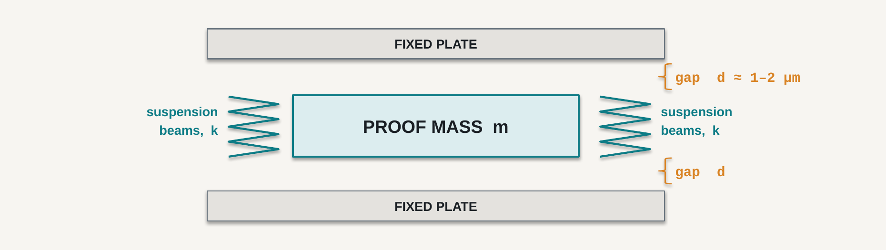

# 4 · Structures, transduction, and what the package does to them

## What you should be able to do after this chapter

1. **Identify** which of five canonical structures a given MEMS sensor uses, and name the relation that governs its behaviour.
2. **Predict** from the transduction principle alone whether a device can measure a *static* quantity, and justify the prediction.
3. **Order** the four fabrication steps and state, for each, one device limitation it imposes.
4. **Explain** why a packaged sensor performs differently on your board than in its datasheet, naming three distinct stress paths.
5. **Decide** which specifications must be measured on the final assembly rather than taken from a datasheet.

---

## 4.1 The question that had no answer

Chapter 2 put a question on the page and refused to answer it:

> *"What is this device's cross-axis sensitivity after it is soldered to my board?"*

The answer given was that the number is not in the datasheet and cannot be. That was left deliberately unpaid, and this chapter pays it.

The reason is not commercial secrecy, and it is not an omission. It is that **a MEMS sensor is not a component.** It is a mechanical structure two micrometres thick, suspended over an etched cavity, glued into a small plastic box with an adhesive that shrinks as it cures, and soldered to a board that bends when you tighten a screw. The manufacturer can characterise everything up to the edge of the box. Beyond that edge the device is in your hands, and what happens there is a property of *your* assembly, which the manufacturer has never seen.

Everything the datasheet cannot promise you comes from that. So this chapter opens the box — and, per the course's design, opens it only as far as the drift, the stress and the failure modes require. This is not a fabrication course, and a chapter that turned into a process tour would be a chapter that failed.

### The anchor: the packaging tax

Here are two rows from the ISM330DHCX datasheet (DS13012 Rev 6), and this time the interesting part is the conditions column.

| Parameter | Typ | Max | Conditions |
|---|---|---|---|
| Zero-g level | ±10 mg | ±65 mg | 25 °C, **after soldering** |

Recall Chapter 2's anchor: a tilt of 0.5° is 8.73 mg of signal. So:

| | | |
|---|---|---|
| typical zero-g offset ÷ signal | 10 / 8.73 | **1.15×** |
| maximum zero-g offset ÷ signal | 65 / 8.73 | **7.45×** |

**Even the typical value exceeds the entire quantity being measured**, and the maximum exceeds it more than sevenfold. And the manufacturer is telling you why, in the specification itself: *after soldering*. The assembly process is part of the error, they know it, and they have measured it so that you do not have to guess.

### The twist worth eighty minutes

Chapter 2's killer term was also 10 mg — the offset *drift*, ±0.5 mg/°C over ±20 °C. The same number appears twice in Module A for entirely different reasons, and the difference is the point of this chapter:

| | Chapter 2's 10 mg | Chapter 4's 10 mg |
|---|---|---|
| What it is | offset **drift** over temperature | zero-g **offset** after soldering |
| Where it comes from | the temperature coefficient of the structure and its package | die attach, package body and solder stress |
| Against the 8.73 mg signal | 1.15× | 1.15× typ, 7.45× max |
| Can you remove it? | **No.** It moves after you calibrate | **Yes.** One-point calibration on your board |
| What it costs to remove | — | one measurement, once, per unit |

So fabrication and packaging hand you a **large but removable** error, while the temperature coefficient hands you a **small-looking but irremovable** one. If you take one thing from this chapter, take that asymmetry: it is why Chapter 2's selection rule weighted drift so heavily, and it is why Lecture 14 and Laboratory 3 exist.

That the two numbers collide at 10 mg is a coincidence of this particular part. It is flagged here because an unremarked coincidence becomes a permanent confusion.

---

## 4.2 Five structures do all the work

Eleven of this course's sixteen lectures are about sensor families. Between them, those families use five mechanical structures. Learning the five is a better investment than learning the families, because the families are combinations of them.

### Proof mass on a flexure

A block of silicon — the **proof mass**, also called the seismic mass — suspended by thin beams that act as springs. When the frame accelerates, the mass lags behind:

$$ x = \frac{ma}{k} \qquad f_{0} = \frac{1}{2\pi}\sqrt{\frac{k}{m}} $$

Displacement is proportional to acceleration, so measuring displacement measures acceleration. The resonant frequency $f_0$ sets the usable bandwidth: you must work well below it, or the structure's own dynamics distort what you are trying to measure.

**Figure 4.1** — The structure from Chapter 1, revisited. The proof mass of mass *m* hangs on flexures of stiffness *k* between two fixed plates separated from it by gaps *d*. Under acceleration one gap grows and the other shrinks, and the differential capacitance is the output. Typical gaps are 1–2 µm, smaller than a red blood cell — which is why one dust particle inside the package is catastrophic, and why Section 4.7 spends more time on packaging than on lithography.

*Senses:* acceleration, and — with a second mass driven into vibration — angular rate.
*Course examples:* the accelerometer of Lecture 5, the gyroscope of Lecture 6.

### Cantilever beam

A beam clamped at one end and free at the other. For a rectangular section of width *w* and thickness *t*, loaded at the tip:

$$ k = \frac{Ewt^{3}}{4L^{3}} $$

The cube on the thickness is the whole story of MEMS mechanical design. Doubling the thickness makes the beam eight times stiffer; halving the length makes it eight times stiffer again. Small changes in geometry produce large changes in behaviour, which is both the opportunity and the reason tolerances matter so much.

The cantilever is also the flexure of the structure above, so this is not really a sixth structure — it is the previous one's suspension, considered on its own.

*Senses:* force, displacement.
*Course examples:* force and tactile sensing, Lecture 8.

### Diaphragm over a cavity

A thin membrane clamped at its edge, with a sealed or vented cavity beneath. A pressure difference across it deflects it. For a clamped circular plate of radius *a* and thickness *t*, at small deflections:

$$ w_{centre} \propto \frac{\Delta P \, a^{4}}{E t^{3}} $$

Note that there is no proof mass here at all. A diaphragm device responds to a pressure difference, not to inertia — which is why the answer to "which of these has no proof mass?" is the pressure sensor, and why microphones and barometers are close relatives.

What is on the other side decides what the device measures: a sealed vacuum cavity gives **absolute** pressure, a vent to atmosphere gives **gauge** pressure, and a second port gives **differential** pressure. Same structure, three products.

*Senses:* pressure, sound.
*Course examples:* pressure sensors in Lecture 8, MEMS microphones in Lecture 11.

### Resonator

A structure deliberately driven at its resonant frequency, where the *measurand shifts the frequency* rather than producing a displacement. Added mass lowers $f_0$; axial stress raises it; temperature changes the modulus and moves it too.

This is a different measurement philosophy from the other four, and a powerful one: frequency can be measured to parts per million with a counter, far more precisely than an amplitude can be measured with an ADC. It is also the principle behind sensors that need extreme stability.

*Senses:* mass (hence gas concentration), temperature, time, stress.
*Course examples:* the gas-sensing microheaters of Lecture 9; timing references.

### Comb structure

Interdigitated fingers, like two combs pushed together without touching. With *n* finger pairs of overlap area *A* and gap *g*:

$$ C = \frac{n \varepsilon A}{g} \qquad F \propto \frac{n \varepsilon h}{g} V^{2} $$

Two things make this the most important structure in the catalogue. First, *n* can be in the hundreds, so a comb multiplies a tiny capacitance into a measurable one. Second — and this is the part worth remembering — **the comb both senses and drives.** Apply a voltage and it produces a force; measure its capacitance and it reports a displacement.

That dual nature is why gyroscopes are possible at all. A drive comb sustains a proof mass in vibration; a sense comb, at right angles, detects the Coriolis deflection when the device rotates. Neither function is available from any of the other four structures, and Lecture 6 depends entirely on it.

*Senses and actuates:* displacement, and force.
*Course examples:* accelerometers and gyroscopes, and the scanning mirrors of Lecture 10.

---

## 4.3 Six ways to turn motion into a signal

A structure deflects. Something must notice. There are six mechanisms in common use, and the property that most often decides between them is not sensitivity or cost — it is whether the mechanism responds to a **static** input at all.

### Capacitive

Measure the capacitance between a moving element and a fixed one, $C = \varepsilon A / d$. Nothing flows and nothing is consumed, so it responds to a constant displacement indefinitely.

Its weakness is that the capacitances are tiny — femtofarads — and the parasitic capacitance of a bond wire is larger. So the sense electronics must be **on the same die**, which is precisely why capacitive MEMS and integrated circuits grew up together. It is also why the datasheet quotes an output in mg rather than in farads: you never see the capacitance.

**Static response: yes.** This is the reason the part you selected in Chapter 2 can measure tilt.

### Piezoresistive

Strain changes a resistor's resistance:

$$ \frac{\Delta R}{R} = G \, \varepsilon $$

where *G* is the gauge factor. For metal foil $G \approx 2$; for doped single-crystal silicon it is 50 to 200. That factor of fifty is the entire reason silicon strain sensing is worth doing, and it is one of the happy accidents of the material.

Four such resistors in a Wheatstone bridge give a millivolt-level differential output — large enough to carry off-chip, which is why piezoresistive sensors can be simpler devices than capacitive ones.

The weakness is temperature. A resistor's resistance and its gauge factor both depend on temperature, strongly. This is why pressure sensor datasheets are full of compensation coefficients and why they specify a total error band over temperature rather than an accuracy at 25 °C — a point Chapter 2's final poll turned on.

**Static response: yes.**

### Piezoelectric

Certain crystals produce charge in proportion to applied stress: $q = d\,F$. No excitation is needed; the material generates its own signal. The sensitivity can be excellent and the noise very low.

And it cannot measure anything static. Charge is produced by a *change* in stress. Held at constant stress, the charge leaks away through the finite input impedance of whatever is connected, and the output decays to zero with a time constant of seconds to minutes.

So a piezoelectric accelerometer on a frame tilted to 0.5° and held there reads 0.5° briefly and then reads **zero**. Not inaccurately — zero. This is the single most important discriminator in this chapter, because it is the only place in Module A where the transduction principle *forbids* an application regardless of every specification on the front page. No amplifier fixes it: a higher input impedance lengthens the decay, and the frame will be tilted for years.

**Static response: no.** Excellent for vibration and impact; useless for tilt, and the datasheet says so in the form of a low-frequency limit that people skip past.

### Thermal

Convert the measurand into a temperature difference and measure that, or measure how the measurand changes heat flow. Thermal anemometers, thermopile infrared sensors and the microheaters of MEMS gas sensors all work this way.

MEMS suits this well, for a reason Chapter 1 already gave: as a device shrinks, its surface-to-volume ratio rises as $1/L$, so small structures exchange heat quickly. A micro-scale heater reaches temperature in milliseconds where a macroscopic one takes minutes.

The weaknesses are speed at the system level, and self-heating — the device is a heat source inside its own measurement. It also explains the warm-up specification on gas sensors, which is a genuine operational constraint and not a datasheet formality.

**Static response: yes, but slowly.**

### Electromagnetic

Induction, Hall effect, magnetoresistance. Signals can be large and low-impedance, which makes the electronics easy.

It shrinks badly. Induced voltage depends on flux and on the number of turns, and neither survives miniaturisation well, so this is the one principle in the list where MEMS has *less* advantage. It is central to Lecture 7 nonetheless, because magnetic field is itself a measurand worth having, and hard-iron and soft-iron distortion — the calibration problem of that lecture — is a direct consequence of how these devices work.

**Static response: yes** (Hall and magnetoresistive; induction needs change).

### Optical

Interrupt, reflect or interfere with a light beam. Signal levels can be enormous and the noise floor very low; optical MEMS gives the highest resolution of anything in this list.

The cost is a window, a light source and an optical path — all of which must survive assembly, stay clean, and be designed around ambient light. The cover-window design problem of Lecture 10 exists entirely because of this.

**Static response: yes.**

### The comparison that matters

| Principle | Static? | Signal | Main weakness | The datasheet line it explains |
|---|---|---|---|---|
| Capacitive | **yes** | fF — needs on-chip electronics | stray capacitance | why your part can measure tilt |
| Piezoresistive | **yes** | mV from a bridge | strong temperature coefficient | the compensation coefficients on a pressure sensor |
| Piezoelectric | **no** | charge, self-generating | no DC response | the low-frequency limit on a vibration sensor |
| Thermal | yes, slowly | µV or ΔR | slow, self-heating | the warm-up time on a gas sensor |
| Electromagnetic | yes | large, low-Z | does not miniaturise | hard-iron and soft-iron terms |
| Optical | yes | can be very large | needs a clean window | cover-window and crosstalk specifications |

Every row's rightmost column is a specification the reader has already met. That is the argument of this chapter in one table: **the transduction principle is not background physics, it is the explanation of the datasheet.**

---

## 4.4 How it is made, in four steps

Four steps, one consequence each. That is the whole treatment, and the brevity is deliberate — the semester plan restricts fabrication to the depth that explains device behaviour, and the ITMO text listed in Section 4.9 covers the subject properly for anyone who wants it.

### Lithography — վիմագրություն

A pattern is projected onto a light-sensitive **photoresist** layer, which is developed away to leave a mask over the regions to be protected.

**The consequence.** Lithography sets the minimum feature size. Minimum feature size sets the comb gap *g*. The gap sets the capacitance $C = n\varepsilon A/g$. The capacitance sets the signal level, and therefore the noise floor. So the noise density you budgeted with in Chapter 2 traces back, through four steps, to how finely the manufacturer can print a line.

### Deposition — նստեցում

Thin films are grown or deposited on the wafer: structural silicon, insulators, metals.

**The consequence.** Films are deposited hot and used cold, and they and the substrate contract by different amounts. The result is **residual stress**, so the structure is already curved and pre-loaded before it has measured anything. Residual stress is a large part of why zero-g offset exists at all, and why it varies from wafer to wafer.

### Etching — փորագրում

Material is removed where the mask does not protect it. **Isotropic** etching removes material equally in all directions, producing rounded profiles; **anisotropic** etching removes it preferentially along one direction, producing the deep vertical walls that comb fingers require.

**The consequence.** Which etch is available decides which shapes exist. Deep, narrow, vertical-walled trenches are what make a high-*n* comb possible, and they are the reason a modern capacitive accelerometer outperforms one from twenty years ago far more than the electronics do.

### Release — ազատում

A **sacrificial layer** beneath the structure is dissolved, leaving it free to move. This is the step that turns a stack of films into a machine.

**The consequence.** A freed structure separated from the substrate by a micrometre is vulnerable to **stiction** — surface forces that hold it down permanently once it touches. At this scale surface forces exceed the restoring force of the spring, which is Chapter 1's area-to-volume scaling argument arriving with teeth. Stiction is a principal cause of MEMS failure under shock, and it is why datasheets specify a shock survival rating in thousands of g.

### Bulk or surface

Two philosophies, and the trade-off is mass.

| | Bulk micromachining | Surface micromachining |
|---|---|---|
| Method | etch into the wafer itself | build up from thin films on top of it |
| Structures | thick, large, heavy | thin, small, light |
| Consequence | **lower noise** — more proof mass | **cheaper, smaller, integrable** with electronics |
| Typical use | pressure sensors, high-performance inertial | consumer IMUs, including your part |

A reader who has Chapter 1's scaling laws can predict that column before being told it: noise falls as proof mass rises, so the bulk-machined device is quieter, and the surface-machined one is cheaper and sits in a phone. Both facts follow from $m \propto L^{3}$.

---

## 4.5 The package is part of the sensor

The die is now a working mechanical structure a few micrometres thick, with gaps of one to two micrometres, which must survive being handled, soldered, and used for ten years. Packaging is what makes that possible, and it is where most of Section 4.1's error comes from.

- **The cavity.** The structure needs room to move. So the package contains a sealed void, and its internal pressure sets the damping — and therefore the bandwidth and the noise. Gyroscopes are often sealed near vacuum so their resonator has a high quality factor; accelerometers are damped deliberately.
- **Die attach.** The die is glued down. The adhesive cures, shrinks, and pulls on the die — and it does so by a different amount at every temperature. This is a direct contributor to zero-g offset and to its temperature coefficient.
- **Electrical connection.** Wire bonds or through-silicon vias. Bond wires add stray capacitance, which for a femtofarad-level capacitive sensor is the reason the electronics had to be on-die in the first place.
- **Hermetic sealing and the getter.** The cavity must stay sealed, or damping changes over years. A **getter** — a material that absorbs stray gas molecules — is sometimes included to absorb what **outgasses** from the adhesives inside. A slow leak or slow outgassing appears as multi-year drift, and this is one of the mechanisms behind ageing specifications.
- **Moulding.** The plastic body has its own thermal expansion coefficient, different from silicon's, and it is what physically couples your board's deformation into the die.

None of this protects the sensor from your assembly. It couples the sensor *to* it.

---

## 4.6 The stress chain

Six links between the transduction and the world, and only the first is specified by anybody.

`die → die-attach adhesive → package body → solder joints → PCB → mounting screw`

| Link | What it contributes | Specified by anyone? |
|---|---|---|
| die | the transduction itself | **yes** — the datasheet |
| die attach | offset shift, hysteresis | partly — this is what "after soldering" covers |
| package body | temperature coefficient | partly |
| solder joints | **asymmetric** stress → cross-axis error | **no** |
| PCB flex | offset and cross-axis, varying with load | **no** |
| mounting screw | an offset that changes when it is retightened | **no** |

Three of the six are unspecifiable in principle, because they are properties of a board and an enclosure the manufacturer has never seen. This is the answer to Section 4.1's question, and it is not an evasion: **no measurement the manufacturer could make would predict your assembly.**

And there is a seventh link. Chapter 1's war story ended with an accelerometer bolted to a motor housing through a 5 mm rubber pad, which had already discarded two-thirds of the vibration before the first electron moved. That pad is the outer end of this same chain. The course's first story and its fourth chapter close on one diagram.

The engineering response is not despair, and it is not to demand better datasheets. It is to **measure the last three links yourself, once, on the real assembly** — which is Laboratory 3, and which is why Chapter 2's selection rule preferred parts with a self-test function and an accessible register map.

---

## 4.7 Worked calculation: the packaging tax, and what to do about it

**Given.** The part from Chapter 2, on your board. Zero-g level ±10 mg typ, ±65 mg max, at 25 °C after soldering. Zero-g temperature coefficient ±0.1 mg/°C typ, ±0.5 mg/°C max. The requirement is still 0.5° of tilt, calibrated once at 20 °C, used over 0–40 °C.

**Step 1 — the signal.**

$$ 0.5° \rightarrow \sin(0.5°) \times 1\,g = 8.73\ \text{mg} $$

**Step 2 — the offset, uncalibrated.** At the maximum figure, 65 mg. As an angle:

$$ \arcsin(65/1000) = 3.73° $$

Seven and a half times the requirement. A device that has been soldered but not calibrated reports a tilt of nearly four degrees on a level frame.

**Step 3 — calibrate once, on your board, at 20 °C.** Measure the output with the frame known level and subtract it. The offset term becomes, in principle, zero — limited only by how well you knew "level" and by the repeatability of the measurement, which is a few tenths of a milli-*g*.

**Step 4 — what calibration did not fix.** The temperature coefficient. Over ±20 °C from the calibration point, at the maximum figure:

$$ \pm 0.5\ \text{mg/°C} \times 20\ °\text{C} = 10\ \text{mg} \rightarrow 0.57° $$

**The verdict.** A 65 mg error — 7.45× the requirement — was removed by one measurement taking a few seconds. A 10 mg error, six and a half times smaller, remains, and no amount of bench work removes it because it is not there when you are on the bench.

This is the asymmetry of Section 4.1, in arithmetic. **The large error was cheap and the small error was fatal**, and the only way to know which was which was to understand where each came from physically. That understanding is what this chapter is for.

For completeness, the route to fixing the residual term is temperature compensation: log the die temperature — the part has a temperature output, and almost nobody uses it — characterise the coefficient over the range, and correct in software. That is Lecture 14, and it is the reason Chapter 3 insisted that you log the temperature column.

---

## 4.8 The honest ledger

Chapter 1 closed with a ledger of what shrinking a device buys and costs. This chapter can now complete it, because two of the rows were not available then.

| Shrinking the device | buys you | costs you |
|---|---|---|
| $m \propto L^{3}$ | — | **less mass → a higher noise floor** |
| $f_{0} \propto 1/L$ | **higher bandwidth** | resonance moves toward your signal band |
| area/volume $\propto 1/L$ | fast thermal response | **surface forces dominate → stiction** |
| batch fabrication | **unit cost; electronics on the same die** | tolerances you cannot control |
| packaging | protection and handling | **stress you cannot specify** |

> Micro-scale is a trade, not an improvement. Everything gained was gained by giving something up — and the datasheet quantifies the gains, while the last two rows are yours to measure.

---

## 4.9 Reading

- **Morris & Langari, *Measurement and Instrumentation*, 3rd ed.** — Chapter 13 on pressure measurement and Chapter 20 on displacement, for the diaphragm and capacitive structures treated as instruments rather than as devices. The book is deliberately not a MEMS text, which is why this chapter exists.
- **Fraden, *Handbook of Modern Sensors*, 5th ed.** — the reference for transduction principles. Consult it per principle, not cover to cover; the piezoelectric and piezoresistive chapters are the ones worth reading in full alongside Section 4.3.
- **Senturia, *Microsystem Design*** — the standard graduate text. Its introductory, sensing, noise and packaging sections are readable now; the fabrication-heavy chapters are optional and beyond this course's scope.
- **The ITMO text** (books.ifmo.ru/file/pdf/2673.pdf, Russian, 75 pp) covers MEMS device physics and fabrication properly and freely, and satisfies the accredited programme's bibliography. If Section 4.4 left you wanting the real process detail, this is where to get it.
- **ISM330DHCX datasheet DS13012 Rev 6** — the zero-g level rows and, this time, their conditions column. Read "25 °C, after soldering" and "package level, not board level" as the technical statements they are.

---

## 4.10 Exercises

**4.1** For each device, name the structure it uses and the transduction principle: (a) a barometric pressure sensor in a phone; (b) a MEMS microphone; (c) a vibrating-structure gyroscope; (d) a MEMS gas sensor with a microheater; (e) a scanning mirror in a laser projector.

**4.2** A cantilever is 200 µm long, 20 µm wide and 2 µm thick. By what factor does its stiffness change if the thickness is increased to 3 µm? If instead the length is reduced to 150 µm?

**4.3** A piezoelectric accelerometer with a low-frequency limit of 0.5 Hz is proposed for (a) detecting bearing faults at 1520 Hz, (b) measuring the tilt of a solar tracker, (c) detecting whether a machine has been switched on. Which are viable, and why?

**4.4** A capacitive accelerometer has a gap of 1.5 µm. A dust particle 3 µm across enters the cavity during assembly. What happens, and why is this a packaging problem rather than a fabrication one?

**4.5** Two accelerometers have identical specifications except that one is bulk-micromachined and one is surface-micromachined. Which would you expect to have the lower noise density, and which the lower unit price? Justify both from a scaling law.

**4.6** A pressure sensor's datasheet specifies ±0.05 % FS accuracy at 25 °C, and a total error band of ±0.25 % FS over 0–50 °C. Your enclosure clamps the sensor's body with an O-ring at an unknown torque. Which of the two figures is useful to you, and what third number do you now need? How would you obtain it?

**4.7** Explain, in three sentences, why the cross-axis sensitivity of a soldered device cannot be specified by its manufacturer, and state what an engineer should do instead.

**4.8** Your capstone project mounts an IMU on a bracket held by two M3 screws. List three specifications that will differ from the datasheet once assembled, name the stress path responsible for each, and state which of the three you can remove by calibration.

---

## Answers

**4.1** (a) Diaphragm over a sealed cavity, piezoresistive or capacitive. (b) Diaphragm, capacitive or piezoelectric. (c) Proof mass on flexures with drive and sense combs, capacitive — the combs both drive the vibration and sense the Coriolis deflection. (d) Resonator or a heated membrane, thermal. (e) Comb structure, capacitive — used as an actuator here rather than a sensor, which the comb uniquely permits.

**4.2** Stiffness $\propto t^{3}/L^{3}$. Thickness 2 → 3 µm: $(3/2)^{3} = 3.4$ times stiffer. Length 200 → 150 µm: $(200/150)^{3} = 2.4$ times stiffer. Both are large changes from small geometric ones, which is why lithographic tolerance matters mechanically and not just electrically.

**4.3** (a) Viable — 1520 Hz is far above the 0.5 Hz limit, and vibration is exactly what piezoelectric devices are best at. (b) Not viable at all: tilt is a static measurand and the device has no DC response, so it will read zero regardless of specifications. (c) Viable, and in fact a good fit — switch-on is a *change*, which is precisely what the principle detects; note that it cannot then tell you the machine is *still* on.

**4.4** The particle is twice the gap, so it either jams the proof mass — the device reads a constant value and never moves — or it holds the structure to one plate permanently. It is a packaging problem because the structure is released and mechanically free before the package is sealed, so cleanliness during assembly and sealing, not during lithography, determines whether a particle can reach the cavity. This is the concrete reason MEMS packaging is done in clean conditions and why the seal integrity in Section 4.5 matters.

**4.5** The bulk-micromachined device should have the **lower noise density**, because bulk etching produces a thicker, heavier proof mass and $m \propto L^{3}$; more mass means a larger displacement per unit acceleration and therefore a better signal against the same electronic noise. The surface-micromachined device should have the **lower unit price**, because it is built from thin films on the wafer surface, occupies less area, and can integrate its electronics on the same die.

**4.6** The **total error band over 0–50 °C** is the useful figure — it bounds the error over the range you will actually operate in, which is Chapter 2's final lesson. Neither figure covers the O-ring: you now need the **zero-offset shift caused by your own clamping**, which appears in no datasheet. Obtain it by measuring the sensor's output at a known reference pressure both unclamped and clamped at the production torque, on several units, and treating the difference as a systematic error to be calibrated out per unit — plus its spread as an additional uncertainty term.

**4.7** Cross-axis sensitivity after soldering depends on the asymmetry of the solder joints, the stiffness and flex of the board, and how the board is mounted — none of which the manufacturer has seen or can control. Any figure they published would describe their evaluation board, not yours, and would therefore be misleading rather than merely incomplete. The engineer's response is to measure it once on the real assembly, using a two-axis reference (a level surface and a known tilt), and to record it as a project-specific calibration constant.

**4.8** Three defensible answers, among others. **Zero-g offset** — via die attach, package body and solder-joint stress; **removable** by one-point calibration on the assembled unit. **Cross-axis sensitivity** — via asymmetric solder-joint stress and PCB flex; removable only by measuring the full 3×3 misalignment matrix, which is Laboratory 3, so partly. **Zero-g offset temperature coefficient** — via the mismatch in thermal expansion between die, adhesive, package and board; **not removable** by calibration at a single temperature, and requiring temperature logging and compensation instead. A fourth worth mentioning: the offset will *change* if the M3 screws are retightened, which means the calibration must be performed after final assembly and repeated if the bracket is ever disturbed.
